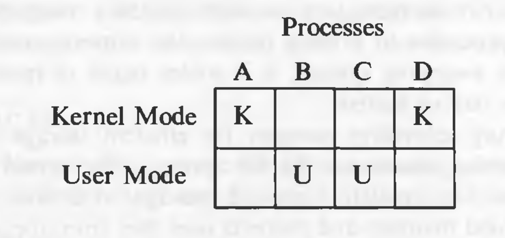
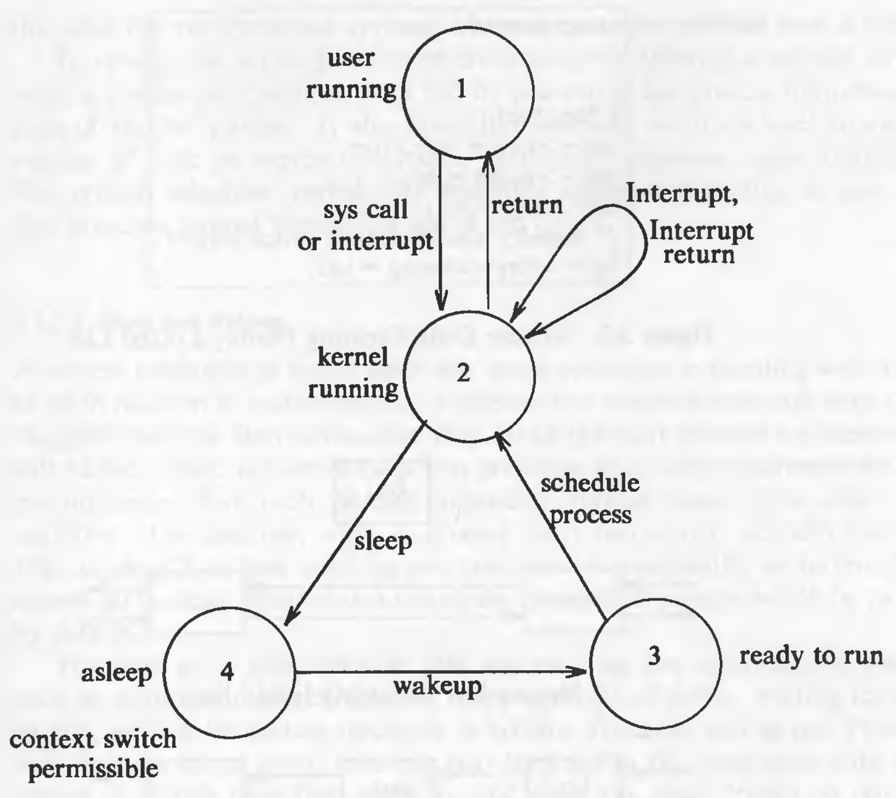

# General Overview of the System

## Why UNIX became so popular

* The system is written in a `high-level language`, making it easy to read, understand, change, and move to tother machines.
* It has a simple user interface that has the power to provide the services that users want.
* It provides primitives that permit complex programs to be built from simpler programs.
* It uses a hierarchical file system that allows easy maintenance and efficient implementation.
* It uses a consistent format for files, the byte stream, making application programs easier to write.
* It provides a simple, consistent interface to peripheral devices.
* It is a multi-user, multiprocess system; each user can execute several processes simultaneously.
* It hides the machine architecture from the user, making it easier to write programs that run on different hardware implementations.


## Architecture of UNIX Systems


The operating systems interacts directly with the hardware, providing common services to programs and insulating them from hardware idiosyncrasies.
Programs such as the shell and editors shown in the outer layers interact with the kernel by invoking a well defined set of *system calls*.

## User Perspective

### The File System

* A hierarchical structure
* consistent treatment of file data
* the ability to create and delete files
* dynamic growth of files
* the protection of file data
* the treatment of peripheral devices as files

The file system is organized as a tree with a single root node called *root* (written '/'). Every non-leaf node of the file system structure is a *directory* of files, and files at the leaf nodes of the tree are either *directories*, *regular files*, or *special device files*.

## Operating System Services

These are the services provided by the kernel:

* Controlling the execution of processes by allowing their creation, termination or suspension, and communication.
* Scheduling processes fairly for execution of the CPU. Processes share the CPU in a *time-shared* manner: the CPU executes a process, the kernel suspends it when its time quantum elapses, and the kernel schedules another process to execute. The kernel later reschedules the suspended process.
* Allocating main memory for an executing process. The kernel allows processes to share portions of their address space under certain conditions, but protects the private address space of a process from outside tampering. If the system runs low on free memory, the kernel frees memory by writing a process temporarily to secondary memory, called a *swap* device. If the kernel writes entire processes to a swap device, the implementation of the UNIX system is called a *swapping* system; if it writes pages of memory to a swap device, it is called a *paging* system.
* Allocating secondary memory for efficient storage and retrieval of user data. This service constitutes the file system. The kernel allocates secondary storage for user files, reclaims unused storage, structures the file system in a well understood manner, and protects user files from illegal access.
* Allowing processes controlled access to peripheral devices such as terminals, tape drives, disk drives, and network devices.

## Assumptions about Hardware

The execution of user processes in a UNIX system is divided in two levels: user and kernel. When a process executes a system call, its execution mode changes from *user mode* to *kernel mode*. Even if the user process doesn't make a system call, the operating system still does bookkeeping work that relates to the user process, handling interrupts, scheduling processes, managing memory, and so on.

* Processes in user mode can access their own instructions and data. Processes in kernel mode however, can access kernel and user addresses.
* Some machine instructions are privileged and result in an error when executed in user mode.

### Multiple processes and modes of execution



In the diagram above, the operating system views from the top (or bottom), it sees which processes are running. However, the hardware view if from the left (or right), it sees which mode is currently active.

### Interrupts and Exceptions

The UNIX system allows devices such as I/O peripherals or the system clock to interrupt the CPU asynchronously. On receipt of an interrupt, the kernel saves its current *context* (a frozen image of what the processor was doing), determines the cause of the interrupt, and services the interrupt. After servicing the interrupt, it restores its interrupted context and begins execution as if nothing had happened. The hardware usually prioritizes devices according to the order that interrupts should be handled: When the kernel services an interrupt, it *blocks* out lower priority interrupts but services higher priority interrupts.

An exception condition refers to unexpected events caused by a process, such as addressing illegal memory, executing privileged instructions, dividing by zero, and so on. They are distinct from interrupts, which are caused by events that are external to a process.

Exceptions happen "in the middle" of the execution of an instruction, and the system attempts to restart the instruction after handling the exception; interrupts are considered to happen between the execution of two instruction, and the system continues with the next instruction after servicing the interrupt. The UNIX system uses one mechanism to handle interrupts and exception conditions.

### Processor Execution Levels

The kernel sometimes wants to prevent occurrence of interrupts when it is doing some important work (such as modifying kernel data structures). In such situations, if the interrupts are not prevented, the kernel itself might get corrupt. Computers typically have a set of privileged instructions that set the processor execution level in the processor status word. Setting the processor execution level to certain values masks off interrupts from the level and lower levels, allowing only higher-level interrupts.


### Memory Management

The kernel permanently resides in the main memory. When compiling a program, the compiler generates a set of addresses in the program that represent addresses of variables and data structures of the addresses of instructions such as functions. The compiler generates the addresses for a *virtual machine* as if no other program will execute simultaneously on the physical machine. When the program is run on the machine, the kernel allocates space in main memory for it, but the virtual addresses generated by the compiler need not be identical to the physical addresses that they occupy in the machine. The kernel coordinates with the machine hardware to set up a virtual to physical address translation that maps the compiler-generated addresses to the physical machine addresses.

# Introduction to the Kernel

## Architecture of the UNIX Operating System

The UNIX system supports the illusions that the file system has "places" and that processes have "life".

The two entities, files and processes, are the two central concepts in the UNIX system model.


* The *file subsystem* is on the left and the *process control subsystem* is on the right.
* The diagram shows 3 levels : user, kernel, and hardware.
* The system call and library interface represent the border between user programs and the kernel.

## Introduction to System Concepts

### An Overview of the File Subsystem

Internal representation of a file is given by an *inode*, which contains a description of the disk layout of the file data and other information such as the file owner, access permissions, and access times. The term inode is a contraction of the term *index node*. Every file has one inode, but it may have several names, all of which map into the inode. Each name is called a *link*. When a process creates a new file, the kernel assigns it an unused inode.

Inodes are stored in the file system, but the kernel reads them into an in-core (in-memory) inode table when manipulating files. The kernel contains two other data structures, the *file table* and the *user file descriptor table*. The file table is a global kernel structure, but the user file descriptor table is allocated per process. When a process *open*s or *creat*s a file, the kernel allocates an entry from each table, corresponding to the file's inode. Entries in the three structures -- user file descriptor table, file table, and inode table -- maintain the state of the file and the user's access to it.  The file table keeps track of the byte offset in the file where the user's next *read8 or *write* will start, and the access rights allowed to the *open*ing process. The user file descriptor table identifier all open files for a process.


The kernel returns a *file descriptor* for the *open* and *creat* system calls, which is an index into the user file descriptor table. These three tables also enable sharing of files.

On a logical level, the kernel deals with file systems rather than with disks. It treats each file system as a *logical device* identified by a logical *device number*.

A file system consists of a sequence of logical blocks, each containing 512, 1024, 2048, or any convenient multiple of 512 bytes. The size of a local block is homogeneous within a file system but may vary between different file systems in a system configuration.

In this text, the size of a "block" is assumed to be 1K, unless stated otherwise.


A file system has the following structure:

* The *boot block* occupies the beginning ofgofofof a file system, typically the first sector, and may contain the *bootstrap* code that is read into the machine to *boot* , or initialize, the operating system. Although only one boot block is needed to boot the system, every file system has a (possibly empty) boot block.
* The *super block* describes the state of a file system -- how large it is, how many files it can store, where to find free space on the file system, and other information.
* The *inode list* is a list of inodes that follows the super block in the file system. Administrators specify the size of the inode list when configuring a file system. The kernel references inodes by index into the inode list. One inode is the *root inode* of the file system: it is the inode by which the directory structure of the file system is accessible after execution of the *mount* system call.
* The data blocks start at the end of the inode list and contain file data and administrative data. An allocated data block can belong to t one and only one file in the file system.

## Processes

A process is the execution of a program and consists of a pattern of bytes that the CPU interprets as machine instructions (called *text*), *data*, and *stack*. Processes communicate with other processes and with the rest of the world via system calls.

A process on a UNIX system is the entity that is created by the *fork* system call. Every process except *process 0* is created when another process executes the *fork* system call. The process which invoked fork system call is called the parent process and the newly created process is called the child process. A process can have only one parent process but it can have many child processes. The kernel identifies each process by its process number, called the *process ID* (PID). Process 0 is a special process that is created "by hand" when the system boots; after *fork*ing a child  process (process 1), process 0 becomes the *swapper* process. Process 1, known as *init* is the ancestor of every other process.

An executable file consists of the following parts:

* a set of "headers" that describe the attributes of the file
* the program text
* a machine language representation of the data that has initial values when the program starts execution, and an indication of how much space the kernel should allocate for uninitialized data, called *bss* (block started by symbol).
* other sections, such as symbol table information.

```
#include <stdio.h>

char buffer[2048];
int version = 1;

main() {
	printf("Hello, world!");
}
```

In the code given above, the initialized data is the variable `version` and the uninitialized data (i.e *bss*) is the array `buffer`.

The kernel loads an executable file into memory during an *exec* system call, and the loaded process consists of at least three parts, called *regions*: text, data, and stack. The text and data regions correspond to the text and data-bss sections of the executable file, but the stack region is automatically created and its size is dynamically adjusted by the kernel at runtime. The stack consists of logical *stack frames* that are *push*ed when calling a function and *pop*ped when returning; a special register called the *stack pointer* indicates the current stack depth. A stack frame consists of parameters to a function, its local variables and the data necessary to recover the previous stack frame, including the value of the program counter and stack pointer at the time of the function call.

Because a process in the UNIX system can execute in two modes, kernel or user, it uses a separate stack for each mode. When a system call is made, a *trap* instruction is executed which causes an *interrupt* which makes the hardware switch to kernel mode. The kernel stack of a process is null when the process executes in user mode.


Every process has an entry in the kernel *process table*, and each process is allocated a *u area* ("u" stands for "user") that contains private data manipulated only by the kernel. The process table contains (or points to) a *per process region table*, whose entries point to entries in a *region table*. A region is a contiguous area of a process's address space, such as text, data, and stack. Region table entries describe the attributes of the region, such as whether it contains text or data, whether it is shared or private, and where the "data" of the region is located in memory. The extra level of indirection (from the per process region table to the region table) allows independent processes to share regions.


Important fields in the process table are:

* a state field
* identifiers indicating the user who owns the process (user IDs, or UIDs)
* an event descriptor set when a process is suspended (in the *sleep* state)

The u area contains information that needs to be accessible only when the process is executing. Important fields in the u area are:

* a pointer to the process table slot of the currently executing process
* parameters of the current system call, return values and error codes
* file descriptors for all open files
* internal I/O parameters
* current directory and current root
* process and file size limits

The kernel internally uses a structure variable *u* which points to the u area of the currently executing process. When another process executes, the kernel rearranges its virtual address space that *u* refers to the u area of the new process.

## Context of a process

Context of a process consists of the following:

* text region
* values of global variables and data structures
* values of machine registers
* values stored in its process table slot
* u area
* contents of user and kernel stacks

The text of the operating system and its global data structures are shared by all processes but do not constitute part of the context of a process.

When the kernel decides that it should execute another process, it does a *context switch*, so that the system executes in the context of the other process.

The kernel services the interrupts in the context of the interrupted process even though it may not have caused the interrupt. Interrupts are served in kernel mode.

## Process states

1. Process is currently executing in user mode.
2. Process is currently executing in kernel mode.
3. Process is not executing, but it is ready to run as soon as the scheduler chooses it.
4. Process is sleeping.

Because a processor can execute only one process at a time, at most one process may be in states 1 and 2.

## State transitions

Processes move continuously between the states according to well-defined rules. A *state transition* diagram is a directed graph.



By prohibiting arbitrary context switches and controlling the occurrence of interrupts, the kernel protects its consistency.

The kernel allows a context switch only when a process moves from the state "kernel running" to the state "asleep in memory". Processes running in kernel mode cannot be preempted by other processes; therefore the kernel is sometimes said to be *non-preemptive*.

Consider the following code snippet:

```
struct queue {

} *bp, bp1;

bp1->forp = bp->forp;
bp1->backp = bp
bp->forp = bp1;
// consider possible context switch here
bp1->forp->backp = bp1;
```

In the above code, we are trying to put a new node into a doubly linked list. Kernel uses many such doubly linked lists as its data structures. While inserting the node in the list, if a context switch occurs at the specified line, it will have incorrect links. If other process modifies the list, it will get corrupt.


Therefore, when entering *critical* regions of the code, kernel raises its processor execution level to prevent interrupts.

The process scheduler periodically preempts processes executing in user mode so that processes cannot monopolize use of the CPU.

## Sleep and wakeup

A process changes its state on its own will. Other processes can communicate with it and suggest various alternatives. But the final decision is made by the process on its own initiative. Consequently, an interrupt handler cannot go to sleep, because if it could, the interrupted process would be put to sleep by default.

Process always *sleep on an event*, meaning that they are in the sleep state until the event occurs, at which time they wake up and enter the state "ready to run". Many processes can simultaneously sleep on an event. When that event occurs, *all* the processes wake up because the event condition is no longer true. They transition from "sleep" state to "ready to run" state. Sleeping processes do not consume CPU resources. The kernel does not constantly check to see that a process is still sleeping but waits for the event to occur and awakens the process then.

The kernel, while modifying a critical data structure, always checks if some other process has locked the data structure. If yes, it *sleep*s on the event of the data structure being unlocked. After it is unlocked, the process will *wakeup* and lock the data structure so that it can modify it. The kernel implements such locks in the following manner:

```
while (condition is true)
	sleep (event: the condition becomes false);
set condition true;
```

It unlocks the lock and awakens all processes asleep on the lock in the following manner:

```
set condition false;
wakeup (event: the condition is false);
```

Example of 3 processes waiting for a the same buffer.


## Kernel Data Structures

Most kernel data structure have fixed size rather than dynamically allocated space.

This decision was taken to make the kernel code simple. But the disadvantage is that kernel cannot be configured dynamically. If, at runtime, kernel hits the limit of some data structure, it has to throw errors. But such situations occur **very** rarely.

## System Administration

Conceptually, there is no difference between system administrative processes and user processes. It's just that the system administrative processes have more rights and privileges. Internally, the kernel distinguishes a special user called the *superuser*. A user may become a superuser by going through a login-password sequence or by executing special programs.

# The Buffer Cache

The kernel could read and write directly to and from the disk for all the file system accesses, but system response time and throughput will be poor because of the slow disk transfer rate. The kernel therefore attempts to minimize the frequency of disk access by keeping a pool of data buffers, called the *buffer cache*, which contains data in recently used disk blocks.

Architecturally, it is positioned between file subsystem and device drivers.

## Buffer Headers

During system initialization, the kernel allocates space for a number of buffers, configurable according to memory size and performance constraints.

Two parts of the buffer:

1. a memory array that contains data from the disk.
2. *buffer header* that identifies the buffer.

Data in a buffer corresponds to data in a logical disk block on a file system. A disk block can **never** map into more than one buffer at a time.


The *device number* fields specifies the logical file system (not physical device) and *block number* block number of the data on disk. These two numbers *uniquely* identify the buffer. The *status* field summarizes the current status of the buffer. The *ptr to data area* is a pointer to the data area, whose size must be at least as big as the size of a disk block.

The status of a buffer is a combination of the following conditions:

* Buffer is locked / busy
* Buffer contains valid data
* Kernel must write the buffer contents to disk before reassigning the buffer; called as "delayed-write"
* Kernel is currently reading or writing the contexts of the buffer to disk
* A process is currently waiting for the buffer to become free.

The two set of pointers in the header are used for traversal of the buffer queues (doubly linked circular lists).

## Structure of the Buffer Pool

The kernel follows the *least recently unused (LRU)* algorithm for the buffer pool. The kernel maintains a *free list* of buffers that preserves the least recently used order. Dummy buffer header marks the beginning and end of the list. All the buffers are put on the free list when the system is booted. When the kernel wants *any* buffer, it takes it from the head of the free list. But it can also take a specific buffer from the list. The used buffers, when become free, are attached to the end of the list, hence the buffers closer and closer to the head of the list are the most recently used ones.


When the kernel accesses a disk block, it searches for the buffer with the appropriate device-block number combination. Rather than search the entire buffer pool, it organizes the buffers into separate queues, *hashed* as a function of the device and block number. The hash queues are also doubly linked circular lists. A hashing function which uniformly distributes the buffers across the lists is used. But it also has to be simple so that the performance does not suffer.


The hash function shown in the figure only depends on the block number; real hash functions depend on device number as well.

Every disk block in the buffer pool exists on one and only one hash queue and only once on that queue. However, presence of a buffer on a hash queue does not mean that it is busy, it could well be on the free list as well if its status is free.

Therefore, if the kernel wants a particular buffer, it will search it on the queue. But if it wants *any* buffer, it removes a buffer from the free list. **A buffer is always on a hash queue, but it may or may not be on the free list**

## Scenarios for Retrieval of a Buffer

The algorithms for reading and writing disk blocks use the algorithm *getblk* to allocate buffers from the pool. There are 5 typical scenarios the kernel may follow in *getblk* to allocate a buffer for a disk block.

1. Block is found on its hash queue and its buffer is free.
2. Block could not be found on the hash queue, so a buffer from the free list is allocated.
3. Block could not be found on the hash queue, and when allocating a buffer from free list, a buffer marked "delayed write" is allocated. Then the kernel must write the "delayed write" buffer to disk and allocate another buffer.
4. Block could not be found on the hash queue and the free list of buffers is empty.
5. Block was found on the hash queue, but its buffer is currently busy.

The algorithm *getblk* is given below (scenarios stated above are marked in the comments) :

```
/*
 *  Algorithm: getblk
 *  Input: file system number
 *          block number
 *  Output: locked buffer that can now be used for block
 */

{
	while (buffer not found)
	{
		if (block in hash queue)
		{
			if (buffer busy)   // scenario 5
			{
				sleep (event: buffer becomes free);
				continue;      // back to while loop
			}
			mark buffer busy;  // scenario 1
			remove buffer from free list;
			return buffer;
		}
		else
		{
			if (there are no buffers on the free list)
			{
				sleep (event: any buffer becomes free);   // scenario 4
				continue;      // back to while loop
			}
			remove buffer from free list;
			if (buffer marked for delayed write)         // scenario 3
			{
				asynchronous write buffer to disk;
				continue:      // back to while loop;
			}
			// scenario 2
			remove buffer from old hash queue;
			put buffer onto new hash queue;
			return buffer;
		}
	}
}

```

When using the buffer, the kernel always marks the buffer as busy so that no other process can access it. When the kernel finishes using the buffer, it releases the buffer according to the algorithm *brelse*.

The algorithm *brelse* is given below :

```
/*  Algorithm: brelse
 *  Input: locked buffer
 *  Output: none
 */
 
{
	wakeup all processes (event: waiting for any buffer to become free;
	wakeup all processes (event: waiting for this buffer to become free;
	raise processor execution level to block interrupts;
	if (buffer contents valid and buffer not old)
		enqueue buffer at end of free list;
	else
		enqueue buffer at beginning of free list;
	lower processor execution level to allow interrupts;
	unlock (buffer);
} 
```

Buffer contents are old only if it is marked as "delayed write", in that case and in the case where the data is not valid (for example, due to I/O corruption), the buffer is put in the beginning of the free list as its data is not valid or old. Otherwise the data is valid as the buffer is put at the end to follow the LRU strategy.

The states of hash queues for different scenarios are shown in following figures :

Scenario 1


Scenario 2

Here the buffer is not on the hash queue, so a buffer from free list is removed and then its device and block numbers are changed.


Scenario 3


Scenario 4


Race for free buffer


Scenario 5


Race for a locked buffer **(this is an important race condition)**


**The kernel guarantees that all processes waiting for buffers will wake up, because it allocates buffers during execution of system calls and frees them before returning.**


## Reading and Writing Disk Blocks

This is the algorithm (*bread*) for reading data from the disk:

```
/*  Algorithm: bread
 *  Input: file system number
 *         block number
 *  Output: buffer containing data
 */
 
{
	get buffer for block (algorithm: getblk);
	if (buffer data valid)
		return buffer;
	initiate disk read;
	sleep (event: disk read complete);
	return buffer;
}
```

If the data is not found in the buffer pool, the kernel initiates disk read. The driver "schedules" a read request to the disk controller, which copies the data from the disk to the buffer and then the disk interrupt handler awakens the sleeping process.

The higher level algorithms anticipate the need for the next disk block if a sequential file access is being done. The second read is asynchronous. The kernel expects the data to be there for the second block when it wants.

The algorithm *breada* (bread-ahead) is given below:

```
/*  Algorithm: breada
 *  Input: file system number and block number for immediate read
 *         file system number and block number for asynchronous read
 *  Output: buffer containing data for immediate read
 */
 
{
	if (first block not in cache)
	{
		get buffer for first block (algorithm: bread);
		if (buffer data not valid)
			initiate disk read;
	}
	if (second block not in cache)
	{
		get buffer for second block (algorithm: getblk);
		if (buffer data valid)
			release buffer (algorithm: brelse);
		else
			initiate disk read;
	}
	if (first block was originally in the cache)
	{
		read first block (algorithm: bread);
		return buffer;
	}
	sleep (event: first buffer contains valid data);
	return buffer;
}
```

Note: in the algorithm above, the line: `get buffer for first block (algorithm: bread)` is not correct in my opinion. The algorithm here should be `getblk` and not `bread` as we are checking for validity and initiating a disk read both of which are done internally in `bread`. So the algorithm here should be `getblk`. It might just be a printing mistake in the book.

If we get the data for the second block in the buffer cache, we release it immediately as we do not need it right away. It will be acquired when the data is actually needed.

The algorithm (*bwrite*) for writing contents of a buffer to a disk block is given below:

```
/*  Algorithm: bwrite
 *  Input: buffer
 *  Output: none
 */

{
	initiate disk write;
	if (I/O synchronous)
	{
		sleep (event: I/O complete);
		release buffer (algorithm: brelse);
	}
	else if (buffer marked for delayed write)
			mark buffer to put at head of free list;
}
```

Because of the two asynchronous I/O operations -- block read ahead and delayed write -- the kernel can invoke *brelse* from an interrupt handler. Hence, it must prevent interrupts in any procedure that manipulates the buffer free list.

# Internal Representation of Files

Every file a UNIX system has a unique inode. Processes interact with files using well defined system calls. The users specify a file with a character string which is the file's path and then the system get the inode which is mapped to the file which corresponds to the path.

The algorithms described below are above the layer of buffer cache. Diagrammatically, it can be shown like this:


## Inodes

Inodes exist in a static form on the disk. The kernel reads them into in-core inodes and modifies them.

Disk inodes consists of the following fields:

* Owner information: ownership is divided into a user and a group of users. Root user has access to all the files.
* File type: it states whether a file is a normal file, a directory, a block or character special file, or a device file.
* File access permissions: there are 3 types of access permissions: owner, group and others. There are separate permissions for reading, writing and executing. Since execute permission is not applicable to a directory, execute permission for a directory gives the right to search inside the directory.
* Access times: the times at which the file was last accessed and last modified, and the time at which the inodes was last modified
* Number of links: number of places from which the file is being referred.
* Array of disk blocks: even if the users get a logically sequential representation of data in files, the actual data is scattered across the disk. This array keeps the addresses of the disk blocks on which the data is scattered.
* File size: the addressing of the file begins from location 0 from relative to the starting location and the size of the file is the maximum offset of the file + 1. For example, if a user creates a file and writes a byte at offset 999, the size of the file is 1000.

The inode does not specify the pathname/pathnames that access the file.


The in-core inodes contain the following fields in additional to the fields of the disk inode:

* Status of the inode
	1. Locked.
	2. A process is (or many processes are) waiting for it to be unlocked.
	3. The data in the inode differs from the disk inode due to change in the inode data.
	4. The data in the inode differs from the disk inode due to change in the file data.
	5. The file is a mount point (discussed later).
* The device number of the logical device of the file system on which the file resides.
* Inode number: the disk inodes are placed in an array. So the number of the inode is nothing but the index of the inode in the array. That is why the disk copy does not need to store the inode number.
* Points to inodes: just like the buffer cache, the in-core inodes are nothing but a cache for disk inodes (but with some extra information which is deterministic). In-core inodes also have hash queues and a free list and the lists behave in a very similar way to the buffer lists. The inode has next and previous pointers to the inodes in the hash queue and free lists. The hash queues have a hash function based on the device number and inode number.
* Reference count: it gives the number of instances of files that are active currently.

The most striking difference between an in-core inode and a buffer header is the *reference count*. The reference count increases when a process allocates that inode, for example, by *open*ing a file. An inode is on the free list if and only if the reference count of the inode is 0. If it is greater, some process is still accessing the inode. This means, that an inode can be on a hash queue and not on the free list even if its not locked. That is not the case with a buffer, a buffer will always be on the free list if it is not locked.

### Accessing Inodes

The algorithm *iget* allocates an in-core copy of an inode. If the inode is not found on a hash queue, it allocates an inode from the free list and reads the disk copy into the in-core inode. It already knows the inode number and device number. It calculates the logical block number on which the disk inode resides according to how many inodes fit into one disk block. The formula for calculating the logical block number is:

`block number = ((inode number - 1) / number of inodes per block) + start block of inode list`

where the division operation returns the integer part of the quotient.

To find the byte offset of the inode in that block, this following formula is used:

`byte offset = ((inode number - 1) % number of inodes per block) * size of disk inode`

The algorithm *iget* is given below:

```
/*  Algorithm: iget
 *  Input: file system inode number
 *  Output: locked inode
 */
 
{
	while (not done)
	{
		if (inode in inode cache)
		{
			if (inode locked)
			{
				sleep (event: inode becomes unlocked);
				continue;
			}
			// special processing for mount points, covered later
			if (inode on free list)
				remove inode from free list;
			increment reference count of the inode;
			return inode;
		}
		// inode not in the cache
		if (free list is empty)
			return error;
		remove inode from free list;
		reset inode number and file system;
		remove inode from old hash queue and place it on the new hash queue;
		read inode from disk (algorithm: bread);
		initialize inode;
		return inode;
	}
}
```

**The kernel manipulates inode lock and reference count independently.** It locks an inode when it is being accessed or modified. An inode is never locked across system calls. But the reference count remains set across system calls. The kernel can lock and unlock an inode independent of the value of the reference count.

The algorithm *iget* is very similar to *getblk* but there's one big difference. In *getblk*, a process sleeps if the free list is empty. But in *iget*, an error returned. The reason behind this difference is that the process have control over inodes at user level with *open* and *close* system calls. If a process *open*s a file and never closes it, the inode will have reference count of at least 1 and it will never be on the free list unless the process *close*s the file. This is not the case with buffers. Processes don't have user level control over buffers. Therefore, buffers are guaranteed to get free but inodes are not.

### Releasing Inodes

The algorithm *iput* is used to release an inode:

```
/*  Algorithm: iput
 *  Input: in-core inode
 *  Output: none
 */
 
{
	lock inode if not already locked;
	decrement inode reference count;
	if (reference count == 0)
	{
		if (inode link count == 0)
		{
			free disk blocks for file (algorithm: free); // free is described later
			set file type to 0;
			free inode (algorithm: ifree); // ifree is described later
		}
		if (file accessed or inode changed or file changed)
			update disk inode;
		put inode on free list;
	}
	release inode lock;
}
```

## Structure of a Regular File

In UNIX, the data in files is not stored sequentially on disk. If it was to be stored sequentially, the file size would not be flexible without large fragmentation. In case of sequential storage, the inode would only need to store the starting address and size. Instead, the inode stores the disk block numbers on which the data is present. But for such strategy, if a file had data across 1000 blocks, the inode would need to store the numbers of 1000 blocks and the size of the inode would differ according to the size of the file.

To be able to have constant size and yet allow large files, indirect addressing is used. The inodes have array of size 13 which for storing the block numbers, although, the number of elements in array is independent of the storage strategy. The first 10 members of the array are "direct addresses", meaning that they store the block numbers of actual data. The 11th member is "single indirect", it stores the block number of the block which has "direct addresses". The 12th member is "double indirect", it stores block number of a "single indirect" block. And the 13th member is "triple indirect", it stores block number of a "double indirect" block. This strategy can be extended to "quadruple" or "quintuple" indirect addressing.


If a logical block on the file system holds 1K bytes and that a block number is addressable by a 32 bit integer, then a block can hold up to 256 block numbers. The maximum file size with 13 member data array is:

```
10 direct blocks with 1K bytes each =                     10K bytes
1 indirect block with 256 direct blocks =                 256K bytes
1 double indirect block with 256 indirect blocks =        64M bytes
1 triple indirect block with 256 double indirect blocks = 16G bytes
```

But the file size field in the inode is 32 bits, the size of a file is effectively limited to 4 gigabytes.

The algorithm *bmap* is used to convert logical byte offset of a file to a physical disk block:

```
/*  Algorithm: bmap
 *  Input: inode
 *         byte offset
 *  Output: block number in file system
 *          byte offset into block
 *          bytes of I/O in block
 *          read ahead block number
 */
 
{
	calculate logical block number in file from byte offset;
	calculate start byte in block for I/O;       // output 2
	calculate number of bytes to copy to user;   // output 3
	check if read-ahead applicable, mark inode;  // output 4
	determine level of indirection;
	while (not at necessary level of indirection)
	{
		calculate index into inode or indirect block from logical block number in file;
		get disk block number from inode or indirect block;
		release buffer from previous disk read, if any (algorithm: brelse);
		if (no more levels of indirection)
			return (block number);
		read indirect disk block (algorithm: bread);
		adjust logical block number in file according to level of indirection;
	}
}
```

Some examples of conversions (refer to the figure):


1. To access byte offset 9000: 
The first 10 blocks contain 10K bytes. So 9000 should be in the first 10 block.
`9000 / 1024 = 8` so it is in the 8th block (starting from 0). And `9000 % 1024 = 808` so the byte offset into the 8th block is 808 bytes (starting from 0). (Block 367 in the figure.)
2. To access byte offset 350000:
The first 10 blocks contain 10K bytes `(350000 - 10240 = 339760)`. A single indirect block contains 256K bytes. `(339760 - (256 * 1024) = 77616)`. So a double indirect block (block 9156 in the figure) must be used. Every single indirect block in the double indirect block contains 256K, so data must be in the 0th single indirect block (block 331 in the figure). Every direct block in the single indirect block addresses 10K bytes `(77616 / 10240 = 7)`. So the data must be in 7th (starting from 0) direct block (block number 3333 in the figure). And the byte offset will be `77616 % 1024 = 816`.

## Directories

Directory files have entries of sub directories and files that reside inside them. Directory files have the mapping of a file name and its inode number. One directory entry takes 16 bytes. 14 bytes are given for the name of the file and 2 bytes for inode number. For example:


The entry `.` has the inode number of the the directory file itself. And `..` has the inode number of the parent directory. `.` and `..` for the root directory are nothing but inode numbers of the root directory itself. Entries that have the inode number 0 are empty (i.e. deleted files).

The kernel has exclusive writes to write to a directory. The access permission for directories mean different things. Read permission is for reading the contents of the directory, write permission given the permission to create files and directories in that directory, and the execute permission gives the right to search in that directory.

## Conversion of Path Name to an Inode

Algorithm *namei* (*name* to *i*node) is used for converting a path to an inode number. The kernel parses the path by accessing each inode in the path and finally returning the inode of the required file. Every process has a *current directory*. The current directory of process 0 is the root directory. For every other process, it is the current directory of its parent process. Later the process can change the current directory with the system call *chdir*. The inode of the current directory is stored in the u-area. Searches start with respect to the current directory unless the path begins with the */* component, stating that the search should start with the root directory. Inode number of the root is present as the global variable. Even if the *current root* is changed by using *chroot* (more on this later), the current root inode number is stored in the u-area.

Algorithm *namei* is given below:

```
/*  Algorithm: namei
 *  Input: pathname
 *  Output: locked inode
 */
 
{
	if (path name starts from root)
		working inode = root inode (algorithm: iget);
	else
		working inode = current directory inode (algorithm: iget);
	
	while (there is more path name)
	{
		read next path name component from input;
		verify that working inode is of a directory and access permissions are OK;
		if (working inode is of root and component is "..")
			continue;
		read directory (working inode) by repeated use of algorithms: bmap, bread, brelse;
		if (component matches an entry in the directory (working inode)
		{
			get inode number for matched component;
			release working inode (algorithm: iput);
			working inode = inode of matched component (algorithm: iget);
		}
		else
			return (no inode)  // component not in the directory
	}
	
	return (working inode);
}
```

Here, `working inode` is used for the intermediate inodes in the path.

## Superblock

The contents of the super block are:

* size of the file system.
* number of free blocks in the file system.
* list of free blocks in the file system.
* pointer to the next free block in the free blocks list
* size  of the inodes list.
* number of free inodes in the file system.
* list of free inodes in the file system.
* pointer to the next free inode in the free inodes list.
* lock fields for the free blocks and free inodes list.
* a field indicating whether the super block has changed.

The kernel periodically writes the superblock to the disk if it had been modified so that it is consistent with the data on the disk.

## Inode Assignment to a New File

Algorithm *ialloc* is used to assign an inode to a newly crated file:

```
/*  Algorithm: ialloc
 *  Input: file system
 *  Output: locked inode
 */
 
{
	while (not done)
	{
		if (super block locked)
		{
			sleep (event: super block becomes free);
			continue;
		}
		if (indoe list in super block is empty)
		{
			lock super block;
			get remembered inode for free inode search;
			search disk for free inodes until super block full, or no more free inodes (algorithm: bread and brelse);
			unlock super block;
			wake up (event: super block becomes free);
			if (no free inodes found on disk)
				return (no inode);
			set remembered inode for next free inode search;
		}
		// there are inodes in super block inode list
		get inode number form super block inode list;
		get inode (algorithm: iget);
		if (inode not free after all)
		{
			write inode to disk;
			release inode (algorithm: iput);
			continue;
		}
		// inode is free
		initialize inode;
		write inode to disk;
		decrement file system free inode count;
		return inode;
	}
}
```

If the list of inodes numbers in the super block is not empty, the kernel assigns the next inode number, allocates a free in-core inode for the newly assigned disk inode using algorithm *iget*, copies the disk inode to the in-core copy, initializes the fields in the inode and returns the locked inode. It updates the inode on disk to indicate that the inode is in use.

If the super block list of free inodes is empty, the kernel searches the disk and places as many free inode numbers as possible into the super block. The kernel reads the inode list on disk, block by block, and fills the super block list of inode numbers to capacity, remembering the highest-numbered inode that it finds ("remembered" inode). It is the last one saved in the super block. The next time the kernel searches the disk for free inodes, it uses the remembered inode as its starting point, thereby assuring that it wastes no time reading disk blocks where no free inodes should exist.

An example:


Super block lists are maintained such that the last inode it dispenses from the list is the remembered inode.

Algorithm for freeing inodes (*ifree*) is a simple one:

```
/*  Algorithm: ifree
 *  Input: file system inode number
 *  Output: none
 */

{
	increment file system free inode count;
	if (super block locked)
		return;
	if (inode list full)
	{
		if (inode number less than remembered inode for search)
			set remembered inode for search = input inode number;
	}
	else
		store inode number in inode list;
	return;
}
```

If the super block is locked, the algorithm returns, the inode number is not updated in the free list of inode numbers. But the inode can be found when searching the disk blocks. If the disk blocks list is full and the inode number is less than the remembered inode number, the replace the remembered inode number with the input inode number, so that the search will start from that inode.

Ideally, there should never be free inodes whose inode number is less than the remembered inode number, but exceptions are possible. If an inode is being freed and the super block is locked, in such situation, the it is possible to have an inode number that is free and is less than the remembered inode number.

An example:


In *ialloc*, there is a race condition where an inode can be in use even if we get it from the list of free inode numbers in the super block. Following is an example where such condition is possible.

Assume that there are 3 processes, A, B, and C. If process A assigns inode I but goes to sleep before it copies the disk inode into the in-core copy. Algorithms *iget* (invoked by *alloc*) and *bread* (invoked by *iget*) give ample opportunity to go to sleep. If, while process A sleeps, process B tries to acquire an inode but finds that the list of free inode numbers is empty. So it starts searching (assume that it starts searching at a lower inode number than inode I) the disk blocks for free inodes and finds inode I, as inode I is still marked free. Process B completes the search, fills up the list and departs taking an inode number. Process A wakes up and completes the assignment of inode I. Now suppose process C later requests an inode and happens to pick inode I from the super block free list. When it gets the in-core copy of the inode, it will find its file type set, implying that the inode was already assigned. That is why that check is required in *ialloc*.

## Allocation of Disk Blocks

When data is written on a file, the kernel must allocate disk blocks from the file system (for direct data blocks or sometimes, indirect data blocks). The file system super block contains an array that is used to cache the numbers of free disk blocks in the file system. The utility program *mkfs* (make file system) organizes the data blocks of a file system in a linked list, such that each link of the list is a disk block that contains an array of free disk block numbers, and one array entry is the number of the next block of the linked list. For example:


Algorithm for allocation of disk blocks (*alloc*) is given below:

```
/*  Algorithm: alloc
 *  Input: file system number
 *  Output: buffer for new block
 */
 
{
	while (super block locked)
		sleep (event: super block not locked);
	remove block from super block free list;
	if (removed last block from free list)
	{
		lock super block;
		read block just taken from free list (algorithm: bread);
		copy block numbers in block into super block;
		release block buffer (algorithm: brelse);
		unlock super block;
		wakeup processes (event: super block not locked);
	}
	get buffer for block removed from super block list (algorithm: getblk);
	zero buffer contents;
	decrement total count of free blocks;
	mark super block modified;
	return buffer;
}
```

The program *mkfs* tries to organize the original linked list of free block numbers so that block numbers dispensed to a file are near each other. This helps performance, because it reduces disk seek time and latency when a process reads a file sequentially. The kernel makes no attempt to sort block numbers on the free list.

The algorithm *free* for freeing a block is the reverse of the one for allocating a block. If the super block list is not full, the block number of the newly freed block is placed on the super block list. If, however, the super block list is full, the newly freed block becomes a link block; the kernel writes the super block list into the block and writes the block to disk. It then places the block number of the newly freed block in the super block list: That block number is the only member of the list.

An example of how the super block free data blocks list works:


There is a difference is how free inode numbers are managed and how free disk block numbers are managed. All the free disk block numbers are stored as a linked list of arrays but in case of free inode numbers, all the free inode numbers are not stored. After the capacity of the free inode numbers exceeds, the other free inode numbers are not stored anywhere. There are 3 reasons for this different treatment:

1. The kernel can determine whether an inode is free by inspecting its file type. However, there is no way to know whether a disk block is free by looking at the data in it.
2. Disk block lend themselves to the use of linked list: a disk block easily holds large lists of free block numbers. But inodes have no convenient place for bulk storage of large list of free inode numbers.
3. Users tend to use free disk blocks more than free inodes, so the performance lag in searching would be more noticeable in case of disk blocks than inodes.

## Other File Types

The UNIX system supports two other file types: pipes and special files. A pipe, sometimes called a *fifo* (first-in-first-out), differs from a regular file in that its data is transient; once data is read from a pipe, it cannot be read again. Also, the data is read in the order that it was written to the pipe, and the system allows no deviation from that order. The kernel stores data in a pipe the same way it stores data in an ordinary file, except that it uses only the direct blocks, not the indirect blocks. Pipes are described later.

Other types in UNIX system are special files, including block device special files and character device special files. Both types specify devices, and therefore the file inodes do not reference any data. Instead, the inode contains two numbers known as the major and minor device numbers. The major number indicates a device type such as terminal or disk, and the minor number indicates the unit number of the device. Device files are covered later.

# System Calls for the File System

Systems calls related to the file system and their relation to other algorithms is given in the diagram below:


## Open

Open is the first step to access data in a file.

`fd = open (pathname, flags, mode);`

where `flags` indicate the type of open (reading or writing) and `mode` gives the permissions if the file is being created. It returns an integer called the user `file descriptor`. Other file operations use the file descriptor returned by `open`.

The algorithm is given below:

```
/*  Algorithm: open
 *  Input: pathname
 *  		 flags
 *  		 mode (for creation type of open)
 * Output: file descriptor
 */
 
{
	convert file name to inode (Algorithm: namei);
	if (file does not exist or access is not permitted)
		return (error);
	allocate file table entry for inode, initialize count, offset;
	allocate user file descriptor entry, set pointer to file table entry;
	if (type of open specifies truncate file)
		free all blocks (algorithm: free);
	unlock (inode);
	return (user file descriptor);
}
```

After getting the in-core inode of the file to be opened, the kernel allocates an entry in the file table and sets the offset of the file, the offset tells the kernel from where to read or write to the file. In the case of *read* and *write* modes, the offset is set to 0, but for *write-append* mode, the offset is set to the size of the file. Then the kernel allocates an entry in the *user file descriptor table* which is local to a process and accessible through the u-area. The user file descriptor table entry has a pointer to its file table entry and the file table entry has a pointer to the in-core inode table entry. The *file descriptor* returned to the user is nothing but the index of the entry in the user file descriptor table.

If a process executes following code:

```
fd1 = open ("/etc/passwd", O_RDONLY);
fd2 = open ("local", O_RDWR);
fd3 = open ("/etc/passwd", O_WRONLY);
```

In this case, the state of the in-core inode table, file table, and user file descriptor table will be like this:


Entries in the user file descriptor table point to unique entries in the file table even though "/etc/passwd" is opened twice. This is needed because the modes of open could be different and even if they are not, the offsets need to be maintained separately. Both the file table entries point to the same in-core inode table entry.

If another process (say process B) executes the following code, in addition to process A executing the above code:

```
fd1 = open ("/etc/passwd", O_RDONLY);
fd2 = open ("private", O_RDONLY);
```

The state of the tables will be like this:


The file table entries created by different process for the same file point to the same in-core inode table entry. The offsets could have been stored in the user file descriptor table entries as well, eliminating the need of the file table. But the additional indirection to the file table enables sharing of files (using *dup* and *fork* system calls) as we will see later.

The first 3 entries (0, 1, 2) in the user file descriptor table point to standard input (*stdin*), standard output (*stdout*), and standard error (*stderr*). But it is just a convention and there is nothing special about these entries. *stdin* is used to read input (usually, keyboard), *stdout* and *stderr* are used for printing the output and the errors respectively (usually, monitor for both).

## Read

`number = read (fd, buffer, count);`

where `fd` is the descriptor returned by *open*. `buffer` is the address of the data structure where the data will be read. `count` is the number of bytes to be read. And it returns how many bytes were successfully read. 

The algorithm is given below:

```
/*  Algorithm: read
 *  Input: user file descriptor
 *         address of buffer in user process
 *         number of bytes to be read
 *  Output: count of bytes copied into user space
 */

{
	get file table entry from user file descriptor table;
	check file accessibility;
	set parameters in u-area for user address, byte count, I/O to user;
	get inode from file table;
	lock inode;
	set byte offset in u-area from file table offset;
	while (count not satisfied)
	{
		convert file offset to disk block (algorithm: bmap);
		calculate offset into block, number of bytes to read;
		if (number of bytes to read is 0)
			break;			// trying to read End Of File (EOF)
		read block (algorithm: bread or breada whichever applicable);
		copy data from system buffer to user address;
		update u-area fields for file byte offset, read count, address to write into user space;
		release buffer;		// locked in bread
	}
	unlock inode;
	update file table offset for next read;
	return (total number of bytes read);
}
```

After getting the file table entry from user file descriptor table, the kernel sets some parameters in the u-area and eliminates the need to pass them as function parameters. The parameters in the u-area:

* mode: indicates read or write
* count: count of bytes to read or write
* offset: byte offset in file
* address: target address to copy data in user or kernel memory
* flag: indicates if address is in user or kernel memory

If a process reads two blocks sequentially, the kernel assumes that all subsequent reads will be sequential until proven otherwise. During each iteration through the loop, the kernel saves the next logical block number in the in-core inode and during the next iteration, compares the current logical block number to the value previously saved. If they are equal, the kernel calculates the physical block number for read-ahead and saves its value in the u-area for use in the *breada* algorithm. Of course, if a process does not read to the end of the block, the kernel does not invoke read-ahead for the next block.

As we had seen previously, it is possible to have some block numbers in an inode or in an indirect block to have the value 0. In such cases, the kernel allocates an arbitrary buffer and clears its contents to 0 and copying it to user address space.

The kernel always unlocks inode at the end of a system call. Inode is not locked across the system calls. Otherwise one malicious/erroneous user can block all the other users from accessing a file.

## Write

`number = write (fd, buffer, count);`

The function signature is exactly same to that of read. But the action is writing instead of reading.

The algorithm is given below:

```
/*  Algorithm: write
 *  Input: user file descriptor
 *         address in the user space from where data is to be written
 *         number of bytes to be written
 *  Output: count of bytes written in the file
 */

{
	get file table entry from user file descriptor table;
	check file accessibility;
	set parameters in u-area for user address, bytes count, I/O to user;
	get inode from file table;
	lock inode;
	set bytes offset in u-area from file table offset;
	while (count not satisfied)
	{
		if (file offset is larger than the file size)
		{
			while (indirection is required)
			{
				allocate a new block for indirection (algorithm: alloc);
				write the block number in the parent block;
			}
			allocate a new block for data (algorithm: alloc);
			write the block number in the inode/indirect block;
		}
		else
			convert file offset to disk block (algorithm: bmap);
		calculate the offset into block, number of bytes to write;
		if (only part of the block to be written)
		{
			read the buffer (algorithm: bread);
		}
		write data in the buffer;
		write block (algorithm: bwrite);
		update u-area fields for file byte offset, write count, address to read from user space;
	}
	update the file size if required;
	unlock inode;
	update file table offset for next write;
	return (total number of bytes read)
}
```

This algorithm is almost similar to *read*, but when the bytes offset is larger than the file size, the kernel has to allocate an extra data block, and if indirection is required, several blocks need to be allocated to be used as indirect blocks.

Also, when a block is to be written partially, the kernel has to read the block, copy the contents which are not going to get overwritten, and then write the block.

## Adjusting the Position of File I/O

With *read* and *write*, access to a file is sequential. *lseek* is used to enable random access to files.

`position = lseek (fd, offset, reference);`

where `offset` is the desired bytes offset and `reference` states whether the byte offset is to be taken from the beginning or current position or the end of the file. The return value `position` is the byte offset where the next read/write will start. *lseek* just adjusts the byte offset in the file table.

## Close

A process *close*s an *open* file when it no longer wants to access it.

`close (fd);`

When closing a file, the kernel first deals with the entries in the user file descriptor table, file table and the in-core inode table. It decrements the reference count of the corresponding file table entry (reference count can be more than 1 is case of *fork* and *dup*, described later). If the reference count becomes 0, it decrements the reference count of the in-core inode table entry. If it becomes 0, the in-core inode is free to be reallocated. When a process exits, the kernel examines the active user file descriptors and *close*s each one. Hence, no process can keep a file open after its termination.

## File Creation

The *creat* system call creates a new file in the file system.

`fd = creat (pathname, modes);`

If pathname of an existing file is passed to *creat*, it will truncate the file and set its size to 0 (if permissions allow, otherwise the system call will fail).

The algorithm is given below:

```
/*  Algorithm: creat
 *  Input: file name
 *         permissions
 *  Output: file descriptor
 */

{
	get inode for file name (algorithm: namei);
	if (file already exists)
	{
		if (not permitted access)
		{
			release inode (algorithm: iput);
			return (error);
		}
	}
	else
	{
		assign free inode from file system (algorithm: ialloc);
		create new directory entry in the parent directory: include new file name and newly assigned inode number;
	}
	allocate file table entry for inode, initialize count;
	if (file existed at time of creat)
		free all file blocks (algorithm: free);
	unlock (inode);
	return (user file descriptor);
}
```

After the steps in the algorithm, the *creat* system calls follows the steps in *open* to create entries in the 3 tables.

The algorithm also remembers the inode of the directory being searched, in the u-area and keeps the inode locked as the directory will become the parent directory of the file. 

The kernel write the newly allocated inode to disk before it writes the directory with the new name to disk. If the system crashes between the write operations, an inode which is not referenced by any path will just lie there, but the system will functional normally. However, if a directory entry references a corrupt inode, the system will crash.

If the pathname refers to an old file, kernel gets the inode of that file, truncates its contents (if write permission is given, otherwise error), but it does not modify the permissions and owner of the file, it ignores the permission modes given in the system call parameter. The kernel does not check if the parent directory allows write permission, because it is not going to write in the parent directory.

## Creation of Special Files

The system call *mknod* creates special files including named pipes, device files, and directories.

`mknod (pathname, type and permissions, dev);`

where `dev` specifies major and minor device numbers for block and character special files. 

The algorithm is given below:

```
/*  Algorithm: mknod
 *  Input: pathname
 *         file type
 *         permissions
 *         major, minor device numbers (for block and character special files)
 *  Output: none
 */

{
	if (new node not named pipe and user not super user)
		return (error);
	get inode of parent of new node (algorithm: namei);
	if (new node already exists)
	{
		release parent inode (algorithm: iput);
		return (error);
	}
	assign free inode from file system of new node (algorithm: ialloc);
	create new directory entry in parent directory with new node name and new inode number;
	release parent directory inode (algorithm: iput);
	if (new node is block or character special file)
		write major, minor numbers into inode structure;
	release new node inode (algorithm: iput);
}
```

It also sets the file type field to indicate if its a pipe, directory or a special file. If a directory is being created, proper format for the directory is set (such as setting the "." and ".." entries).

## Change Directory and Change Root

When process 0 is created, it sets its current directory as root. It gets the root inode (*iget*), saves it in its u-area as the current directory and releases the inode. When a new process is created with *fork*, it inherits the current directory from the parent process in its u-area and the inode reference count is incremented.

`chdir (pathname);`

The algorithm is given below:

```
/*  Algorithm: chdir
 *  Input: new directory name
 *  Output: none
 */

{
	get inode for new directory name (algorithm: namei);
	if (inode not that of directory or if access not permitted)
	{
		release inode (algorithm: iput);
		return (error);
	}
	unlock inode;
	release "old" current directory inode (algorithm: iput);
	place new inode in current directory slot of u-area;
}
```

In a way, *chdir* is similar to *open*, as both of them leave the inode allocated. In the case of *chdir*, the inode will be release only when the process calls *chdir* again with different pathname, or when the process *exit*s.

Processes usually use the global root "/" as for pathnames starting with "/". The kernel has a global variable that points to the inode of the global root. Processes can change their current root via *chroot* system call. This is useful for simulations.

`chroot (pathname);`

The algorithm is similar to *chdir*. But if the old root was the global root, it is not released. When the current root is changed, searches for pathnames starting from "/" will start from the new root. And all of the child process will inherit the current root.

## Change Owner and Change Mode

Changing the owner or mode (access permissions) of a file are operations on the inode.

```
chown (pathname, owner, group);
chmod (pathname, mode);
```

For both the algorithms, the kernel gets the inode using *namei*, and then modifies the inode accordingly (access permissions are checked).

## Stat and Fstat

The system calls *stat* and *fstat* allow processes to query the status of files, returning information such as the file type, file owner, access permissions, file size, number of links, inode number, and file access times.

```
stat(pathname, statbuffer);
fstat(fd, statbuffer);
```

where `statbuffer` is the address of the data structure in user process that will get filled in the call. The system calls simply write the fields of inodes into the *statbuffer*.

## Pipes

Pipes allow transfer of data between processes in a first-in-first-out manner. There are two kinds of pipes: *named pipes* and *unnamed pipes*. Both are identical, except the way processes initially accesses them. Named pipes are created with *open* and unnamed pipes are created with the *pipe* system call. Afterwards, *read*, *write*, and *close* are used for further operations on pipes.

Access to unnamed pipes is shared only for child processes. For example, in the following diagram, process B has called *pipe* so that pipe can be used only by process B, D, and E. But process A and C cannot access the pipe. However, named pipes can be shared between any processes.


### The Pipe System Call

`pipe (fdptr);`

where `fdptr` is the pointer to an integer array that will contain the two file descriptors for *reading* and *writing* the pipe. Pipes use the same data structures as used by normal files, the user file descriptor table, and the in-core inode table; as a result, the interface to read/write files remains consistent and the processes do not need to know whether they are reading a normal file or a pipe.

The algorithm is given below:

```
/*  Algorithm: pipe
 *  Input: none
 *  Output: read file descriptor
 *  		  write file descriptor
 */
 
{
	assign new inode from pipe device (algorithm: ialloc);
	allocate a file table entry for reading and another for writing;
	initialize file table entries to point to new inode;
	allocate user file descriptor for reading, another for writing and point to respective file table entries;
	set inode reference count to 2;
	initialize count of inode readers, writers to 1;
}
```

A *pipe device* is just a file system from which the kernel can assign inodes and data blocks for pipes. System admins specify a pipe device during system configuration.

One big difference between normal files and pipes is that the byte offset for normal files is in the file table entry, but for pipe files, it is in the inode. And the *lseek* system call cannot adjust the byte offsets in the inode; random access I/O to a pipe is not possible.

**Opening a Named Pipe**

Named pipe has the same semantics of as those of an unnamed pipe, except that it has a directory entry and is accessed by a pathname.
The algorithm for opening a name pipe is identical to the algorithm for opening a regular file. However, before completing the system call, the kernel increments the read or write counts in the inode, indicating the number of processes that have the named pipe open for reading or writing. A process that open the named pipe for reading will sleep until another process opens the named pipe for writing, and vice versa. It makes no sense for a pipe to be open for reading if there is no hope for it to receive data; the same is true for writing. Depending on whether the process opens the named pipe for reading or writing, the kernel awakens other processes that were asleep, waiting for a writer or reader process (respectively) on the named pipe.

If a process opens a named pipe for reading and a writing process exists, the open call completes. Or if a process opens a named pipe with the *no delay* option, the *open* call returns immediately, even if there are no writing processes. But if neither condition is true, the process sleeps until a writer process opens the pipe. Similar rules hold for a process that opens a pipe for writing.

**Reading and Writing Pipes**

A pipe should be viewed as if processes write on one end of the pipe and read from the other end. The number of processes reading from a pipe do not necessarily equal the number of processes writing the pipe; when the number is not equal, they must coordinate use of the pipe with other mechanisms. 

The storage mechanism for a regular file and a pipe is similar. The kernel uses the data blocks from the pipe device. But there is a difference, the pipe uses only direct blocks of the inode for efficiency. But this places a limit on the size of the pipe at a time. The kernel manipulates the direct blocks of the inode as a circular queue. It maintains read and write pointers internally to preserve the FIFO order, as shown in the figure:


We will study 4 cases:

1. **Writing a pipe that has room for the data being written**: The sum of bytes being written and the number of bytes that are already there in the pipe is less than the capacity of the pipe. The kernel follows the same algorithm as of normal files, except that it increments the size of the pipe after every write. For normal files, the kernel increments the size only if the data is written beyond the maximum byte offset. If the next byte offset is going to require an indirect block, the kernel just brings the byte offset value in the u-area to 0, but it never overwrites the data in the pipe. It sets the offset to 0 because it has already determined that the the data will not overflow the capacity. When the writer process has written all its data into the pipe, the kernel updates the pipe's write pointer (stored in the inode) so that next writes begins from that location. The kernel then awakens all other processes waiting for to read data from the pipe.

2. **Reading from a pipe which has enough data to satisfy the read**: Before reading, kernel checks if the pipe is not empty. The reading begins from the read offset (stored in the inode). With every block of read, the kernel decrements the size of the pipe according to the number of bytes it read, and adjusts the u-area offset value to wrap around, if needed. On completion of the call, kernel awakens all sleeping writer processes and saves the current read offset in the inode. 

3. **Reading from a file that does not contain enough data to satisfy the read**: If a process tries to read more data than is in the pipe, the read will complete successfully after returning all data currently in the pipe. If there is no data in the pipe, the reading process sleeps unless *no delay* option is given.

4. **Writing to a pipe which does not have enough space**: If a process tries to write data that does not fit into the pipe, the process goes to sleep waiting for space to become available. But the case when data to be written is greater than the capacity of the pipe, is different. In that case, the kernel writes writes as much data as possible and puts the process to sleep until more room becomes available. Because of the race to write the data, the data in a pipe is not guaranteed to be contiguous.

The offsets had to be stored in the inode so that processes could share the read and write offsets. For every *open* call, a process gets a new entry in the file table, that is why it is not possible to share the offset in the file table.


**Closing Pipes**

When closing the pipes, the kernel follows the usual routine for *close*. But it does some special processing before releasing the inode. It decrements the number of pipe readers or writers, according to the type. If count of writer processes drops to 0 and there are processes waiting to read data from the pipe, the kernel awakens them, and they return from their read calls without reading any data. If the count of reader processes drops to 0 and there are processes waiting to write data to the pipe, the kernel awakens them and sends them a signal (explained later) to indicate an error condition. If an unnamed pipe has no writer process, there will never be a writer process, but for named pipes, this is not the case. If no reader or writer process access the pipe, the kernel frees all its data blocks and adjusts the inode to indicate that the pipe is empty. When it releases the inode of an ordinary pipe, it frees the disk copy for reassignment.

## Dup

The *dup* system call copies the given file descriptor to the first free slot in the user file descriptor table, and returns the new file descriptor.

`newfd = dup (fd);`

Since it duplicates the entry in the user file descriptor, it increments the reference count in the file table.

## Mounting and Unmounting File Systems

A physical disk may have many logical partitions. And if each partition has a file system on it, it means that it will have its own boot block, super block, inode list, and data blocks. The *mount* system call can attach such a file system on a specified location on the current file system. The *unmount* system call can detach it. The *mount* system call thus, allows data on a disk block to be read as a file system instead of sequence of a disk blocks.

`mount (special pathname, directory pathname, options);`

where `special pathname` is the name of the device file of the disk section whose file system is to be mounted. The `directory pathname` is the path in existing file system where the new file system will be mounted. The `options` indicate whether to mount in a "read-only" manner.

For example, if this system call is made:

`mount ("/dev/dsk1", "/usr", 0);`

the kernel attaches the file system on "/dev/disk1" on the directory "/usr". The root of the file system on "/dev/dsk1" will be accessed by "/usr". The processes can seamlessly access this newly mounted file system. Only the *link* system call checks if the file system is same for the files being linked.

The kernel has a *mount table* which has entries for each mounted file system. The contents of each entry are:

* The device number of the file system.
* Pointer to a buffer containing the super block of the mounted file system.
* Pointer to a buffer containing the root inode of the mounted file system.
* Pointer to a buffer containing the inode of the mount point on the existing file system.

The algorithm of the *mount* system call is given below:

```
/*  Algorithm: mount
 *  Input: file name of the block special file
 *         directory name of mount point
 *         options (read only)
 *  Output: none
 */

{
	if (not super user)
		return (error);
	get inode for block special file (algorithm: namei);
	make legality checks;
	get inode for "mounted on" directory name (algorithm: namei);
	if (not directory, or reference count > 1)
	{
		release inodes (algorithm: iput);
		return (error);
	}
	find empty slot in mount table;
	invoke block device driver open routine;
	get free buffer from buffer cache;
	read super block into free buffer;
	initialize super block fields;
	get root inode of mounted device (algorithm: iget), save in mount table;
	mark inode of "mounted on" directory as mount point;
	release special file inode (algorithm: iput);
	unlock inode of mount point directory;
}
```

The kernel only allows the superuser to *mount* or *unmount* file systems. After mounting, processes can no longer access the inode of the mount point, unless *unmount* is called.

State of data structures after *mount*:


## Crossing Mount Points in File Path Names

In the algorithms *namei* and *iget*, special handling is required for mount points. There are two cases: going from host file system to the mounted file system and going from mounted file system to host file system. The last 2 commands of the following 3 commands cover both the cases respectively:

```
mount /dev/dsk1 /usr 
cd /usr/src/uts
cd ../../..
```

The revised algorithm for *iget* with mount point handling is given below:

```
/*  Algorithm: iget
 *  Input: file system inode number
 *  Output: locked inode
 */
 
{
	while (not done)
	{
		if (inode in inode cache)
		{
			if (inode locked)
			{
				sleep (event: inode becomes unlocked);
				continue;
			}
			// special processing for mount points
			if (inode a mount point)
			{
				find mount table entry for mount point;
				get new file system number from mount table;
				use root inode number in search;
				continue;
			}
			if (inode on free list)
				remove inode from free list;
			increment reference count of the inode;
			return inode;
		}
		// inode not in the cache
		if (free list is empty)
			return error;
		remove inode from free list;
		reset inode number and file system;
		remove inode from old hash queue and place it on the new hash queue;
		read inode from disk (algorithm: bread);
		initialize inode;
		return inode;
	}
}
```

For the first case, when the inode for "/usr" is accessed (*iget*), the above algorithm will return the inode of the root of the mounted file system. For the second case, when ".." is accessed the third time, special handling is required in the algorithm *namei*. Consider revised algorithm for *namei*:

```
/*  Algorithm: namei
 *  Input: pathname
 *  Output: locked inode
 */
 
{
	if (path name starts from root)
		working inode = root inode (algorithm: iget);
	else
		working inode = current directory inode (algorithm: iget);
	
	while (there is more path name)
	{
		read next path name component from input;
		verify that working inode is of a directory and access permissions are OK;
		if (working inode is of changed root and component is "..")
			continue;
	component search:
		read directory (working inode) by repeated use of algorithms: bmap, bread, brelse;
		if (component matches an entry in the directory (working inode)
		{
			get inode number for matched component;
			if (found inode of root and working inode is root and component is "..")
			{
				// crossing mount point
				get mount table entry for working inode;
				release working inode (algorithm: iput);
				working inode = mounted on inode;
				lock mounted on inode;
				increment reference count of working inode;
				go to component search (for "..");
			}
			release working inode (algorithm: iput);
			working inode = inode of matched component (algorithm: iget);
		}
		else
			return (no inode)  // component not in the directory
	}
	return (working inode);
}
```

In the algorithm above, when  finding the inode number of path name component in a directory, the kernel checks if the inode number is the root inode of a file system. If it is, and if the inode of the current working inode is also root, and the path name component is "..", the kernel knows the inode is a mount point. It finds the mount table entry whose device number equals the device number of the last found inode, gets the inode of the mounted-on directory, and continues its search for ".." using the mounted-on inode as the working inode. At the root of the file system, however, ".." is the root.

### Unmounting a File System

`unmount (special filename);`

where `special filename` indicates the file system to be unmounted. The algorithm is given below:

```
/*  Algorithm: unmount
 *  Input: special file name of file system to be unmounted
 *  Output: none
 */

{
	if (not super user)
		return (error);
	get inode of special file (algorithm: namei);
	extract major, minor number of device being unmounted;
	get mount table entry, based on major, minor number, for unmounting file system;
	release inode of special file (algorithm: input);
	remove shared text entries from region table for files belonging to file system; // explained later
	update super block, inodes, flush buffers;
	if (files from file system still in use)
		return (error);
	get root inode of mounted file system from mount table;
	lock inode;
	release inode (algorithm: input);    // iget was in mount
	invoke close routine for special device;
	invalidate buffers in pool from unmounted file system;
	get inode of mount point from mount table;
	lock inode;
	clear flag marking it as mount point;
	release inode (algorithm: iput);    // iget was in mount
	free buffer used for super block;
	free mount table slot;
}
```

Before unmounting the file system, it is checked if any file on the file system is in use. After unmounting the file system, the buffer that hold the data of the unmounted file system do not need to be cached. So they are release from the buffer pool. They are placed in the front of the free list so that buffers with valid data will remain on the buffer pool for a long time.

## Link

The *link* system call links a file to a new name in the directory structure. It creates a new directory entry which points to an existing inode.

`link (source file name, target file name);`

After linking the files, the kernel does not keep track of which file name was the original one. Therefore, no name is treated specially. For example, after linking with the following code:

```
link ("/usr/src/uts/sys", "/usr/include/sys");
link ("/usr/include/realfile.h", "/usr/src/uts/sys/testfile.h");
```

the 3 pathnames refer to the same file: "/usr/src/uts/sys/testfile.h", "/usr/include/sys/testfile.h", "/usr/include/realfile"


Only a superuser is allowed to link directories. This is done to avoid mistakes by arbitrary users. If a user *links* a directory to a child directory, a program which accesses that pathname will enter in a infinite loop.

The algorithm for *link* is given below:

```
/*  Algorithm: link
 *  Input: existing file name
 *  		 new file name
 *  Output: none
 */

{
	get inode for existing file name (algorithm: namei);
	if (too many links on file or linking directory without super user permission)
	{
		release inode (algorithm: iput);
		return (error);
	}
	increment link count on inode;
	update disk copy of inode;
	unlock inode;
	get parent inode for directory to contain new file name (algorithm: namei);
	if (new file name already exists or existing file, new file on different file systems)
	{
		undo update done above;
		return (error);
	}
	create new directory entry in parent directory of new file name;
		include new file name, inode number of existing file name;
	release parent directory inode (algorithm: iput);
	release inode of existing file (algorithm: iput);
}
```

The kernel unlocks the inode of the source file right after incrementing its link count, to avoid a deadlock. Consider what will happen if the inode was not unlocked immediately while creating following two links:

```
link ("a/b/c/d", "e/f/g");		// Process A
link ("e/f", "a/b/c/d/ee");	// Process B
```

Suppose process A and B arrive at a state where A has locked the inode for "a/b/c/d" and B has locked the inode "e/f". Now when process A tries to read "e/f" while reading the target file name, it finds that it is locked and process B when trying to read "a/b/c/d" finds that the inode is locked. This is a classical example of a deadlock. This is avoided because the inode for the source file is unlocked right after incrementing the reference count for the source file.

Even a single process can deadlock itself with this:

`link ("a/b/c", "a/b/c/d");`

Since inodes are finitely allocatable resources, receipt of a signal cannot awaken the process from its sleep (studied later). Hence in such cases, the system could not be able to break the deadlock without rebooting.

## Unlink

The *unlink* system call removes a directory entry for a file.

`unlink (pathname);`

The algorithm for *unlink* is given below:

```
/*  Algorithm: unlink
 *  Input: file name
 *  Output: none
 */

{
	get parent inode of file to be unlinked (algorithm: namei);
	// if unlinking the current directory
	if  (last component of file name is ".")
		increment inode reference count;
	else
		get inode of file to be unlinked (algorithm: iget);
	if (file is directory but user is not super user)
	{
		release inodes (algorithm: iput);
		return (error);
	}
	if (shared text file and link count currently 1)
		remove from region table;
	write parent directory: zero inode number of unlinked file;
	release inode parent directory (algorithm: iput);
	decrement file link count;
	release file inode (algorithm: iput);
	// iput checks if link count is 0: if so, releases file blocks and frees inode
}
```

### File System Consistency

The kernel orders writes to disk to minimize file system corruption in the event of system failure. For example, when *unlink*ing a file, the kernel first writes the modified parent directory blocks synchronously to the disk before accessing the inode and file contents (if required) of the file being unlinked. If the system were to crash before the inode (and file contents, if required) was modified, there would be an inode which would have link count 1 greater than the file names which access it in the file system. If the directory write were not synchronous, there would be a possibility of a directory entry for an inode which has been freed (or reallocated). System damage is much less severe in the first case, and it is recoverable too.

Same is the case when freeing data blocks of a file, the kernel has to modify the inode to reflect the changes in data blocks and then actually has to clear the data blocks. If the kernel chose to clear the data blocks first and then modify the inode, in the event of a system crash after the data blocks have been cleared, the inode would still contain the data blocks that have been freed. In this case, the kernel would not notice the corruption, but the user would see unusual data when such file is opened. Therefore, the kernel first modifies the inode, writes it to the disk, and then clears the data blocks. If the system crashes after writing the inode to disk, there would be data blocks which contain data but are not associated with any file and neither are they free. Such situation is not harmful to the user, and it could be recovered from, by running disk maintenance programs like *fsck* (file system check). The previous case also could be recovered from, by using *fsck*, but the efforts required would be far more.

### Race Conditions

There are many possible race conditions around the *unlink* system call. Suppose process A is accessing the file "a/b/c/d", in processing the pathname, process A sleeps while getting the inode of "a/b/c". Now, suppose process B is *unlink*ing the directory "a/b/c", and it also sleeps while getting the inode for "a/b/c". In such scenario, if process B runs before process A after both have been woken up, process B will clear unlink the inode (if its the last link) and then when process A runs, it will access an invalid inode. Therefore, in *namei*, kernel always checks if the link count of the inode is not 0, and if it is, reports an error.

However, this check is not enough. After unlinking, another process could create a file which could use the same inode, hence incrementing its reference count. And then the reading process will access a different file. But at least, the system integrity is maintained. And such race condition is extremely rare in practice. It is shown in the figure below:


Consider the following program:


The process *unlinks* the file which was just opened. So there is no directory entry for the file and hence the *stat* system call fails. But *fstat* succeeds as it refers the inode by the file descriptor. After the program ends, the process *close*es the file and its inode reference count drops to 0 and the file gets deleted. Sometimes, processes use this kind of mechanism for creating temporary files.

## File System Abstractions

Unix supports multiple file system types. All the file system types are accessible through the usual system calls (*open*, *read*, *write*, *close*, etc.). To make this possible, the kernel has generic inodes, which point to specific inodes of a file system type. The generic inodes contain information like the device number, inode number, file name, file size, owner, reference count. And the specific inode contains information such as block information, file permissions. To maintain the abstraction in the system calls, the kernel has function pointers which point to functions of a specific file system type. The kernel calls these functions based on file system type and operations.


## File System Maintenance

The kernel maintains the integrity and consistency of the file system by proper ordering of operations in its system calls. But events like a power failure can leave a file system in an inconsistent state. The command *fsck* checks for such inconsistencies and repairs the file system if necessary. It accesses the disk blocks using its raw or block interface (explained later), bypassing the file system abstractions.

The possible inconsistencies could be:

* A disk block number is in more than 1 inode.
* A disk block number is in an inode and also on the free list of blocks.
* A disk block number is neither in an inode nor on the free list of blocks.
* An inode has non 0 link count but the inode number does not appear in any directory.
* Format of an inode is incorrect (such as undefined file type).
* Number of free blocks or free inodes recorded in the super block does not match the number in the disk blocks.

Most of these inconsistencies occur because the updated in-memory copy could not be written to disk (due to a power failure). Some inconsistencies (last 2) could occur due to mounting of improperly formatted file systems.

# The Structure of Processes

The kernel has a process table where it stores the state of the process and other information about the process. The information of the entry and the u-area of the process combined is the *context* of the process.

## Process States And Transitions

The complete set of process states:

1. Executing in user mode.
2. Executing in kernel mode.
3. Ready to run.
4. Sleeping in memory.
5. Ready to run, but in swap space (covered later).
6. Sleeping in swap space.
7. Preempted. (the process is returning from kernel to user mode, but the kernel preempts it and does a context switch to schedule another process. Very similar to state 3)
8. Newly created. Not ready run, nor sleeping. This is the start state for all processes expect process 0.
9. The process executed *exit* system call and is in the *zombie* state. The process no longer exists, but it leaves a record containing an exit code and some timing statistics for its parent process to collect. The zombie state is the final state of a process.


The process enters the *created* state when the parent process executes the fork system call model and eventually moves into a state where it is ready to run (3 or 5). The scheduler will eventually pick the process and the process enters the state *kernel running*, where it completes its part of *fork* system call. After the completion of system call, it may move to *user running*. When interrupts occur (such as system call), it again enters the state *kernel running*. After the servicing of the interrupt the kernel may decide to schedule another process to execute, so the first process enters the state *preempted*. The state *preempted* is really same as the state *ready to run in memory*, but they are depicted separately to stress that a process executing in kernel mode can be preempted only when it is about to return to user mode. Consequently, the kernel could swap a process from the state *preempted* if necessary. Eventually, it will return to *user running* again.

When a system call is executed, it leaves the state *user running* and enters the state *kernel running*. If in kernel mode, the process needs to sleep for some reason (such as waiting for I/O), it enters the state *asleep in memory*. When the event on it which it has slept, happens, the interrupt handler awakens the process, and it enters the state *ready to run in memory*.

Suppose the system is executing many processes that do not fit simultaneously into main memory, then the swapper (process 0) swaps out a process to make room for another process that is in the state *ready to run swapped*. When evicted from main memory, the process enters the state *ready to run swapped*. Eventually, swapper chooses the process as most eligible to run and it re-enters the state *ready to run in memory*. And then when it is scheduled, it will enter the state *kernel running*. When a process completes and invokes *exit* system call, thus entering the states *kernel running* and finally, the *zombie* state.

Some state transitions can be controlled by the users, but not all. User can create a process. But the user has no control over when a process transitions to *sleeping in memory* to *sleeping in swap*, or *ready to run in memory* to *ready to run in swap*, etc. A process can make a system call to transition itself to *kernel running* state. But it has no control over when it will return from kernel mode. Finally, a process can *exit* whenever it wants, but that is not the only reason for *exit* to be called.

The process transitions follow a rigid model encoded in the kernel, reacting to events in a predictable way according to formulated rules (studied later). For example, no process can preempt another process executing in the kernel.


Two kernel data structures describe the state of a process: the process table entry and the u-area. The process table contains information that should be accessible to the kernel and the u-area contains the information that should be accessible to the process only when its running. Kernel allocates space for u-area only when creating a process. It does not need u-area for process table entries that do not have processes. For example, the process table entries that contain the information about the kernel context, do not have processes.

The fields in the process table are the following:

* State of the process
* Fields that allow the kernel to locate the process and its u-area in main memory or in secondary storage. This information is used to do a *context switch* to the process when the process moves from state *ready to run in memory* to the state *kernel running* or from the state *preempted* to the state *user running* or when *swapping* the process. It contains a field that gives the size of the process so that the kernel knows how much space to allocate for the process.
* Several user identifiers (user IDs or PIDs) specify the relationship of processes to each other. These ID fields are set up when the process enters the state *created* in the *fork* system call.
* Event descriptor when the process is *sleep*ing.
* Scheduling parameters allow the kernel to determine the order in which processes move to the states *kernel running* and *user running*.
* A signal fields enumerates the signals sent to a process but not yet handled.
* Various timers give process execution time and kernel resource utilization. These are used for calculation of process scheduling priority. One field is a user-set timer used to send an alarm signal to a process.

The u-area contains these fields (some are covered previously as well) :

* A pointer in the process table identifies the entry that corresponds to the u-area.
* The real and effective user IDs determine various privileges allowed the process, such as file access rights.
* Timer fields record the time the process spent executing in user mode and in kernel mode.
* An array indicates how the process wishes to react to signals.
* The control terminal field identifies the "login terminal" associated with the process, if one exists.
* An error field records errors encountered during a system call.
* A return value field contains the result of system calls.
* I/O parameters describe the amount of data to transfer, the address of the source (or target) data array in user space, file offsets for I/O, and so on.
* The current directory and current root describe the file system environment of the process.
* The user file descriptor table records the files the process has open.
* Limit fields restrict the size of a process and the size of a file it can write.
* A permission modes field masks mode settings on files the process creates.

## Layout of System Memory

The physical memory is addressable. Starting from offset 0, going up to the amount of physical memory. A process in UNIX contains three sections: text, data, and stack. Text section contains the instructions. Those instructions could refer to other addresses, for example, addresses of different subroutines, addresses of global variables in the data section, or the addresses of local data structures on the stack. If the addresses generated by the compiler were to be treated as physical addresses, it would be impossible to run more than one process at a time, because the addresses could overlap. Even if the compiler tries to address this problem by using heuristics, it would be difficult and impractical.

To solve this problem, the kernel treats the addresses given by the compiler as *virtual addresses*. And when the program starts executing, the memory management unit translates the virtual addresses to physical addresses. The compiler doesn't need to know which physical addresses the process will get. For example, two instances of a same program could be executing in memory using the same virtual addresses but different physical addresses. The subsystems of the kernel and the hardware that cooperate to translate virtual to physical addresses comprise the *memory management* subsystem.

### Regions

The UNIX system divides its virtual address space in logically separated *regions*. The regions are contiguous area of virtual address space. A region is a logically distinct object which can be shared. The text, data, and stack are usually separate regions. It is common to share the text region among instances of a same process.

The region table entries contain the physical locations at which the region is spread. Each process contains a private *per process regions table*, called a *pregion*. The pregion entry contains a pointer to an entry in the region table, and contains starting virtual address of the region. *pregion* are stored in process table, or u-area, or a separately allocated memory space, according to the implementation. The pregion entries contain the access permissions: read-only, read-write, or read-execute. The pregion and the region structure is analogous to file table and the in-core inode table. But since, pregions are specific to a process, *pregion* table is private to a process, however the file table is global. Regions can be shared amongst processes.

An example of regions:


The concept of *region*s is independent of the memory management policies.

### Pages and Page Tables

In a memory model based a pages, the physical memory is divided into equal sized blocks called *pages*. Page sizes are usually between 512 bytes to 4K bytes, and are defined by the hardware. Every memory location can be address by a "page number" and "byte offset" in the page. For example, a machine with 2^32 bytes of memory has pages of size 1K bytes (2^10), then it will have 2^22 pages.

When kernel assigns physical pages of memory to a region, it need not assign the pages contiguously or in any particular order. Just like disk blocks are not assigned contiguously to avoid fragmentation.

The kernel maintains a mapping of logical to physical page numbers in a table which looks like this:


These tables are called *page tables*. Region table entry has pointers to page tables. Since logical address space is contiguous, it is just the index into an array of physical page numbers. The page tables also contain hardware dependent information such as permissions for pages. Modern machines have special hardware for address translation. Because software implementation of such translation would be too slow. Hence, when a process starts executing, the kernel tells the hardware where its page tables reside.


For being hardware independent, let us assume that the hardware has register triples (in abundance) which the kernel uses for memory management. The first register in the triple contains the address of the page table, the second register contains the first virtual address mapped by the page table, and the third register contains control information such as number of pages in page tables and page access permissions. When executing a process, the kernel loads such register triples with the data in the pregion entries.

If a process accesses an address outside its virtual address space, an exception is generated. Suppose a process has 0 to 16K bytes of address space and the process accesses the virtual address 20K, an exception will generated, and it is caught by the operating system. Similarly, if a process tries to access a page without having enough permission, an exception will be generated. In such cases, process normally *exit*.

### Layout of the Kernel

Even if the kernel executes in the context of a process, its virtual address space is independent of processes. When the system boots up, the kernel is loaded into memory and necessary page tables and registers are loaded with appropriate data. Many hardware systems slice a process' address space into many sections, user and kernel being two of them. When in user mode, access to kernel page tables is prohibited. When the process switches to kernel mode, only then it can access kernel page tables. Some system implementations try to allocate the same physical pages to the kernel, keeping the translation function, an identity function.

Example:


### The U Area

Even if every process has a u-area, the kernel accesses them through its *u* variable. It needs to access only one u-area at a time, of the currently executing process. The kernel knows where the page table entry of the u-area is located, therefore, when a process is scheduled, the physical address of its u-area is loaded into kernel page tables.

Example:


The first two register triples point to text and data and the third triple refers to the u-area of currently executing process (in this case, process D). When a context switch happens, the entry in this fields changes and points to the u-area of the newly scheduled process. Entries 1 and 2 do not change as all the process share the kernel text and data.


## The Context of a Process

The context of a process consists of:

* Contents of its (user) address space, called as *user level context*
* Contents of hardware registers, called as *register context*
* Kernel data structures that relate to the process, called as *system context*

User level context consists of the process text, data, user stack and shared memory that is in the virtual address space of the process. The part which resides on swap space is also part of the user level context.

The register context consists of the following components:

* Program counter specifies the next instruction to be executed. It is an address in kernel or in user address space.
* The processor status register (PS) specifies hardware status relating the process. It has subfields which specify if last instruction overflowed, or resulted in 0, positive or negative value, etc. It also specifies the current processor execution level and current and most recent modes of execution (such as kernel, user).
* The stack pointer points to the current address of the next entry in the kernel or user stack. If it will point to next free entry or last used entry it dependent on the machine architecture. The direction of the growth of stack (toward numerically higher or lower addresses) also depend on machine architecture.
* The general purpose registers contain data generated by the process during its execution.

The system level context has a "static part" and a "dynamic part". A process has one static part throughout its lifetime. But it can have a variable number of dynamic parts.

The static part consists of the following components:

* The process table entry
* The u-area
* Pregion entries, region tables and page tables.

The dynamic part consists of the following components:

* The kernel stack contains the stack frames the kernel functions. Even if all processes share the kernel text and data, kernel stack needs to be different for all processes as every process might be in a different state depending on the system calls it executes. The pointer to the kernel stack is usually stored in the u-area but it differs according to system implementations. The kernel stack is empty when the process executes in user mode
* The dynamic part of the system level context consists of a set of layers, visualized as a last-in-first-out stack. Each *system-level context layer* contains information necessary to recover the previous layer, including register context of the previous layer.

The kernel pushes a context layer when an interrupt occurs, when a process makes a system call, or when a process does a context switch. It pops a context layer when it returns from an interrupt handler, returns from a system call, or when a context switch happens. Thus, a context switch entails a push-pop operation: The kernel pushes the context of the old process and pops the context layer of the new process. The process table entry stores the necessary information to recover the current context layer.

The following figure shows the components that form the context of a process:


The right side of the figure shows the dynamic portion of the context. It consists of several stack frames where each stack frame contains saved register context of the previous layer and the kernel stack as it executes in that layer. System context layer 0 is a dummy layer that represents the user-level context; growth of the stack here is in the user address space and the kernel stack is null. The process table entry contains the information to recover the current layer in of the process (shown by the arrow).

The maximum number of context layer depends on the number of levels of interrupts the system supports. Suppose the system supports 5 levels interrupts (software, terminal, disk, peripheral devices, clock), then 7 context layers are enough. 1 for user-level context, 1 for system call and 5 for different interrupt levels. As the kernel blocks all the lower level interrupts when a higher level interrupt occurs, there could be maximum 1 interrupt of each level. Therefore, in the worst case (interrupts occurring in the sequence of level 1 to 5), 7 context layers will be used. Although the kernel executes in the context of a process, the logical function it performs do not necessarily pertain to the process. For instance, interrupts handlers do not generally modify the static parts of the the process.

## Saving the Context of a Process

### Interrupts and Exceptions

The system is responsible for handling interrupts and exceptions. If the system is executing at a lower processor execution level, when an interrupts occurs, the kernel accepts the interrupt before decoding the next instruction and then raises the processor execution level to block other interrupts of that or lower level. It handles the interrupt by performing following sequence of operations:

1. It saves the current register context of the executing process and creates (pushes) a new context layer.
2. The kernel determines the source (cause) of the interrupt, and if applicable, unit number (such as which drive caused the interrupt). When the system receives an interrupt, it gets a number. It uses that number as an index into the *interrupt vector*, which stores the actions to be taken (interrupt handlers) when interrupts occur. Example of *interrupt vector*:


3. The kernel invokes the interrupt handler. The kernel stack of the new context layer is logically distinct from the kernel stack of the previous context layer. Some implementations use the processes kernel stack to store the stack frame of an interrupt handler, while some implementations use a global interrupt stack for the interrupt handlers which are guaranteed to return without a context switch.
4. The kernel returns from the interrupt handler and executes a set of hardware instructions which restore the previous context. The interrupt handler may affect the behavior of the process as it might modify the kernel data structures. But usually, the process resumes execution as if the interrupt never occurred.

The algorithm for interrupt handling is given below:

```
/*  Algorithm: inthand
 *  Input: none
 *  Output: none
 */

{
	save (push) current context layer;
	determine interrupt source;
	find interrupt vector;
	call interrupt handler;
	restore (pop) previous context layer;
}
```

Example of state of the context layer as stack as system call is executed and interrupts occur:


### System Call Interface

The library functions such as *open*, *read*, etc. in the standard C library are not actually system calls. Those are normal functions and normal functions cannot change the mode of execution of the system. These functions invoke a special instruction which makes the system change its execution mode to kernel mode and start executing the system call code. The instruction is called as *operating system trap*. The system calls are a special case of interrupt handling. The library routines pass the a number unique for each system call, as the parameter to the operating system trap through a specific register or on the stack. Through that number, the kernel determines which system call to execute.

The algorithm for executing system calls is given below:

```
/*  Algorithm: syscall
 *  Input: system call number
 *  Output: result of system call
 */
 
{
	find entry in the system call table corresponding to the system call number;
	determine number of parameters to the system call;
	copy parameters from the user address space to u-area;
	save current context for abortive return;	// studied later
	invoke system call code in kernel;
	if (error during execution of system call)
	{
		set register 0 in user saved register context to error number;
		turn on carry bit in PS register in user saved register context;
	}
	else
		set register 0, 1 in user saved register context to return values from system call;
}
```

Register 0 and 1 are used to exchange information between user mode and kernel mode. For being machine independent, the terms register 0 and 1 are used. The kernel calculates the address of the parameters by adding (or subtracting, according to the direction of growth of the stack) an offset to the user stack pointer, corresponding to the number of parameters to the system call. The setting of carry bit indicates that there was an error in the system call execution. After execution of this algorithm, the library function determines the return value from registers 0 and 1 and returns it to the user.

Consider the following code which calls the *creat* function of the C library. And the assembly code generated by the compiler (on a Motorola 68000) :


Consider the stack configuration for the above program:


The code for main begins at address 58. It copies the parameters 0666 and the variable "name" onto the user stack. The order in which the parameters are copied is machine dependent. Then it calls the C library function *creat* at address 64. The function is at address 7a. The return address from the function call is 6a, and the process pushes this number on the stack. The function places the value 8 (number of the creat system call) in register 0 and then executes the trap instruction which makes the system switch to kernel mode. The kernel checks the number of the system call and determines that the routine for *creat* is to be executed. It determines the number of parameters to the system call and copies them to the u-area from the user stack. When the system call returns, the interrupt handler checks it the u-area field for error is set, and if it is, it sets the carry bit and places the error code in register 0, and returns. The library routine then checks if carry bit is set, if it is, it jumps to address 13c. It moves the error code from register 0 to a global variable *errno* at address 20e and moves -1 in the data register 0, and returns to address 86. If the carry bit was not set, the creat library function will return and further execution will start after the call at address 64. Register 0 contains the return value from the system call.

### Context Switch

As seen previously, the kernel permits a context switch under 4 situations:

1. When a process sleeps
2. When a process exits
3. When a process returns from a system call to user mode but is not the most eligible process to run.
4. When a process returns from an interrupt handler to user mode but is not the most eligible process to run.


The process followed for a context switch is similar to that of a system calls and interrupts. Except that the context layer of a different process is restored instead of the previous layer of the same process. The choice of which process to schedule is a policy decision and it is independent of the mechanism of the context switch.

The code that implements the context switch on UNIX systems is usually the most difficult to understand in the operating system, because function calls give the appearance of not returning on some occasions and materializing from nowhere on the others. This is because the kernel, in many implementations, saves the process context at one point in the code but proceeds to execute the context switch and scheduling algorithms in the context of the "old" process. When it later restores the context of the process, it resumes execution according to the previously saved context. To differentiate between the case where the kernel resumes the context of a new process and the case where it continues to execute in the old context after having saved it, the return values of critical functions may vary, or the program counter where the kernel executes may be set artificially.

The pseudo code for a context switch is given below:

```
if (save_context())		// save context of executing process
{
	// pick another process to run
	.
	.
	.
	resume_context (new_process);
	// never gets here
}
// resuming process executes from here
```

Suppose, process A is doing a context switch, the function *save_context* will save the context of process A and return the value 1. The current program counter (somewhere inside the function *save_context*) is also saved. The value 0, to be returned from *save_context* is also saved. In spite of saving the context, the kernel continues to execute in the context of process A, and picks another process to schedule, say process B. And then calls *resume_context* for process B. Then the context of process B is restored and it starts executing, hence the comment "never gets here". When eventually, the process A is selected for scheduling, the context of process A is restored, it begins executing in the function *save_context* and returns the value 0. Hence not going in the *if* block resuming execution from below the if block, hence the comment "resuming process executes from here". 

**Saving Context for Abortive Returns**

Situations arise when kernel needs to abort the current execution sequence and restore a previously save context. Such situations are discussed later in the sections where *sleep* and *signals* are described. The mechanism for such context restore is discussed here. For saving the context, the algorithm *setjmp* is used and the algorithm *longjmp* is used to restore the previous context. *setjmp* is similar to *save_context* except that *save_context* pushes a new context layer whereas *setjmp* saves the current context in the u-area and continues to execute in the old context layer. When the kernel wishes to restore the context saved in *setjmp*, it does a *longjmp*, restoring the context saved in the u-area and returning 1 from *setjmp*.

**Copying Data Between System and User Address Space**

The process executes in kernel mode *or* in user mode. But the system calls need to copy the data from user to kernel address space and vice-a-versa. Addresses in kernel address space are of course, not accessible from user address space. The kernel copies data from user address space kernel address space and vice-a-versa. The kernel when accessing addresses is user address space, must ascertain that the address is in user space, otherwise it could inadvertently, write on some kernel data structures and corrupt the system. Therefore, copying data between kernel and user address space is an expensive operation, requiring more than one instruction.

This is the VAX code for moving one character from user to kernel address space:


The *prober* instruction checks if one byte at the address *argument pointer register + 4* (indicated by : *4(ap)*) could be read in user mode (mode 3). If not, the kernel branches to address *eret*, stores -1 in register 0, and returns; the move failed. Otherwise, the kernel copies one byte from the user given address to register 0 and returns the value to the caller. The procedure requires 5 instructions (with the call to *fubyte*) to move 1 character; the process is expensive.

## Manipulation of the Process Address Space

The region table entry contains the following information:

* The inode of the file from which the region was initially loaded.
* The type of the region (text, shared memory, private data, or stack).
* The size of the region.
* The location of the region in physical memory.
* The state of the region:
	- locked
	- in demand
	- being loaded into memory
	- valid, loaded into memory
* The reference count, giving the number of processes that reference the region

The operations that manipulate regions are:

* lock a region
* unlock a region
* allocate a region
* attach a region to the memory space of a process
* change the size of a region
* load a region from a file into the memory space of a process
* free a region
* detach a region from the memory space of a process, and duplicate the contents of a region

**Locking and Unlocking a Region**

The kernel can lock and unlock a region independent of the operations to allocate and free a region, just like the the locking-unlocking mechanism of inodes is independent of the allocating the releasing (*iget* and *iput*) inodes.

### Allocating a Region

The kernel allocates a region in *fork*, *exec*, and *shmget* (shared memory get) system calls. Just like inodes, the kernel contains a free list of regions, when a region is to be allocated, the kernel picks up the first region from the free list and places it on the active list. The inode is used by the kernel to enable other process to share the region. The kernel increments the inode reference count to prevent other processes from removing its contents when *unlink*ing it.

The algorithm *allocreg* is given below:

```
/*  Algorithm: allocreg
 *  Input: indoe pointer
 *         region type
 *  Output: locked region
 */

{
	remove region from linked list of free regions;
	assign region type;
	assign region inode pointer;
	if (inode pointer not null)
		increment inode reference count;
	place region on linked list of active regions;
	return (locked region);
}
```

We check if the inode pointer is not null because there are a few exceptions where a region is not associated with an inode.

### Attaching a Region to a Process

The kernel attaches the region to a processes address space with the *attachreg* system call. It is used in *fork*, *exec*, and *shmat*. The region being attached might be newly allocated or might be an already allocated region which is to be shared.

The algorithm is given below:

```
/*  Algorithm: attachreg
 *  Input: pointer to (locked) region being attached
 *         process to which the region is being attached
 *         virtual address in process where region will be attached
 *         region type
 *  Output: pre process region table entry
 */

{
	allocate per process region table entry for process;
	initialize per process region table entry;
		set pointer to region being attached;
		set type field;
		set virtual address field;
	check legality of virtual address, region size;
	increment region reference count;
	increment process size according to attached region;
	initialize new hardware register triple for process;
	return (per process region table entry);
}
```

### Changing the Size of a Region

The stack region of a process grows and shrinks automatically according to the nesting of calls. It uses the *growreg* algorithm. The data region of a process can be extended with the *sbrk* system call. It also internally calls *growreg*. Both of these regions are private to a process. Shared regions cannot be extended, so there are no side-effects of *growreg*. Text regions also cannot grow.

The algorithm *growreg* is given below:

```
/*  Algorithm: growreg
 *  Input: pointer to per process region table entry
 *         change in size of region (positive or negative)
 *  Output: none
 */

{
	if (region size increasing)
	{
		check legality of new region size;
		allocate auxiliary tables (page tables);
		if (not system supporting demand paging)
		{
			allocate physical memory;
			initialize auxiliary tables, as necessary;
		}
	}
	else		// region size decreasing
	{
		free physical memory, as appropriate;
		free auxiliary tables, as appropriate;
	}
	
	do (other) initialization of auxiliary tables, as necessary;
	set size field in process table;
}
```

### Loading a Region

In a system supporting demand paging, the kernel can "map" a file into process address space during the exec system call, arranging to read individual physical pages later on demand (studied later). If the kernel does not support demand paging, it must copy the executable file into memory, loading the process regions at virtual addresses specified in the executable file. It may attach a region at a different virtual address from where it loads the contents of the file, creating a gap in the page table. For example, this feature is used to cause memory faults when user programs access address 0 illegally. Programs with pointer variables sometimes use them erroneously without checking that their value is 0 and, hence, that they are illegal for use as a pointer reference. By protecting the page containing address 0 appropriately, processes that errantly access address 0 incur a fault and abort, allowing programmers to discover such bugs more quickly.

The algorithm *loadreg* is given below:

```
/*  Algorithm: loadreg
 *  Input: pointer to per process region table entry
 *         virtual address to load region
 *         inode pointer of file for loading region
 *         byte offset in file for start of region
 *         byte count for amount of data to load
 *  Output: none
 */
 
{
	increase region size according to eventual size of region (algorithm: growreg);
	mark region state: being loaded into memory;
	unlock region;
	set up u-area parameters for reading file:
		target virtual address where data is read to,
		start offset value for reading file,
		count of bytes to read from file;
	read file into region (internal variant of read algorithm);
	lock region;
	mark region state: completely loaded into memory;
	awaken all processes waiting for region to be loaded;
}
```

For example, if the kernel wants to load text of size 7K into a region that is attached at virtual address 0 of a process but wants to leave a gap of 1K bytes at the beginning of the region. By this time, the kernel will have allocated a region table entry and will have attached the region at address 0 using algorithms *allocreg* and *attachreg*. Now it invokes *loadreg*, which invokes *growreg* twice -- first, to account for the 1K byte gap at the beginning of the region, and second, to allocate storage for the contents of the region -- and *growreg* allocates a page table for the region. The kernel then sets up fields in the u-area to read the file: It reads 7K bytes from a specified byte offset in the file (supplies as a parameter by the kernel) into virtual address 1K of the process. It is shown in the following diagram:


### Freeing a Region

When a kernel no longer needs a region, it frees the region and places it on the free list again. The algorithm *freereg* is given below:

```
/*  Algorithm: freereg
 *  Input: pointer to a (locked) region
 *  Output: none
 */

{
	if (region reference count non zero)
	{
		// some process still using region
		release region lock;
		if (region has an associated inode)
			release inode lock;
		return;
	}
	if (region has associated inode)
		release inode (algorithm: iput);
	free physical memory still associated with region;
	free auxiliary tables associated with region;
	clear region fields;
	place region on region free list;
	unlock region;
}
```

### Detaching a Region from a Process

The kernel detaches regions in the *exec*, *exit*, and *shmdt* system calls. It updates the pregion entry and cuts the connection to physical memory by invalidating the associated memory management register triple. The address translation mechanisms thus invalidated apply specifically to the *process*, not to the region (as in the algorithm *freereg*). The kernel decrements the region reference count. If the region referenced count drops to 0 and there is no reason to keep the region in memory (studied later), the kernel frees the region with algorithm *freereg*. Otherwise, it only releases the region and inode locks.

The algorithm *detachreg* is given below:

```
/*  Algorithm: detachreg
 *  Input: pointer to per process region table entry
 *  Output: none
 */

{
	get auxiliary memory management tables for process, release as appropriate;
	decrement process size;
	decrement region reference count;
	if (region reference count is 0 and region not stick bit)		// studied later
		free region (algorithm: freereg;)
	else		// either reference count non-0 or region sticky bit on
	{
		free inode lock, if applicable (inode associated with region);
		free region lock;
	}	
}
```

### Duplicating a Region

In the *fork* system call, the kernel needs to duplicate the regions of a process. If the region is shared, the kernel just increments the reference count of the region. If it is not shared, the kernel has to physically copy it, so it allocates a new region table entry, page table, and physical memory for the region. The algorithm *dupreg* is given below:

```
/*  Algorithm: dupreg
 *  Input: pointer to region table entry
 *  Output: pointer to a region that looks identical to input region
 */

{
	if (region type shared)
		// caller will increment region reference count with subsequent attachreg call
		return (input region pointer);
	allocate new region (algorithm: allocreg);
	set up auxiliary memory management structures, as currently exist in input region;
	allocate physical memory region contents;
	"copy" region contents from input region to newly allocated region;
	return (pointer to allocated region);
}
```

The state of regions when process A *fork*s process B:


## Sleep

Processes sleep inside of system calls awaiting for a particular resource or even if a page fault occurs. In such cases, they push a context layer and do a context switch. The context layers of a sleep process are shown below:


### Sleep Event and Addresses

As seen previously, processes sleep on a particular event (for example, unlocking of a buffer). When it is said that processes sleep on an event, they actually sleep on an address. This mechanism has couple of disadvantages. If there are many processes sleeping on a buffer to become unlocked, the kernel wakes up all the processes when the buffer gets unlocked, even though many of them will go back to sleep after entering the kernel mode.

Another disadvantage is that, multiple events can map to a single address. As shown in the figure below:


Many process are waiting on addr A but some are waiting for the buffer while a process is awaiting I/O completion. On any of these two events, all the processes will be woken up. Even though any one of these two events occurs, all the process will be woken up since they are sleeping on the same address. It would have been better if there was a one-to-one mapping, but practically, such clashes are rare and system performance is not affected.

### Algorithms for Sleep and Wakeup

Algorithm for *sleep* is given below:

```
/*  Algorithm: sleep
 *  Input: sleep address
 *         priority
 *  Output: 1 if a process awakened as a result of a signal that process catches,
 *          longjmp if the process is awakened as a result of a signal it does not catch,
 *          0 otherwise
 */

{
	raise processor execution level to block all the interrupts;
	set process state to sleep;
	put process on sleep hash queue, based on sleep address;
	save sleep address in process table slot;
	set process priority level to input priority;
	if (process sleep is not interruptible)
	{
		do context switch;
		// process resumes execution here when it wakes up
		reset processor priority level to allow interrupts as when process went to sleep;
		return (0);
	}
	
	// here, process is interruptible by signals
	if (no signal pending against process)
	{
		do context switch;
		// process resumes execution here when it wakes up
		if (no signal pending against process)
		{
			reset processor priority level to allow interrupts as when process went to sleep;
			return (0);
		}
	}
	remove process from sleep hash queue, if still there;
	
	reset processor priority level to what it was when the process went to sleep;
	if (process sleep priority set to catch signals)
		return 1;
	do longjump algorithm;
}
```

The the kernel raises the processor execution level, it stores the old level so that it can be restored when the process wakes up. The kernel saves the sleep address and sleep priority in the process table.

The algorithm for *wakeup* is given below:

```
/*  Algorithm: wakeup
 *  Input: sleep address
 *  Output: none
 */

{
	raise process execution level to block all the interrupts;
	find sleep hash queue for sleep address;
	for (every process asleep on sleep address)
	{
		remove process from hash queue;
		mark process as "ready to run";
		put process on scheduler list of processes ready to run;
		clear field in process table entry for sleep address;
		if (process not loaded in memory)
			wake up swapper process (0);
		else if (awakened process is more eligible to run than currently running process)
			set scheduler flag;
	}
	restore processor execution level to original level;
}
```

If a process that is woken up is not loaded in the memory, the kernel wakes up the swapper process to swap the process in memory. Otherwise, if the awakened process is more eligible to run than currently executing process, the kernel sets a scheduler flag so that it will go through the scheduling algorithm after the process enters the user mode.

*wakeup* does **not** cause the process to be scheduled immediately; it only makes the process eligible to get scheduled.

Processes usually sleep on events that are guaranteed to occur. Such as, I/O of a buffer or an inode/buffer to get unlocked. But processes also might sleep on events that are not guaranteed to happen. In such cases, there must be a mechanism through which processes can wakeup and regain control. The kernel can send a *signal* to such processes (signals are studies later) and wake them up. A signal can be sent *selectively* to a process, and as a result, it wakes up and it can recognize that a signal has been received.

If the sleep priority is above a threshold value, a process will not wake up on receiving a signal, but will sleep until the event occurs. But if the priority is below a threshold value, it will wakeup immediately on receipt of a signal.

In the case where a signal has arrived when a process enters the *sleep* algorithm, the process will sleep if the sleep priority is above a threshold value, but if the priority value is below the threshold, it will never sleep and respond to the signal as if it had arrived while it was sleeping. If it had slept, the signal might not arrive later and the process might never wakeup.

If a process wakes up (or never sleeps as described above) on reception of a signal, the process may do a *longjmp* depending on the event that it had slept on. The kernel does a *longjmp* if, after reception of a signal, there is no way to complete the system call. For instance, if a process is *read*ing from a terminal and that terminal is switches off, there is no way for *read* to complete and it should return with an error. This holds for all system calls that can be interrupted while they are in sleep. In the algorithm *syscall*, the kernel saves the previous context using *setjmp* in anticipation of the need for a later *longjmp*.

There are situations where kernel wants to wakeup on receipts of a signal but do not want to do a *longjmp*. The kernel invokes the *sleep* algorithm with a special priority parameter that suppresses execution of the *longjmp* and causes the *sleep* algorithm to return the value 1. The purpose is to allow the kernel to cleanup the local data structures. For example, a device driver may allocate private data structures and then sleep at an interruptible priority; if it wakes up because of a signal, it should free the allocated data structures, then *longjmp* if necessary.

# Process Control

The relationship between the system calls and memory management algorithms is shown in the following diagram:


Almost all calls use *sleep* and *wakeup* so its not shown in the figure. *exec* also interacts with the file system algorithms.

## Process Creation

The only way to create a new process in UNIX is to use the *fork* system call. The process which calls *fork* is called the *parent* process and the newly created process is called the *child* process.

`pid = fork();`

On return of the *fork* system call, the two processes have identical user-level context except for the value of *pid*. *pid* for the parent process is the process ID of the *child* process. And *pid* for child process is 0. The process 0 is the only process which is not created via *fork*.

The steps followed by the kernel for *fork* are:

1. It creates a new entry in the process table.
2. It assigns a unique ID to the newly created process.
3. It makes a logical copy of the regions of the parent process. If a regions can be shared, only its reference count is incremented instead of making a physical copy of the region.
4. The reference counts of file table entries and inodes of the process are increased.
5. It turned the child process ID to the parent and 0 to the child.

The algorithm for *fork* varies slightly for demand paging systems and swapping systems. The algorithms given below are for the traditional swapping system, but wherever changes are required for a paging system, it is mentioned so.

The algorithm *fork* is given below:

```
/*  Algorithm: fork
 *  Input: none
 *  Output: to parent process, child PID number
 *          to child process, 0
 */

{
	check for available kernel resources;
	get free proc table slot, unique PID number;
	check that user not running too many processes;
	mark child state "being created";
	copy data from parent proc table slot to new child slot;
	increment counts on current directory inode and changed root (if applicable);
	increment open file counts in file table;
	make copy of parent context (u-area,	text, data, stack) in memory;
	push dummy system level context layer onto child system level context;
		// dummy context contains data allowing child process to 
		// recognize itself and start running from here when scheduled
	if (executing process is parent process)
	{
		change child state to "ready to run";
		return (child ID);		// from system to user
	}
	else		// executing process is the child process
	{
		initialize u-area timing fields;
		return (0);
	}
}
```

The kernel first checks if it has enough resources to create a new process. In a swapping system, it needs space either in memory or on disk to hold the child process; on a paging system, it has to allocate memory for auxiliary tables such as page tables. The kernel assigns a unique ID to a process. It is one greater than the previously assigned ID. If another process has the proposed ID number, the kernel attempts to assign the next higher ID number. When ID numbers reach the maximum value, assignment starts from 0 again. Since most processes execute for a short time, most ID numbers are not is use when ID assignment wraps around.

The system imposes a (configurable) limit on the number of processes a user can simultaneously execute so that no user can steal many process table slots. Similarly, ordinary users cannot create a process that would occupy the last remaining slot in the process table. On the other hand, a super user can create as many processes as it wants (limited by the size of the process table.)

The kernel assigns parent process ID in the child slot, putting the child in process tree structure, and initialize various scheduling parameters, such as the initial priority value, initial CPU usage, and other timing fields. The initial state of the process is "being created".

The kernel duplicates every region in the parent process using algorithm *dupreg*, and attaches every region to the child process using algorithm *attachreg*. In a swapping system,
it copies the contents of regions that are not shared into a new area of main memory.

The kernel copies the parent context layer 1, containing user saved register context and the kernel stack frame of the *fork* system call. If the implementation is one where the kernel stack is part of the u-area, the kernel automatically creates the child kernel stack when it creates the child u-area. Otherwise, the parent process must copy its kernel stack to a private area of memory associated with the child process. The kernel then creates a dummy context layer 2 for the child process, containing the saved register context for context layer 1. It sets the program counter and other registers in the saved register context so that it can "restore" the child context, even though it had never executed before, and so that the child process can recognize itself as the child when it runs. For instance, if the kernel code tests the value of register 0 to decide if the process is the parent or the child, it writes the appropriate value in the child saved register context in layer 1.

When the child context is ready, the parent completes its part of *fork* by changing the child state to "ready to run (in memory)" and by returning the child process ID to the user. The kernel later schedules the child process for execution via the normal scheduling algorithm, and the child process "completes" its part of the *fork*. The context of the child process was set up by the parent process; to the kernel, the child process appears to have awakened after awaiting a resource. The child process executes part of the code for the *fork* system call, according to the program counter that the kernel restored from the saved register context in context layer 2, and returns a 0 from the system call.

The figure give a logical view of the parent and child processes and their relationship with the kernel data structures immediately after completion of the *fork* system call:


Consider a program where a process has some global variables and has opened some files. After opening the files, the process *fork*s a child process. In this scenario, as the data region was copied, both the processes have their own copies of the global variables, and changing a variable in one process' context will not affect the variable in other process' context. But as the user file descriptor entries of the two processes point to the same file table entry, if one process *read*s/*write*s a file, the offset in the file table will change and the other process will get affected, because when it tries to *read*/*write*, it will do it with respect to the changed offset.

Now consider the following program:

```
#include <string.h>
char string[] = "hello world";
main()
{
	int count, i;
	int to_par[2], to_chil[2];		// for pipes to parent, child
	char buff[256];
	pipe (to_par);
	pipe (to_chil);
	if (fork() == 0)
	{
		// child process executes here
		close (0);				// close old standard input
		dup (to_chil[0]);		// dup pipe read to standard input;
		close (1);				// close old standard output
		dup (to_par[1]);		// dup pipe write to standard out
		close (to_par[1]);		// close unnecessary pipe descriptors
		close (to_chil[0]);
		close (to_par[0]);
		close (to_chil[1]);
		for (;;)
		{
			if ((count = read (0, buf, sizeof(buf)) == 0)
				exit ();
			write (1, buf, count);
		}
	}
	// parent process executes here
	close (1);		// rearrange standard in, out
	dup (to_chil[1]);
	close (0);
	dup (to_par[0]);
	close (to_chil[1]);
	close (to_par[0]);
	close (to_chil[0]);
	close (to_par[1]);
	for (i = 0; i < 15; i++)
	{
		write (1, string, strlen(string));
		read (0, buf, sizeof(buf));
	}
}
```

The execution of each *pipe* system calls allocates two new file descriptors in the user file descriptor table. So the table now has 7 entries (stdin, stdout, stderr, to_par[0], to_par[1], to_chil[0], to_chil[1]). The process then *fork*s a new process, which inherits the user file descriptor table entries from the parent process. The parent process closes its standard output and *dup*s the write end of the child pipe. Then it closes the standard input and *dup*s the read end of the parent pipe. Then it *close*s all the pipes as *dup* has duplicated the needed pipes. After these operations, the user file descriptor table of the parent will have these entries : `[to_par[0], to_chil[1], stderr]`. Everything else has been *close*d. Similarly, the child process *close*s its standard input and *dup*s the read end of the child pipe, and also *close*s the standard output and *dup*s the write end of the parent pipe, and *close*s all unnecessary pipe descriptors. The child process will have these entries in the user file descriptor table: `[to_chil[0], to_par[1], stderr]`.

As a result, when the parent *write*s its standard output, it is writing the pipe *to_child* and sending data to the child process, which *read*s the pipe on its standard input. When the child *write*s its standard output, it is writing the pipe *to_par* and sending data to the parent process, which *read*s the pipe on its standard input. The processes thus exchange messages over the two pipes. The parent exits after 15 iterations through the loop; the child then *read*s "end-of-file" because the pipe has no writer processes and *exit*s. If the child were to *write* the pipe after the parent had *exit*ed, it would receive a signal for writing a pipe with no reader processes.

It is good practice to *close* redundant file descriptors for these reasons:

* It conserves the file descriptors in view of the system-imposed limit.
* If a child process *exec*s, the file descriptors remain assigned in the new context, as will be seen. Closing extraneous files before an *exec* allows programs to execute in a clean, surprise free environment, with only standard input, standard output, and standard error file descriptors open.
* A *read* of a pipe returns end-of-file only  if no processes have the pipe open for writing. If a reader process keeps the pipe write descriptor open, it will never know when the writer processes *close* their end of the pipe. The example above would not work properly unless the child *close*s its write pipe descriptors before entering its loop.

## Signals

*Signal*s inform processes of the occurrence of asynchronous events. Processes may send each other *signal*s with the *kill* system call, or the kernel may send signals internally. There are 19 signals in the System V (Release 2) UNIX system that can be classified as follows:

* Signals having to do with the termination of a process, send when a process *exit*s or when a process invokes the *signal* system call with the *death of child* parameter.
* Signals having to do with process induced exceptions such as when a process accesses an address outside its virtual address space, when it attempts to write memory that is read-only (such as program text), or when it executes a privileged instruction or for various hardware errors.
* Signals having to do with the unrecoverable conditions during a system call, such as running out of system resources during *exec* after the original address space has been released
* Signals caused by an unexpected error condition during a system call, such as making a nonexistent system call (the process passed a system call number that does not correspond to a legal system call), writing a pipe that has no reader processes, or using an illegal "reference" value for the *lseek* system call. It would be more consistent to return an error on such system calls instead of generating a signal, but the use of signals to abort misbehaving processes is more pragmatic.
* Signals originating from a process in user mode, such as when a process wishes to receive an *alarm* signal after a period of time, or when processes send arbitrary signals to each other with the *kill* system call.
* Signals related to terminal interaction such as when a user hands up a terminal (or the "carrier" signal drops on such a line for any reason), or when a user presses the "break" or "delete" keys on a terminal keyboard.
* Signals for tracing execution of a process.

When a kernel or a process sends a signal to another process, a bit in the process table entry of that process is set, with respect to the type of signal received. If the process is asleep at an interruptible priority, the kernel awakens it. A process can remember different types of signals but it cannot remember how many times a signal of a particular type was received.

The kernel checks for receipt of a signal when a process about to return from kernel mode to user mode and when it enters or leaves the sleep state at a suitably low scheduling priority. The kernel handles signals only when a process returns from kernel mode to user mode. This is shown in the following figure:


If a process is running in user mode, and the kernel handles an interrupt that causes a signal to be sent to the process, the kernel will recognize and handle the signal when it returns from the interrupt. Thus, a process never executes in user mode before handling outstanding signals.

The algorithm *issig* for check if a signal is received is given below:

```
/*  Algorithm: issig
 *  Input: none
 *  Output: true, if process received signals that it does not ignore
 *          false otherwise
 */

{
	while (received signal field in process table entry not 0)
	{
		find a signal number sent to the process;
		if (signal is death of child)
		{
			if (ignoring death of child signals)
				free process table entries of zombie children;
			else if (catching death of child signals)
					return (true);
		}
		else if (not ignoring signal)
				return (true);
		turn off signal bit in received signal field in process table;
	}
	return (false);
}
```

## Handling Signals

The kernel handles signals in the context of the process that receives them so a process must run to handle signals. There are three cases for handling signals: the process *exit*s on receipt of the signal, it ignores the signal, or it executes a particular (user) function on receipt of the signal. The default action is to call *exit* in kernel mode, but a process can specify special action to take on receipt of certain signals with the *signal* system call.

`old function = signal (signum, function);`

where `signum` is the signal number the process is specifying the action for, `function` is the address of the (user) function the process wants to invoke on receipt of the signal, and the return value `oldfunction` was the value of `function` in the most recently specified call to *signal* for *signum*. The process can pass the values 1 or 0 instead of a function address: The process will ignore future occurrences of the signal if the parameter value is 1 and *exit* in the kernel on receipt of the signal if its value is 0 (default value). The u-area contains an array of signal-handler fields, one for each signal defined in the system. The kernel stores the address of the user function in the field that corresponds to the signal number.

The handling of signal is done through the algorithm *psig*, given below:

```
/*  Algorithm: psig
 *  Input: none
 *  Output: none
 */

{
	get signal number set in process table entry;
	clear signal number in process table entry;
	if (user had called signal sys call to ignore this signal)
		return;				// done
	if (user specified function to handle the signal)
	{
		get user virtual address of signal catcher stored in u area;
		// the next statement has undesirable side-effects
		clear u area entry that stored address of signal catcher;
		modify user level context:
			artificially create user stack frame to mimic call to signal catcher function;
		modify system level context:
			write address of signal catcher into program counter field of user saved register context;
		return;
	}
	if (signal is type that system should dump core image of process)
	{
		create file named "core" in current directory;
		write contents of user level context to file "core";
	}
	invoke exit algorithm immediately;
}
```

If signal handling function is set to its default value, the kernel will dump a "core" image of the process for certain types of signals before *exit*ing. This is done for signals that imply that something is wrong with a process, such as when a process executes an illegal instruction or when it accesses an address outside its virtual address space. But the kernel does not dump core for signals that do not imply a program error. For instance, receipt of an interrupt signal, sent when a user hits the "delete" or "break" key on a terminal, implies that the user wants to terminate a process prematurely, and receipt of a hangup signal implies that the login terminal is no longer "connected". These signals do no imply that anything is wrong with the process. The *quit* signal, however, induces a core dump even though it is initiated outside the running process.

If a process decides to ignore the signal, or receipt of the signal, the signal field is not reset and the process will continue ignoring the signal.

If a process receives a signal that it had previously decided to catch, it executes the user specified signal handling function immediately when it returns to user mode, after the kernel does the following steps:

1. The kernel accesses the user saved register context, finding the program counter and stack pointer that it had saved for return to the user process.
2. It clears the signal handler field in the u area, setting it to the default state.
3. The kernel creates a new stack frame on the user stack, writing in the values of the program counter and stack pointer it had retrieved from the user saved register context and allocating new space, if necessary. The user stack looks as if the process had called user-level function (the signal catcher) at the point where it had made the system call or where the kernel had interrupted it (before recognition of the signal).
4. The kernel changes the user saved register context: It resets the value for the program counter to the address of the signal catcher function and sets the value for the stack pointer to account for the growth of the user stack.

Consider the following program which catches interrupt signals (SIGINT) and sends itself an interrupt signal. Consider the disassembly (only relevant parts) of the load module on a VAX 11/780.


The call to the *kill* library routine comes from address f9, and the library routine executes the *chmk* (change mode to kernel) instruction at address 10a to call the *kill* system call, the kernel sends an interrupt signal to the process. The return address from the system call is 10c. in executing the system call, the kernel sends an interrupt signal to the process. The kernel notices the interrupt signal when it is about to return to user mode, removes the address 10c from the user saved register context, and places it on the user stack. The kernel takes the address of the function *catcher*, 104, and puts it into the user saved register context. The following figure shows the states of the user stack and saved register context:


There are some anomalies in the way signals are handled. The kernel clears the virtual address of the catcher function before it returns to the user mode. If the process wanted to handle the signal again, it must call the *signal* system call again. But here a race condition results because a second instance of the signal may arrive before the process has a chance to invoke the system call. Since the process is executing in user mode, the kernel could do a context switch, increasing the change that the process will receive the signal before resetting the signal catcher. But if the address of the signal catcher was not reset and many signals had arrived before the kernel gets a chance to handle them, the user stack would grow infinitely, resulting into a system crash. This is more severe than the previously seen case. BSD solved this problem by blocking signals of same type when a signal is being handled. When it unblocks the signals, the pending signals are sent.

A secondary anomaly is when a process is sleeping at interruptible priority inside a system call and a signal is received. The signal causes the process to take *longjmp* out of its sleep, return to user mode, and call the signal handler. When the signal handler returns, the process appears to have returned from the system call with an error. Then the user has to restart the system call. But it would sometimes be more convenient if the kernel automatically restarted the system call, as is done in the BSD system.

A third anomaly exist for the case where the process ignores a signal. If signal arrives while the process is asleep at an interruptible sleep priority level, the process will wake up but will no do a *longjmp*. That is, the kernel realizes that the process ignores the signal only after waking it up and running it. A more consistent policy would be to leave the process asleep. However, the kernel stores the signal function address in the u-area, and the u-area may not be accessible when the signal is sent to the process. A solution to this problem would be to store the signal function address in the process table entry, where the kernel could check whether it should awaken the process on receipt of the signal. Alternatively, the process could immediately go back to sleep in the *sleep* algorithm, if it discovers that it should not have awakened. Nevertheless, user processes never realize that the process woke up, because the kernel encloses entry to the *sleep* algorithm in a "while" loop, putting the process back to sleep if the event did not really occur.

An important thing to note about signals is that, if a process invokes the *signal* system call with "death of child" parameter, the kernel sends the calling process a "death of child" signal if it has child processes in the zombie state. The reason behind this is discussed later.

## Process Groups

The system has to identify processes by "groups" in some cases, for instance, a signal might relate to all the processes which are ancestors of the login shell. The kernel uses the *process group ID* to identify groups of related processes that should receive a common signal for certain events. It saves the group ID in the process table.

The *setpgrp* system call initializes the process group number of a process and sets it equal to the value of its process ID.

`grp = setpgrp();`

where `grp` is the new process group number. A child retains the process group number of its parent during *fork*.

## Sending Signals from Processes

Processes use the *kill* system call to send signals.

`kill (pid, signum);`

where `pid` identifies the set of processes to receive the signal, and `signum` is the signal number being sent. The following list shows the correspondence between values of *pid* and sets of processes.

* If *pid* is a positive integer, the kernel sends the signal to the process with process ID *pid*.
* If *pid* is 0, the kernel sends the signal to all processes in the sender's process group.
* If *pid* is -1, the kernel sends the signal to all processes whose real user ID equals the effective user ID of the sender (real and effective user IDs are studied later). If the sending process has effective user ID of superuser, the kernel sends the signal to all processes except processes 0 and 1.
* If *pid* is a negative integer but not -1, the kernel sends the signal to all processes in the process group equal to the absolute value of *pid*.

In all cases, if the sending process does not have effective user ID of superuser, or its real or effective user ID do not match the real or effective user ID of the receiving process, *kill* fails.

Consider the following program:

```
#include <signal.h>
main()
{
	register int i;
	
	setpgrp();
	for (i = 0; i < 10; i++)
	{
		if (fork() == 0)
		{
			//child proc
			if (i & 1)
				setpgrp();
			printf("pid = %d pgrp = %d\n", getpid(), getpgrp());
			pause();		// sys call to suspend execution
		}
	}
	kill(0, SIGINT);
}
```

The process first sets its group ID with `setpgrp` and then forks 10 processes. The processes forked at odd iterations of the for loop set their group ID again. The parent calls *kill*, which sends SIGINT to all the processes which have the same group ID as the parent. Since the processes created on odd iterations have reset their group IDs, they would not receive the signal and continue to pause.

## Process Termination

Processes on the UNIX system exit by executing the *exit* system call. When a process *exit*s, it enters the zombie state, relinquishes all of its resources, and dismantles its context except for its process table entry.

`exit (status);`

where `status` is the exit code returned to the parent. The process may call *exit* explicitly, but the startup routine in C calls *exit* after the *main* function returns. The kernel may call *exit* on receiving an uncaught signal. In such cases, the value of *status* is the signal number.

The algorithm for exit is given below:

```
/*  Algorithm: exit
 *  Input: return code for parent process
 *  Output: none
 */

{
	ignore all signals;
	if (process group leader with associated control terminal)
	{
		send hangup signal to all members of the process group; 
		reset process group for all members to 0;
	}
	close all open files (internal version of algorithm close);
	release current directory (algorithm: iput);
	release current (changed) root, if exists (algorithm: iput);
	free regions, memory associated with process (algorithm: freereg);
	write accounting record;
	make process state zombie;
	assign parent process ID for all child processes to be init process (1);
		if any children were zombie, send death of child signal to init;
	send death of child signal to parent process;
	context switch;
}
```

In the "write accounting record" step in the above algorithm, it saves its exit code and user and kernel execution time of itself and its descendants in the process table entry. It also *write*s accounting data to a global accounting file, containing various run time statistics such as user ID, memory and CPU usage and amount of I/O for the process. The kernel never schedules a zombie process to execute.

## Awaiting Process Termination

A process can synchronize its execution with the termination of a child process by executing the *wait* system call.

`pid = wait (stat_addr);`

where `pid` is the process ID of the zombie child, and `stat_addr` is the address in user space of an integer that will contain the *exit* status code of the child.

The algorithm for *wait* is given below:

```
/*  Algorithm: wait
 *  Input: address of the variable to store status of exiting process
 *  Output: child ID, child exit code
 */

{
	if (waiting process has no child processes)
		return (error);
	
	for(;;)			// loop until return from inside loop
	{
		if (waiting process has zombie child)
		{
			pick arbitrary zombie child;
			add child CPU usage to parent;
			free child process table entry;
			return (child ID, child exit code);
		}
		if (process has no children)
			return error;
		sleep at interruptible priority (event: child process exits);
	}
}
```

The kernel adds the accumulated time the child process executed in user and in the kernel mode to the appropriate fields in the parent process u-area.

If the signal is "death of child", the process responds differently (to properly grasp these cases, look at *sleep*, *issig* and *wait* simultaneously according to the described flow) :

* In the default case, it will wake up from its sleep in *wait*, and *sleep* invokes algorithm *issig* to check for signals. *issig* recognizes the special case of "death of child" signals and returns "false". Consequently, the kernel does not "long jump" from *sleep*, but returns *wait*. The kernel will restart the *wait* loop, find a zombie child -- at least one is guaranteed to exist, release the child's process table slot, and return from the *wait* system call.
* If the process catches "death of child" signals, the kernel arranges to call the user signal-handler routine, as it does for other signals.
* If the process ignores "death of child" signals, the kernel restarts the *wait* loop, frees the process table slots of zombie children, and searches for more children.

Consider the following program:

```
#include <signal.h>
main (argc, argv)
	int argc;
	char *argv[];
{
	int i, ret_val, ret_code;
	
	if (argc > 1)
		signal (SIGCLD, SIG_IGN);		// ignore death of children
	for (i = 0; i < 15; i++)
		if (fork() == 0)
		{
			// child proc here
			printf("child proc %x\n", getpid());
			exit(i);
		}
	ret_val = wait(&ret_code);
	printf("wait ret_val %x ret_code %x\n", ret_val, ret_code);
}
```

If the above program is executed with 0 arguments, it *wait*s for any child to finish execution. But if the program is executed with one or more arguments, it ignores the "death of child" signal. As a result, when it is sleeping inside *wait*, and it receives a signal, it wakes up in *sleep* inside *wait*, in *issig* called by sleep, it sees the signal is "death of child" and it is being ignored. So it clears the zombie process' process table entry and *sleep*s again. It will return with error only when there are no children processes. Therefore, in the first case, the program waits for *any* child to finish execution where as in the second case, the program waits for *all* children to finish execution.

## Invoking Other Programs

The *exec* system call overlays the address space of a process with the contents of an executable file.

`execve (filename, argv, envp)`

where `filename` is name of the file being invoked, `argv` is a pointer to array of character pointers which are arguments to the program in the executable file, and `envp` is a pointer to array of character pointers which are the *environment* of the executed program. There are several library functions that call *exec*, like *execl*, *execv*, *execle*, and so on. All call *execve* eventually. The character strings in the *envp* array are of the form, "name=value". C programs can access the environment variables by accessing the global variable *environ*, initialized by the C startup routine.

The algorithm for *exec* is:

```
/*  Algorithm: exec
 *  Input: file name
 *         parameter list
 *         environment variables list
 *  Output: none
 */

{
	get file inode (algorithm: namei);
	verify file executable, user has permission to execute;
	read file headers, check that it is a load module;
	copy exec parameters from old address space to system space;
	for (every region attached to process)
		detach all old regions (algorithm: detach);
	for (every region specified in load module)
	{
		allocate new regions (algorithm: allocreg);
		attach the regions (algorithm: attachreg);
		load region into memory if appropriate (algorithm: loadreg);
	}
	copy exec parameters into new user stack region;
	special processing for ssetuid programs, tracing;
	initialize user register save area for return to user mod;
	release inode of file (algorithm: iput);
}
```

The kernel examines the file header to determine the layout of the executable file. The logical format of an executable file as it exists in the file system is shown in the diagram below:


It consists of four parts:

1. The primary header describes how many sections are in the file, the start address for process execution, and the *magic number*, which gives the type of the executable file.
2. Section headers describe each section in the file, giving the section size, the virtual addresses the section should occupy when running in the system, and other information.
3. The sections contain the "data", such as text, that are initially loaded in the process address space.
4. Miscellaneous sections may contain symbol tables and other data, useful for debugging.

The magic number is a short integer, which identifies the file as a load module and enables the kernel to distinguish run-time characteristics about it. Magic number plays an important role in paging systems (studied later).

The kernel has to copy the parameters passed to exec to a holding space as the address space is going to be overlaid. It usually copies the parameter into kernel memory. The use of kernel stack for saving the copied parameters is also common, but there is a limit to the kernel stack and the parameters can be of arbitrary length. The kernel usually copies them to a space which is accessible faster. Hence, use of primary memory is preferable that secondary memory (swap device).

The kernel allocates and attaches regions for text and data, loading the contents of the executable file into main memory (algorithms *allocreg*, *attachreg*, and *loadreg*). The data region of a process is (initially) divided into two parts: data initialized at compile time and data not initialized at compile time ("bss"). The initial allocation and attachment of the data region is for the initialized data. The kernel then increases the size of the data region is for the initialized data. The kernel then increases the size of the data region using algorithm *growreg* for the "bss" data, and initializes the value of the memory to 0. Finally, it allocates a region for the process stack, attaches it to the process, and allocates memory to store *exec* parameters. If the kernel has saved the *exec* parameters in memory pages, it can use those pages for the stack. Otherwise, it copies the *exec* parameters to the user stack.

The kernel clears the addresses of user signal catchers from the u area, because those addresses are meaningless in the new user-level context. Signals that are ignored remain ignored in the new context. Then kernel sets the saved register context for user mode, specifically setting the initial user stack pointer and program counter: The loader had written the initial program counter in the file header. The kernel takes special action for *setuid* programs and for process tracing (studied later).

After *exec*, the process ID doesn't change. Only user level context changes.

The reason why text and data regions are separate, is primarily to protect the text region. The kernel can use hardware protection for the text region and any attempt to overwrite the text region, results into a protection fault that typically results in termination of the process. If the text region is protected, it does not change from the time kernel loaded it into the memory. Therefore, several processes can share the text region, saving memory. Thus, when the kernel allocates a text region for a process in *exec*, it checks if the executable file allows its text to be shared, indicated by its magic number. If so, it follows algorithm *xalloc* to find an existing region for the file text or to assign a new one. The algorithm is as follows:

```
/*  Algorithm: xalloc
 *  Input: inode of executable file
 *  Output: none
 */

{
	if (executable file does not have separate text region)
		return;
	if (text region associated with text of inode)
	{
		// text region already exists.. attach to it
		lock region;
		lock region;
		while (contents of region not ready yet)
		{
			// manipulation of reference count prevents total removal of the region
			increment region reference count;
			unlock region;
			sleep (event: contents of region ready);
			lock region;
			decrement region reference count;
		}
		attach region to process (algorithm: attachreg);
		unlock region;
		return;
	}
	// no such text region exists---create one
	allocate text region (algorithm: allocreg);	// region is locked
	if (inode mode has sticky bit set)
		turn on region sticky flag;
	attach region to virtual address indicated by inode file header (algorithm: attachreg);
	if (file specially formatted for paging system)
		// discussed later
	else	// not formatted for paging system
		read file text into region (algorithm: loadreg);
	change region protection in per process region table to read only;
	unlock region;
}
```

When allocating a region for the first time in *allocreg*, the kernel increments the reference count of the inode associated with the region, after it had incremented the reference count in *namei* (invoking *iget*) at the beginning of *exec*. Because the kernel decrements the reference count once in *iput* at the end of *exec*, the inode reference count of a (shared text) file being executed is at least 1: Therefore, if a process *unlinks* the file, its contents remain intact. The kernel no longer needs the file after loading it into memory, but it needs the pointer to the in-core inode in the region table to identify the file that corresponds to the region. If the reference count were to drop to 0, the kernel could reallocate the in-core inode to another file, compromising the meaning of the inode pointer in the region tale: If a user were to *exec* the new file, the kernel would fin the text region of the old file by mistake. The kernel avoids this problem by incrementing the inode reference count in *allocreg*, preventing reassignment of the in-core indoe. When the process detaches the text region during *exit* or *exec*, the kernel decrements the inode reference count an extra time in *freereg*, unless the inode has the sticky-bit mode set, as will be seen.

To decrease the startup time of a program, the kernel can set the sticky-bit for that particular file. Sticky-bit can be set with the *chmod* system call (or command). If the sticky bit is set, the kernel does not remove a region even if the reference count is dropping to 0. It keeps the reference count at 1, even if no process is referring the file. When a process *exec*s such a program, the regions are already loaded and it runs faster as there is no I/O needed.

The kernel removes the entries for sticky-bit text regions in the following cases:

1. If a process *open*s the file for writing, the *write* operations will change the contents of the file, invalidating the contents of the region.
2. If a process changes the permission modes of the file (*chmod*) such that the sticky-bit is no longer set, the file should not remain in the region table.
3. If a process *unlinks* the file, no process will be able to *exec* it any more because the file has no entry in the file system; hence no new processes will access the file's region table entry. Because there is no need for the text region, the kernel can remove it to free some resources.
4. If a process unmounts the file system, the file is no longer accessible and no processes can *exec* it, so the logic of the previous case applies.
5. If the kernel runs out of space on the swap device, it attempts to free available space by freeing sticky-bit regions that are currently unused. Although other processes may need the text region soon, the kernel has more immediate needs.

Of course, the kernel frees the regions only if no processes currently use it.

The scenario for *exec* is slightly more complicated if a process *exec*s itself. If a user types

`sh script`

the shell *fork*s and the child process *exec*s the shell and executes the commands in the file "script". If a process *execIs itself and allows sharing of its text region, the kernel must avoid deadlocks over the inode and region locks. That is, the kernel cannot lock the "old" text region, hold the lock, and then attempt to lock the "new" text region, because the old and new regions are one region. Instead, the kernel simply leaves the old text region attached to the process, since it will be reused anyway.

## The User ID of a Process

There are two *user ID* associated with a process, the *real user ID* and the *effective user ID* or *setuid* (set user ID). The real user ID identifies the user who is responsible for the running process. The effective user ID is used to assign ownership of newly created files, to check file access permissions, and to check permission to send signals to processes via the *kill* system call. The kernel allows a process to change its effective user ID when it *exec*s a *setuid* program or when it invokes the *setuid* system call explicitly.

A *setuid* program is an executable file that has the *setuid* bit set in its permission mode field. When a process *exec*s a *setuid* program, the kernel sets the effective user ID fields in the process table and u-area to the owner ID of the file. To distinguish the two fields, let us call the field in the process table the *saved* user ID.

`setuid (uid);`

where `uid` is the new user ID, and its result depends on the current value of the effective user ID. If the effective user ID of the calling process is superuser, the kernel resets the real and effective user ID fields in the process table and u-area to *uid*. If its not the superuser, the kernel resets the effective user ID in the u-area to *uid* if *uid* has the value of the real user ID or if it has the value of the saved user ID. Otherwise, the system call returns an error. Generally, a process inherits its real and effective user IDs from its parent during the *fork* system call and maintains their values across *exec* system calls.

Consider the following program:

```
#include <fcntl.h>
main()
{
	int uid, euid, fdmjb, fdmaury;
	
	uid = getuid();		// get real UID
	euid = geteuid();	// get effective UID
	printf("uid %d euid %d\n", uid, euid);
	
	fdmjb = open("mjb", O_RDONLY);
	fdmaury = open("maury", O_RDONLY);
	printf("fdmjb %d fdmaury %d\n", fdmjb, fdmaury);
	
	setuid(uid);
	printf("after setuid(%d): uid %d euid %d\n", uid, getuid(), geteuid());
	
	fdmjb = open("mjb", O_RDONLY);
	fdmaury = open("maury", O_RDONLY);
	printf("tdmjb %d fdmaury %d\n", fdmjb, fdmaury);
	
	setuid(euid);
	printf("after stuid(%d): uid %d euid %d\n", euid, getuid(), geteuid());
}
```

Suppose the executable file produced by compiling the program has owner "maury" (user ID 8319), its *setuid* bit is on, and all users have permission to execute it. Further assume that users "mjb" (user ID 5088) and "maury" own the files of their respective names, and that both files have read-only permission for their owners. User "mjb" sees the following output when executing the program:

```
uid 5088 euid 8319
fdmjb -1 fdmaury 3
after setuid(5088): uid 5088 euid 5088
fdmjb 4 fdmaury -1
after setuid(8319): uid 5088 euid 8319
```

The process cannot *open* file "mjb", because its effective user ID (8319) does not have read permission for the file, but the process can *open* file "maury". After calling *setuid* to reset the effective user ID of the process to the real user ID ("mjb"), the second print statement prints values 5088 and 5088, the user ID of "mjb". Now the process can *open* the file "mjb", because its effective user ID has read permission on the file, but the process cannot open file "maury". Finally, after calling *setuid* to reset the effective user ID to the saved *setuid* value of the program (8319), the third print statement prints values 5088 and 8319 again. The last case shows that a process can *exec* a *stuid* program and toggle its effective user ID between its real user ID and its *exec*ed *setuid*.

User "maury" sees the following output when executing the program:

```
uid 8319 euid 8319
fdmjb -1 fdmaury 3
after setuid(5088): uid 8319 euid 8319
fdmjb -1 dfmaury 4
after setuid(8319): uid 8319 euid 8319
```

The *login* calls *setuid* system call. *login* is *setuid* to root (superuser) and therefore runs with *effective user ID* root. When login is successful, it calls *setuid* system call to set its real and effective user ID to that of the user trying to log in (found in fields in the file "/etc/passwd").

The *mkdir* command is a typical *setuid* program. To allow ordinary users to create directories, the *mkdir* command is a *setuid* program owned by root (superuser permission).

## Changing the Size of a Process

A process can increase or decrease the size of its data region by using the *brk* system call.

`brk (endds);`

where `endds` becomes the value of the highest virtual address of the data region of the process (called its *break* value). Alternatively, a user can call

`oldendds = sbrk(increment);`

where `increment` changes the current break value by the specified number of bytes, and `oldendds` is the break value before the call. `sbrk` is a C library routine that calls *brk*. The kernel checks that the new process size is less than the system maximum and that the new data region does not overlap previously assigned virtual address space. The algorithm is given below:

```
/*  Algorithm: brk
 *  Input: new break value
 *  Output: old break value
 */

{
	lock process data region;
	if (region size increasing)
		if (new region size is illegal)
		{
			unlock data region;
			return (error);
		}
	change region size (algorithm: growreg);
	zero out addresses in new data space;
	unlock process data region;
}
```

When the user stack overflows, the kernel extends it using *brk*.

## The Shell

The shell is a very complex program. But this section will describe the shell, apart from the complex parts. The main loop of the shell looks like this:

```
// read command line until "end of file"
while (read(stdin, buffer, numchars))
{
	// parse command line
	if (/* command line contains & */)
		amper = 1;
	else
		amper = 0;
	// for commands not part of the shell command language
	if (fork() == 0)
	{
		// redirection of IO?
		if (/* redirect output */)
		{
			fd = creat(newfile, fmask);
			close(stdout);
			dup(fd);
			close(fd);
			// stdout is now redirected
		}
		if (/* piping *)
		{
			pipe (fildes);
			if (fork() == 0)
			{
				// first component of command line
				close(stdout);
				dup(fildes[1]);
				close(fildes[1]);
				close(fildes[0]);
				// stdout now goes to pipe
				// child process does command
				execlp(command1, command1, 0);
			}
			// 2nd command component of command line
			close(stdin);
			dup(fildes[0]);
			close(fildes[0]);
			close(fildes[1]);
			// standard input now comes from pipe
		}
		execve(command2, command2, 0);
	}
	// parent continues over here...
	// waits for child to exit if required
	if (amper == 0)
		retid = wait(&status);
}
```

The standard input and output file descriptors for the login shell are usually the terminal on which the user logged in. If the shell recognizes the input string as a built-in command (for example, *cd*, *for*, *while* and others), it executes the command internally without creating new processes; otherwise, it assumes the command is the name of an executable file.

If a *&* character is postfixed to the command, the shell runs the *exec*ed process asynchronously. Otherwise, it will wait for the *exec*ed process to finish execution.

When input or output is redirected using the *>*, *<*, or *>2* characters, the shell redirects the output by closing the *stdin*, *stdout*, whichever applicable, or both and then *creat*ing new file(s) and using *dup* for actual redirection. (In the code above, the redirection of *stdout* is shown, same method is used for *stdin* and *stderr*.)

The code shows how the shell could handle a command line with a single *pipe*, as in

`ls -l | wc`

This will result in the output of `ls -l` to be passed to `wc` as its input. For doing this, the shell pipes the output of ls to the input of wc. Here, the child of shell creates another child (grandchild of the shell).

The shell keeps looping and *read*ing the commands.

## System Boot and the Init Process

But procedures vary according to machine types, but the goal is to copy the operating system into machine memory and start executing it. This is done in a series of steps and hence called as the "bootstrap". On UNIX machines, the bootstrap finally reads the boot block (block 0) of a disk and loads it into memory. The program in the boot block loads the kernel from the file system (for example, from the file "/unix"). Then the boot block program transfers control to the start address of the kernel and the kernel starts running. The algorithm *start* is given below:

```
/*  Algorithm: start
 *  Input: none
 *  Output: none
 */

{
	initialize all kernel data structures;
	pseudo-mount of root;
	hand-craft environment of process 0;
	fork process 1:
	{
		// process 1 here
		allocate region;
		attach region to init address space;
		grow region to accommodate code about to copy in;
		copy code from kernel space to init user space to exec init;
		change mode: return from kernel to user mode;
		/*  init never gets here---as result of above change mode,
		 *  init exec's /etc/init and becomes a "normal" user process
		 *  with respect to invocation of system calls
		 */
	}
	// proc 0 continues here
	for kernel processes;
	/*  process 0 invokes the swapper to manage the allocation of
	 *  process address space to main memory and the swap devices.
	 *  This is an infinite loop; process 0 usually sleeps in the
	 *  loop unless there is work for it to do.
	 */
	execute code for swapper algorithm;
}
```

The algorithm for *init* is given below:

```
/*  Algorithm: init
 *  Input: none
 *  Output: none
 */

{
	fd = open("/etc/inittab", O_RDONLY);
	while (line_read(fd, buffer))
	{
		// read every line of file
		if (invoked state != buffer state)
			continue;		// loop back to while
		// state matched
		if (fork() == 0)
		{
			execl("process specified in buffer");
			exit();
		}
		// init process does not wait
		// loop back to while
	}
	
	while ((id = wait((int *) 0)) != -1)
	{
		// check here if a spawned child died
		// consider respawning it
		// otherwise, just continue
	}
}
```

*init* reads the file "/etc/inittab" for instructions about which processes to spawn. The file "/etc/inittab" contains lines that contain an "id", a state identifier (single user, multi-user, etc), an "action" and a program specification. This is shown below:


*init* reads the file and, if the *state* in which it was invoked matches the state identifier of a line, creates a process that executes the given program specification. Meanwhile, *init* executes the *wait* system call, monitoring the death of its child processes and the death of processes "orphaned" by *exit*ing parents.

Processes in the UNIX system are either user processes, daemon processes, or kernel processes. Most processes are user processes, associated with users at a terminal. Daemon processes are not associated with any users but do system-wide functions, such as administration and control of networks, execution of time-dependent activities, and so on. They are like user processes in that they run at user mode and make system calls to access system services.

Kernel processes execute only in kernel mode. Process 0 spawns kernel processes, such as the page-reclaiming process *vhand*, and then becomes the *swapper* process. Kernel processes are similar to daemon processes in that they provide system-wide services, but they have greater control over their execution priorities since their code is part of the kernel. However, they are not as flexible as daemon processes, because the kernel must be recompiled to change them.

# Process Scheduling and Time

On a time sharing system, the kernel allocates CPU to a process for a period of time called the time slice or time quantum. After the time quantum expires, it preempts the process and schedules another one. The scheduler in UNIX uses relative time of execution as a parameter to determine which process to schedule next. Every process has a priority associated with it. Priority is also a parameter in deciding which process to schedule next. The kernel recalculates the priority of the running process when it comes to user mode from kernel mode, and it periodically re-adjusts the priority of every "ready-to-run" process in user mode.

The hardware clock interrupts the CPU at a fixed, hardware dependent rate. Each occurrence of the clock interrupt is called a *clock tick*.

## Process Scheduling

The scheduler on the UNIX system belongs to the general class of operating system schedulers knows as *round robin with multilevel feedback*. That means, when kernel schedules a process and the time quantum expires, it preempts the process and adds it to one of the several priority queues.

The algorithm *schedule_process* is given below:

```
/*  Algorithm: schedule_process
 *  Input: none
 *  Output: none
 */

{
	while (no process picked to execute)
	{
		for (every process on run queue)
			pick highest priority process that is loaded in memory;
		if (no process eligible to execute)
			idle the machine;
			// interrupt takes machine out of idle state
	}
	remove chosen process from run queue;
	switch context to that of chosen process, resume its execution;
}
```

This algorithm is executed at the conclusion of a context switch. It selects the highest priority process from the states "ready to run, loaded in memory" and "preempted". If several processes have the same priority, it schedules the one which is "ready to run" for a long time.

### Scheduling Parameters

Each process table entry contains a priority field. The priority is a function of recent CPU usage, where the priority is lower if a process has recently used the CPU. The range of priorities can be partitioned in two classes: user priorities and kernel priorities. It is shown in the diagram below:


Each priority has a queue of processes logically associated with it. The processes with user-level priorities were preempted on their return from the kernel to user mode, and processes with kernel-level priorities achieved them in the *sleep* algorithm. User priorities are below a threshold value and kernel priorities are above a threshold value. Processes with low kernel priority wake up on receipt of a signal, but processes with high kernel priority continue to sleep. The user level 0 is the highest user level priority and user level n is the lowest.

The kernel calculates process priorities in these process states:

* It assigns priority to a process about to go to sleep. This priority solely depends on the reason for the sleep. Processes that sleep in lower-level algorithms tend to cause more system bottlenecks the longer they are inactive; hence they receive a higher priority than process that would cause fewer system bottlenecks. For instance, a process sleeping and waiting for the completion of disk I/O has a higher priority than a process waiting for a free buffer. Because the first process already has a buffer and it is possible that after the completion of I/O, it will release the buffer and other resources, resulting into more resource availability for the system.
* The kernel adjusts the priority of a process that returns from kernel mode to user mode. The priority must be lowered to a user level priority. The kernel penalizes the executing process in fairness to other processes, since it had just used valuable kernel resources.
* The clock handler adjusts the priorities of all processes in user mode at 1 second intervals (on System V) and causes the kernel to go through the scheduling algorithm to prevent a process from monopolizing use of the CPU.

When a process is running, every clock tick increments a field in the process table which records the recent CPU usage of the process. Once a second, the clock handler also adjusts the recent CPU usage of each process according to a decay function on system V:

`decay (CPU) = CPU / 2;`

When it recomputes recent CPU usage, the clock handler recalculates the priority of every process in the "preempted but ready-to-run" state according to the formula.

`priority = ("recent CPU usage" / 2) + base level user priority;`

where `base level user priority` is the threshold priority between kernel and user mode. A numerically low value implies a high scheduling priority. As the effect of once a second recalculation, processes with user-level priorities move between the priority queues. The priorities in kernel mode do not change.

If a process is in critical region of the kernel (i.e. the process execution level is risen), the kernel does not recompute the priorities on the one second clock tick, it recomputes the priorities at the next clock tick after the critical region is finished.

**Examples of Process Scheduling**

Consider the following time diagram:


Process A, B, and C are created and initially given the priority 60, which is the highest user-level priority. Assuming that the processes make no system calls, and process A gets scheduled first, after one second the CPU count of A becomes 60. And when it is recalculated, it becomes 30 (decay = 60 / 2). And the priority becomes 75 (priority = 30 / 2 + 60). Then B gets scheduled and the calculation continues every second.

### Controlling Process Priorities

Processes can use the *nice* system call to crude control their scheduling priorities.

`nice(value);`

where `value` is added in the calculation of process priority

`priority = ("recent CPU usage" / constant) + (base priority) + (nice value);`

The *nice* system call increments or decrements the *nice* field in the process table by the value parameter, although only the superuser can supply *nice* values that increase the process priority. The term "nice" is used because decreasing the priority (which is the usual use-case) is being "nice" to other processes. Processes inherit their *nice* value of their parent during the *fork* system call. *nice* system call works for running processes only; a process cannot reset the *nice* value of another process.

### Fair Share Scheduler

The scheduler algorithm described above does not differentiate between classes of users. In *fair share scheduling*, there are groups of processes and the time quantum is allocated equally to all the groups, even if number of processes in each group might be different. For example, if there are 4 fair share groups with 1, 2, 3, and 4 processes respectively, then the one process in group 1 will get twice time quantum than a process in group 2, thrice than a process in group 3 and four times than a process in group 4.

To implement this scheme, another field is added in the u-area for "fair share group priority". It is shared by all the processes in the same fair share group. The clock interrupt handler increments the fair share group CPU usage field for the running process, just as it increments the CPU usage field of the running process and decays the values of all fair share group CPU usage fields once a second. When calculating priorities, a new component of the calculation is the group CPU usage, normalized according to to the amount of CPU time allocated to the fair share group.

For example, consider the processes in the following diagram:


Process A belongs to one group and processes B and C belong to another group. Therefore, the "group" value is shared between B and C. The priorities will be calculated by this formula :

`priority = (CPU usage / 2) + (Group CPU usage / 2) + base priority`

That is why processes execute in this manner: A, B, A, C, A, B, A, C, and so on...

## System Calls for Time

There are several time-related system calls, *stime*, *time*, *times*, and *alarm*. The first two deal with global system time, and the latter two deal with time for individual processes.

*stime* allows the suepruser to set a global kernel variable to a value that gives the current time:

`stime(pvalue);`

where `pvalue` points to a long integer that gives the time as measured in seconds from midnight before (00:00:00) January 1, 1970, GMT. The clock interrupt handler increments the kernel variable once a second.

*time* retrieves the time as set by *stime*.

`time(tloc);`

where `tloc` points to a location in the user process for the return value. *time* returns this value from the system call, too.

*times* retrieves the cumulative times that the calling process spent executing in user mode and kernel mode and the cumulative times that all zombie children had executed in user mode and kernel mode.

```
struct tms *tbuffer;
times(tbuffer);
```

where the structure `tms` contains the retrieved times, and is defined by:

```
struct tms {
	// time_t is the data structure for time
	time_t tims_utime;		// user time of process
	time_t tm_stime;			// kernel time of process
	time_t tms_cutime; 		// user time of children
	time_t tms_cstime;		// kernel time of children
}
```

*times* returns the elapsed time "from an arbitrary point in the past", usually the time of system boot.

The following program forks 10 children and uses *times* to get the time related statistics:

```
#include <sys/types.h>
#include <sys/times.h>
extern long times();

main()
{
	int i;
	// tms is data structure containing the 4 time elements
	struct tms pb1, pb2;
	long pt1, pt2;
	
	pt1 = times(&ab1);
	for (i = 0; i < 10; i++)
		if (fork() == 0)
			child(i);
			
	for (i = 0; i < 10; i++)
		wait((int *) 0);
	pt2 = times(&pb2);
	printf("parent real %u user %u sys %u csys %u", pt2 - pt1, 
				pb2.tms_utime - pb1.tms_utime, pb2.tms_stime - pb1.tms_stime, 				pb2.tms_cutime - pb1.tms_cutime, pb2.tms_cstime - pb1.tms_cstime);
}

child(n)
	int n;
{
	int i;
	struct tms cb1, cb2;
	long t1, t2;
	
	t1 = times(&cb1);
	for (i = 0; i < 10000; i++)
		;
	t2 = times(&cb2);
	printf("child %d: real %u user %u sys %u", n, t2 - t1,
				cb2.tms_utime - cb1.tms_utime, cb2.tms_stime - cb1.tms_stime);
	exit();
}
```

One would naively expect the parent *child user* and *child system* times to equal the respective sums of the child processes' *user* and *system* times, and the parent *real time* to equal the sum of the child processes' *real time*. However, child times do not include times spent in the *fork* and *exit* system calls, and all times can be distorted by time spent handling interrupts or doing context switches.

User processes can schedule alarm signals using the *alarm* system call.


## Clock

The functions of the clock interrupt handler are to:

* restart the clock
* schedule invocation of internal kernel functions based on internal timers
* provide execution profiling capability for the kernel and for user processes
* gather system and process accounting statistics,
* keep track of time
* send alarm signals to processes on request
* periodically wake up the swapper process
* control process scheduling

Some operations are done every clock interrupt, whereas others are done after several clock ticks. The clock handler runs with processor execution level set high. The algorithm *clock* is given below:

```
/*  Algorithm: clock
 *  Input: none
 *  Output: none
 */

{
	restart clock;		// so that it will interrupt again
	if (callout table not empty)
	{
		adjust callout times;
		schedule callout function if time elapsed;
	}
	if (kernel profiling on)
		note program counter at time of interrupt;
	if (user profiling on)
		note program counter at time of interrupt;
	gather system statistics;
	gather statistics per process;
	adjust measure of process CPU utilization;
	if (1 second or more since last here and interrupt not in critical region of code)
	{
		for (all processes in the system)
		{
			adjust alarm time if active;
			adjust measure of CPU utilization;
			if (process to execute in user mode)
				adjust process priority;
		}
		wakeup swapper process if necessary;
	}
}
```

### Internal System Timeouts

Some kernel functions require invocation on a real-time basis (such as device drivers or network protocols). The kernel stores the necessary information in the *callout* table which consists of the functions to be invoked when time expires, a parameter for the function, and the time in clock ticks until the function should be called.

The user has no direct control over the entries in the callout table; various kernel algorithms make entries as needed. The kernel sorts entries in the callout table according to their respective "time to fire". Because of such ordering, the time field for each entry in the callout table is stored as the amount of time to fire after the previous element fires. Decrementing the time field for the first entry effectively decrements the time for all functions. For example, look at the following diagram (the time of "c()" is decreased after "f()" gets added which has the time 2):


The clock interrupt handler does not call the callout functions directly, because it doesn't know how much time they will take, and it does not want to block the clock handler for that reason. Therefore, it sends a "software interrupt" to schedule such functions. Software interrupts are at a lower priority and therefore can get blocked in the execution level is set to a higher level. In such cases, the time field in the callout table could be a negative number. Since it is possible that the time fields of the first entries in the callout table are 0 or negative, the clock handler must find the first entry whose time field is positive and decrement it. In the above example, the time field of the entry for function *a* is -2, meaning that the system took 2 clock interrupts after *a* was eligible to be called. Assuming the entry for *b* was in the table 2 ticks ago, the kernel skipped the entry for *a* and decremented the time field for *b*.

### Profiling

The kernel profile driver monitors the relative performance of kernel modules by sampling system activity at the time of a clock interrupt. The profile driver has a list of kernel addresses to sample, usually addresses of kernel functions. If kernel profiling is enabled, the clock interrupt handler invokes the interrupt handler of the profile driver, which determines the processor mode at the time of interrupt. If the mode was user, the profiler increments a count for user execution, but if the mode was kernel, it increments an internal counter corresponding to the program counter.

For example, the following figure shows hypothetical addresses of several kernel routines:


If the sequence of program counter values sampled over 10 clock interrupts is 110, 330, 145, addresses in user space, 125, 440, 130, 320, addresses in user space, and 104, the figure shows the counts the kernel would save. Examining these figures, one would conclude that the system spends 20% of its time in user mode and 50% of its time executing the kernel algorithm *bread*.

Users can profile execution of processes at user-level with the *profil* system call:

`profil (buff, bufsize, offset, scale);`

where `buff` is the address of an array in user space, `bufsize` is the size of the array, `offset` is the virtual address of a user subroutine (usually, the first virtual address), and *scale* is a factor that maps user virtual addresses into the array. The kernel treats *scale* as a fixed-point binary fraction with the binary point at the extreme "left": The hexadecimal value 0xffff gives a one to one mapping of program counters to words in `buff`, 0x7fff maps pairs of program addresses into a single `buff` word, 0x3fff maps groups of 4 program addresses into a single `buff` word, and so on. When the clock interrupts the process while in user mode, the clock handler examines the user program counter at the time of interrupt, compares it to *offset*, and increments a location in *buff* whose address is a function of *bufsize* and *scale*.

Consider the following program:


Running the program for about 10 seconds on a lightly loaded AT&T 3B20 computer gave this output:


The address of *f* is 204 greater than the 0th profiling address; because the size of the text of *f* is 12 bytes (216 - 208) and the size of an integer is 4 on AT&T 3B20 computer, the addresses of *f* map into *buf* entries 51, 52, 53. Similarly, the addresses of *g* map into *buf* entries 54, 55 and 56. The *buf* entries 46, 48, and 49 are for addresses in the loop in function *main*. In typical usage, the range of addresses to be profiled is determined by examination of the text addresses in the symbol table of the program being profiled. Users are discouraged from using the *profil* call directly because it is complicated; instead, an option on the C compiler directs the compiler to generate code to profile processes.

### Accounting and Statistics

Every process has two fields in its u-area to keep a record of elapsed kernel and user time. Every process has one field in its u-area for the kernel to log its memory usage. The memory usage by a process is a function of its private memory regions and its proportional usage of shared memory regions. For example, if a process shares a text region of size 50K bytes with four other processes and uses data and stack regions of size 25K and 40K bytes, respectively, the kernel charges the process for 75K bytes (50K / 5 + 25K + 40K). For a paging system, it calculates the memory usage by counting the number of valid pages in each region. Thus, if the interrupted process uses two private regions and shares another region with another process, the kernel charges it for the number of valid pages in the private regions plus half the number of valid pages in the shared region.

### Keeping Time

The kernel increments a timer variable at every clock interrupt, keeping time in clock ticks from the time the system was booted. The kernel  saves the process start time in its u-area when a process is created in the *fork* system call, and it subtracts that value from the current time when the process *exit*s, giving the real execution time of a process. Another timer variable, set by the *stime* system call, is updated once a second, keeps track of calendar time.

# Memory Management Policies

Historically, UNIX systems transferred entire processes between primary memory and the swap device. Such a memory management policy is called *swapping*. It made sense to implement such a policy on the PDP 11, where the maximum process size was 64K. The BSD system (release 4.0) was the first major implementation of a *demand paging* policy, transferring memory pages instead of processes to and from a secondary device; later releases of UNIX system V also support demand paging. The entire process does not have to reside in main memory to execute, and the kernel loads pages for a process on demand when the process references the pages. This permits greater flexibility in mapping the virtual address space of a process into the physical memory of a machine, usually allowing the size of a process to be greater than the amount of available physical memory and allowing more processes to fit simultaneously in main memory. Swapping policy is easier to implement and has less overhead.

## Swapping

Swapping has 3 parts to it:

* managing space on the swap device
* swapping processes out of main memory
* swapping processes into main memory

### Allocation of Swap Space

The swap device is a block device in a configurable section of a disk. The space on swap device is allocated in the form of contiguous blocks (as opposed to single block allocation for files). The allocation of space on the swap device is transitory (as opposed to long lasting file allocation). A process that resides on the swap device will eventually migrate back to main memory. Since speed is critical and the system can do I/O faster in one multi-block operation than in several single block operations, the kernel allocates contiguous space on the swap device without regard for fragmentation (as opposed to the flexible allocation for files which results into minimum fragmentation).

The allocation scheme for swap space allocation differs from the scheme used for file systems. Therefore, the data structures also differ. The kernel maintains the free space for the swap device in an in-core table, called *map*. A map is an array where each entry consists of an address of an allocatable resource and the number of resource units available there; the kernel interprets the address and units according to the type of map. Initially, a map contains one entry that indicates the address and the total number of resources; it is shown in the figure:


This is to be interpreted as: there are 10000 free blocks starting from address 1.

The algorithm to allocate map space, *malloc* is given below:

```
/*  Algorithm: malloc
 *  Input: map address
 *         requested number of units
 *  Output: address, if successful
 *          0, otherwise
 */

{
	for (every map entry)
	{
		if (current map entry can fit requested units)
		{
			if (requested units == number of units in entry)
				delete entry from map;
			else
				adjust start address of entry;
			return (original address of entry);
		}
	}
	return (0);
}
```

The following figures show the state of the map after allocating 100 units, 50 units, then 100 units again:


When freeing resources, the kernel finds their proper position in the map by address. Three cases are possible here:

1. The freed resources completely fill a hole in the map. In this case, the kernel combines the newly freed resources and the existing (two) entries into one entry in the map.
2. The freed resources partially fill a hole. In this case, the kernel adjusts the address and units fields of an appropriate entry to account for the resources just freed.
3. The freed resources partially fill a hole but are not contiguous to any resources in the map. Then a new entry is created and inserted in the proper position.

Considering the previous example, if the kernel frees 50 units of swap space starting at address 101, the swap map will contain a new entry (case 3). If the kernel then frees 100 units starting at address 1, it adjusts the first entry of the swap map (case 2). Suppose the kernel now requests 200 units of swap space, since the first entry cannot satisfy the requirement, the second entry is modified and space is given from address 251 to 450, both inclusive. These actions are shown below:


Now if the 300 units are freed from address 151 are freed, it will completely, fill the hole between entry number 1 and 2 (case 1), and the entries will be merged together, resulting into only one entry in the map.

Traditional implementations of the UNIX system use one swap device, but later implementations of System V allow multiple swap devices. Swap devices are chosen in a round robin scheme. Administrators can create and remove swap devices dynamically.

### Swapping Processes Out

A process is swapped out if the kernel needs space in memory. It needs space in memory under following situations:

1. The *fork* system call must allocate space for a child process.
2. The *brk* system call increases the size of a process.
3. A process becomes larger by the natural growth of its stack.
4. The kernel wants to free space in memory for processes it had previously swapped out and should now swap in.

When the kernel decides that a process is eligible for swapping from main memory, it decrements the reference count of each region in the process and swaps the region out if its reference count drops to 0. The kernel allocates space on a swap device and locks the process in memory (for cases 1-3), preventing swapper from swapping it out while the current swap operation is in progress. The kernel saves the swap address of the region in the region table entry.

The buffer cache is bypassed when the kernel swaps data between the swap device and user address space. If memory is organized in pages, the data to be swapped out is likely to be discontiguous in physical memory. The kernel must gather the page addresses of data to be swapped out, and the disk driver may use the collection of page addresses to set up the I/O. The swapper waits for each I/O operation to complete before swapping out other data.

It is not necessary that the kernel write the entire virtual address space of a process to a swap device. Instead, it copies the physical memory assigned to a process to the allocated space on the swap device, ignoring unassigned virtual addresses. When the kernel swaps the process back into memory, it knows the virtual address map of the process, so it can reassign the process to the correct virtual addresses. The kernel eliminates an extra copy from a data buffer to physical memory by reading the data into the physical memory locations that were previously set up to conform to the virtual address locations.

The following figure is an example of mapping the in-core image of a process onto a swap device:


Note: for simplicity, the virtual address space is depicted as a linear array of page table entries, disregarding the fact that each region usually has a separate page table.

When swapping out, the kernel does not allocate space for empty entries in the page tables. The following figure depicts the scenario when the process in swapped back in. The physical addresses it gets are different. However, no change is noticed on the user-level.


The kernel does not swap out the u-are of a process if it contains the address translation tables for the process (implementation dependent). The implementations dictate whether a process can swap itself out or whether it must request another process to swap it out.

**Fork Swap**

If enough memory is not available in *fork*, the kernel swaps the process out without freeing the memory occupied by the in-core (parent) copy. When the swap is complete, the child process exists on the swap device; the parent places the child in the "ready-to-run" state and returns to user mode. When the kernel swaps the child in and schedules it, then the child will complete its part of the *fork* system call and return to user mode.

**Expansion Swap**

A process needs to be swapped as a result of its user stack growth or invocation of the *brk* system call, if enough memory is not available. In such situation, the kernel reserves enough space on the swap device, including the newly requested space. Then, it adjusts the address translation mapping of the process to account for the new virtual memory but does not assign physical memory (since none was available). Finally, it swaps the process out in a normal swapping operation, zeroing out the newly allocated space on the swap device. When the kernel later swaps the process into memory, it will allocate physical memory according to the new address translation map. It is shown in the figure below:


**Swapping Processes In**

The swapper process (process 0), is the only process that swaps processes into memory from swap devices. After system initialization, the swapper goes into an infinite loop, where its only task is to do process swapping. The swapper sleeps if there is no work for it. Swapper executes only in kernel mode.

When swapper wakes up to swap processes in, it selects the processes which has spent the longest time in the state "ready to run but swapped out". The algorithm *swapper* is given below:

```
/*  Algorithm: swapper
 *  Input: none
 *  Output: none
 */

{
	loop:
		for (all swapped out processes that are ready to run)
			pick process swapped out longest;
		if (no such process)
		{
			sleep (event: must swap in);
			goto loop;
		}
		if (enough room in main memory for process)
		{
			swap process in;
			goto loop;
		}
	// loop2: here in revised algorithm given later
		for (all processes loaded in main memory, not zombie and not locked in memory)
		{
			if (there is a sleeping process)
				choose process such that priority + residence time is numerically highest;
			else		// no sleeping process
				choose process such that residence time + nice is numerically highest;
		if (chosen process not sleeping or residency requirements not satisfied)
			sleep (event must swap process in);
		else
			swap out process;
		goto loop;	// goto loop2 in revised algorithm given later
}
```

The swapper tries to swap out sleeping processes rather than ready-to-run processes, because ready-to-run processes might get scheduled earlier than sleeping processes. A ready-to-run process must be core resident for at least 2 seconds before being swapped out, and a process to be swapped in must have been swapped out for at least 2 seconds.

If the swapper cannot find a processes to swap out or if neither the process to be swapped in nor the process to be swapped out have accumulated more than 2 seconds residence time in their environment, then swapper sleeps on the event that it wants to swap a process into memory but cannot find room for it. The clock will awaken the swapper once a second in that state. The kernel also awakens swapper if another process goes to sleep, since it may be more eligible for swapping out than the processes previously considered by the swapper. In any case, the swapper wakes up and begins execution from the beginning, attempting to swap in eligible processes.

Here is an example of process scheduling in a system where A, B, C, D are same sized processes and only 2 processes can stay in main memory. This is the scheduling timeline:


The swapper chooses processes to swap in based on the amount of time the processes had been swapped out. Another criterion could have been to swap in the highest-priority process that is ready to run, since such processes deserve a better chance to execute. It has been demonstrated that such a policy results in "slightly" better throughput under heavy system load.

The algorithm for choosing a process to swap out has some serious flaws:

1. The swapper swaps out a process based on its priority, memory-residence time, and *nice* value. Although it swaps out a process only to make room for a process being swapped in, it may swap out a process that does not provide enough memory for the incoming process. For instance, if the swapper attempts to swap in a process that occupies 1 megabyte of memory and the system contains no free memory, it is futile to swap out a process that occupies only 2K bytes of memory. An alternative strategy would be to swap out groups of processes only if they provide enough memory for the incoming process.
2. If the swapper sleeps because it could not find enough memory to swap in a process, it searches again for a process to swap in although it had previously chosen one. The reason is that other swapped processes may have awakened in the meantime and they may be more eligible for swapping in than the previously chosen process. But that is small solace to the original process still trying to be swapped in. In some implementations, the swapper  tries to swap out many smaller processes to make room for the big process to be swapped in before searching for another process to swap in; this is the revision in the swapper algorithm shown by the comments in the algorithm given above.
3. If the swapper chooses a "ready-to-run" process to swap out, it is possible that the process had not executed since it was previously swapped in. The following figure shows such a case, where the kernel swaps in process D at the 2-second mark, schedules process C, and then swaps out process D at the 3-second mark in favor of process E (because of the interaction of the *nice* value) even though process D had never run. Such thrashing is clearly undesirable:


4. If the swapper attempts to swap out a process but cannot find space on the swap device, a system deadlock could arise if the following four conditions are met:
	
	- All the processes in main memory are asleep
	- All the ready-to-run processes are swapped out
	- There is no room on the swap device for new processes
	- There is no room in main memory for incoming processes

## Demand Paging

Machines whose memory architectures is based on pages and whose CPU has restartable instructions can support a kernel that implements a demand paging algorithm, swapping pages of memory between main memory and a swap device. Demand paging systems free processes from size limitations otherwise imposed by the amount of physical memory available on a machine. The kernel still has a limit on the virtual size of a process, dependent on the amount of virtual memory the machine can address. Demand paging is transparent to the user except for the virtual size permissible to a process.

The portion of the text section which contains the frequently called subroutines and program loops is a small subset of the total space of the process. This is known as the principle of "locality". The *working set* of a process is the set of pages that the process has referenced in its last *n* memory references; the number *n* is called the *window* of the working set. If the working set stays in the memory, swapping could be reduced. When a process addresses a page that is not in its working set, it incurs a page fault; in handling the fault, the kernel updates the working set, reading in pages from a secondary device if necessary.

The following figure shows the changes in working set of different window sizes as the process accesses pages:


As shown in the diagram, working sets with larger window sizes are more efficient, implying that the process will not fault often as often. 

It is expensive to remember the order of page references. Instead, systems approximate a working set model by setting a *reference* bit whenever a process accesses a page and by sampling memory references periodically: If a page was recently referenced, it is part of a working set; otherwise, it "ages" in memory until it is eligible for swapping.

When a process accesses a page that is not part of its working set, it incurs a *validity page fault*. The kernel suspends execution of the process until it reads the page into memory and makes it accessible to the process. When the page is loaded in memory, the process restarts the instruction it was executing when it incurred the fault. Thus, the implementation of a paging subsystem has two parts: swapping rarely used pages to a swapping device and handling page faults.

### Data Structures for Demand Paging

The kernel contains 4 major data structures to support low-level memory management functions and demand paging:

* page table entries
* *disk block descriptors*
* *page frame data table* (called *pfdata* for short)
* swap-use table

pfdata table is allocated once for the lifetime of the system, but allocations for other structure are dynamic.

As seen previously, the region contains page tables to access physical memory. Each entry of a page table contains the physical address of the page, protection bits indicating whether processes can read, write or execute from the page, and the following bit fields to support demand paging:

* Valid
* Reference
* Modify
* Copy on write
* Age

The kernel sets the *valid* bit to indicate that the contents of a page are legal, but the page reference is not necessarily illegal if the *valid* bit is not set. The *reference* bit indicates whether a process recently referenced a page, and the *modify* bit indicates whether a process recently modified the contents of a page. The *copy on write* bit, used in the *fork* system call, indicates that the kernel must create a new copy of the page when a process modifies its contents. The kernel manipulates the *age* bits to indicate how long a page has been a member of the working set of a process. Assume the kernel manipulates the valid, copy on write, and age bits, and the hardware sets the reference and modify bits of the page table entry (later, a hardware that does not have these capabilities is considered).

The structure of the region is given below:


Each page table entry is associated with a disk block descriptor, which describes the disk copy of the virtual page. Processes that share a region therefore access common page table entries and disk block descriptors. The contents of a virtual pages are either in a particular block on a swap device, in an executable, or not on a swap device. If the page is on a swap device, the disk block descriptor contains the logical device number and block number containing the page contents. If the page is contained in an executable file, the disk block descriptor contains the logical block number in the file that contains the page; the kernel can quickly map this number into its disk address. The disk block descriptor also indicates two special conditions set during *exec*: that a page is "demand fill" or "demand zero", studied later.

The pfdata table describes each page of *physical* memory and is indexed by page number. It contains these fields:

* State of the page, indicating that the page is on a swap device or executable file, that DMA is currently underway for the page (reading data from a swap device), or that the page can be reassigned.
* The number of processes that reference the page. The reference count equals the number of valid page table entries that reference the page. It may differ from the number of processes that share regions containing the page, as will be described below when reconsidering the algorithm *fork*.
* The logical device (swap or file system) and block number that contains a copy of the page.
* Pointers to other pfdata table entries on a list of free pages and on a hash queue of pages.

The kernel links entries of the pfdata table onto a free list and a hashed list, just like the buffer cache. This free list is also used in LRU order. The hash queues are hashes according to the (swap) device number and block number. 

The swap-use table contains an entry for every page on a swap device. The entry consists of a reference count of how many page table entries point to a page on a swap device.

The following figure shows the relationship between page table entries, disk block descriptors, pfdata table entries, and the swap-use count table.


It will be explained later why the block number is duplicated in disk block descriptor and pfdata entry table.

### Fork in Paging System

In swapping systems, the kernel copies the address space of the parent. But in paging system, for shared regions, kernel just increments the reference count in the region table entry to share the region. And for private regions such as data and stack, the kernel allocates a new region table entry and page table. Then it examines the pages on the parent process and if they are valid, increments the reference count in *pfdata* table entry, sharing the page (as opposed to sharing the region).

The kernel sets the "copy-on-write" bit in *fork*, for the shared pages in the private regions. If any process writes on such shared page, it incurs the "protection fault". In the fault handler, the kernel makes a copy of page and then the process can write on its private copy. So the copying is differed until an actually write operation is done.

The diagram below shows the kernel data structures after the *fork* system call:


Text region is shared, the page frame reference count remains 1. And pages in private regions are shared, the page frame reference count is 2.

In BSD systems, the *fork* system call makes a physical copy of parent's address space. There is a different system call, *vfork*, in which the regions are shared. But in this case, the child operates in parent's address space and therefore can affect the parent. There is a philosophical difference between the System V approach and the BSD update: whether to hide the working of the system call from the user or whether to allow the user to take advantage of knowing how the system calls work.

### Exec in a Paging System

On a demand paged system, the executable file may be too large to fit in the available main memory. Therefore, the kernel does not preassign memory to executable file but "faults" it in, assigning memory as needed. It first assigns the page tables and disk block descriptors for the executable file, marking the page table entries "demand fill" (for non-bss data) or "demand zero" (for bss data). Following a variant of *read* algorithm for reading the file into memory, the process incurs a validity fault as it reads each page. The fault handler notes whether the page is "demand fill", meaning its contents will immediately be overwritten with the contents of the executable file so it need not be cleared, or that it is "demand zero", meaning that its contents should be cleared. If the process cannot fit into memory, the page-stealer process periodically swaps pages from memory, making room for the incoming file.

There are some inefficiencies in this scheme:

* A process incurs a page fault when reading each page of the executable file, even though it may never access the page.
* The page stealer may swap pages from memory before the *exec* is done, resulting in two extra swap operations per page if the process needs the page early.
* To make *exec* more efficient, the kernel can demand page directly from the executable file if the data is properly aligned, as indicated by a special magic number. However, use of standard algorithms (such as *bmap*) to access a file would make it expensive to demand page from indirect blocks because of the multiple buffer cache accesses necessary to read a block.
* Consistency problems could arise because *bmap* is not reentrant. The kernel sets various I/O parameters in the u-area during the *read* system call. If a process incurs a page fault during a *read* system call when attempting to copy data to user space, it would overwrite these fields in the u-area to read the page from the file system. Therefore, the kernel cannot use the regular algorithms to fault in pages from the file system. The algorithms are, of course, reentrant in regular cases, because each process has separate u-area and a process cannot simultaneously execute multiple system calls.

To page directly from an executable file, the kernel finds all the disk block numbers of the executable file when it does the *exec* and attaches the list to the file indoe. When setting up the page table for such an executable file, the kernel marks the disk block descriptor with the logical block number (starting from block 0 in the file) containing the page; the validity fault handler later uses this information to load the page from the file. The following figure shows a typical arrangement, where the disk block descriptor indicates that the page is at logical block offset 84 in the file. The kernel follows the pointer from the region to the inode and looks up the appropriate disk block number.


### The Page-Stealer Process

The page stealer is a kernel process that swaps out memory pages that are no longer part of the working set of a process. It is created on system initialization and is invoked throughout the system lifetime when system is low on free pages. It examines every active, unlocked region and increments the age field of all valid pages. The kernel locks a region when a process faults on a page in the region, so that the page stealer cannot steal the page being faulted in.

There are two paging states for a page in memory: the page is aging and is not yet eligible for swapping, or the page is eligible fro swapping and is available for reassignment to other virtual pages. The first state indicates that a process recently accessed the page. Some machines set a *reference* bit when they reference a page, but software methods can be substituted if the hardware does not have this feature. The page stealer turns off the *reference* bit for such pages but remembers how many examinations have passed since the page was last referenced. Te first state thus consists of several substates, corresponding to the number of passes the page stealer makes before the page is eligible for swapping. When the number exceeds a threshold value, the kernel puts the page into the second state, ready to be swapped. The figures show how a page ages:


Because of sharing, a page can be part of the working set of one or more processes. But this does not matter to the page stealer. It is just that there is more chance of the page getting referred. The kernel wake up the page stealer when memory is below a low-water mark and the page stealer swaps out pages until the available memory goes above a high-water mark. Because of swapping out up till a high-water mark, the memory usage does not go below to the low-water mark quickly. Administrators can configure the low and high water mark values.

When the page stealer decides to swap out a page, it considers whether a copy of the page is on a swap device. There are three possibilities:

1. If no copy of the page is on a swap device, the kernel "schedules" the page for swapping: The page stealer places the page on a list of pages to be swapped out and continues; the swap is logically complete. When the list of pages to be swapped reaches a limit (dependent on the capabilities of the disk controller), the kernel writes the pages to the swap device.
2. If a copy of the page is already on a swap device and no process had modified its in-core contents (the page table entry *modify* bit is clear), the kernel clears the page table entry *valid* bit, decrements the reference count in the pfdata table entry, and puts the entry on the free list for future allocation.
3. If a copy of a page is on a swap device but the contents are modified in memory, the kernel schedules the page for swapping, as above, and frees the space it currently occupies on the swap device.

The page stealer fills a list of pages to be swapped and swaps them to a swap device when the list is full. If no swap device contains enough contiguous space, the kernel swaps out one page at a time (this is more costly). There is more fragmentation of a swap device in the paging scheme than in a swapping scheme, because the kernel swaps out block of pages but swaps in only one page at time.

When the kernel writes a page to swap device, it turns off the *valid* bit in its page table entry and decrements the use of count of its pfdata table entry. If the count drops to 0, it places the pfdata table entry at the end of the free list, caching it until reassignment. If the count is not 0, several processes are sharing the page as a result of a previous *fork* call, but the kernel still swaps the page out. Finally, the kernel allocates swap space, saves the swap address in the disk block descriptor, and increments the swap-use table count for the page. If a process incurs a page fault while the page is on the free list, however, the kernel can rescue the page from memory instead of having to retrieve it form the swap space. However, the page is still swapped if it is on the swap list.

For example, suppose the page stealer swaps out 30, 40, 50, and 20 pages from processes A, B, C, and D, respectively, and that it writes 64 pages to the swap device in one disk write operation. The figure shows the sequence of page-swapping operations that would occur if the order is A, B, C, and D.


### Page Faults

There are two types of page faults: validity faults and protection faults. The fault handlers may have to read a page from disk to memory and sleep during the I/O operation, therefore, they are an exception to the general rule that interrupt handlers cannot sleep.

**Validity Fault Handler**

If a process attempts to access a page whose *valid* bit is not set, it incurs a validity fault and then the kernel invokes the validity fault handler. The algorithm *vfault* is given below:

```
/*  Algorithm: vfault
 *  Input: address where process faulted
 *  Output: none
 */

{
	find region, page table entry, disk block descriptor corresponding to faulted address, lock region;
	if (address outside virtual address space)
	{
		send signal (SIGSEGV: segmentation violation) to process;
		goto out;
	}
	if (address now valid)			// process may have slept above
		goto out;
	if (page in cache)
	{
		remove page from cache;
		adjust page table entry;
		while (page contents not valid)		// another proc faulted first
			sleep (event: contents become valid);
	}
	else
	{
		assign new page to region;
		put new page in cache, update pfdata entry;
		if (page not previously loaded and page "demand zero")
			clear assigned page to 0;
		else
		{
			read virtual page from swap dev or exec file;
			sleep (event: I/O done);
		}
		awaken processes (event: page contents valid);
	}
	set page valid bit;
	clear page modify bit, page age;
	recalculate process priority;
 out: unlock region;
}
```

For the pages not in the address space and for the pages which are in the address space but do not currently have a physical page assigned to them of a process, *validity* bit is not set. The virtual address at which the fault occurred, it provided to the algorithm. If the disk block descriptor has no reference of the page, the kernel sends a "segmentation violation" signal to the process.

The page that caused the fault could have the following states:

1. On a swap device and not in memory.
2. On the free page list in memory.
3. In an executable file.
4. Marked "demand zero".
5. Marked "demand fill".

Let us see each case in detail. Consider the following states of data structure:


In case 1, the page is on the swap device, that means it once resided in the main memory. From the disk block descriptor, the kernel finds the swap device and block number where the page is stored and verifies that the page is not in the page cache. The kernel updates the page table entry so that it points to the page about to be read in, places the pfdata table entry on a hash list and reads the page from the swap device.

For example, consider the page table entry for virtual address 66K in the diagram above. If a process incurs a validity fault when accessing the page, the fault handler examines the disk block descriptor and sees that the page is contained in block 847 of the swap device (assume there is only one swap device): Hence, the virtual address is legal. The fault handler then searches the page cache but fails to find an entry fro disk block 847. Therefore, there is no copy of the virtual page in memory, it must be read from the swap device. The kernel assigns page 1776 (see the figure above), reads the contents of the virtual page from the swap device into the new page, and updates the page table entry to refer to page 1776. Finally, it updates the disk block descriptor to indicate that the page is still swapped and the pfdata table entry for page 1776 to indicate that block 847 of the swap device contains a duplicate copy of the virtual page.

In case 2, the page is on the free list. It then ignores the block number in the disk block descriptor and reassigned the page table entry to point to the page just found, increments its page reference count, and removes the page from the free list. For example, the entry at virtual address 64K, describes that the page is not in memory, but at 1206 block on the swap device. But when kernel looks if the page is in the cache, it finds that the page 1861 contains the contents of block 1206 of the swap device. That means that the page is found in the cache. It resets the page table entry for virtual address 64K to point to page 1861, sets the *valid* bit, and returns. The disk block number thus associates a page table entry with a pfdata table entry, explaining why both tables save it.

If a process is trying to read a page while other process just faulted over it and is reading the page in, the process trying to read the page sleeps because the region is locked by the process which is reading page in. The following figure shows such condition:


If the page is not on in memory neither in swap space, it has to be read from the executable file (case 3). The fault handler examines the disk block descriptor, finds the logical block number in the file that contains the page, and finds the inode associated with the region table entry. It uses the logical block number as an offset into the array of disk block numbers attached to the inode during *exec*. Knowing the disk block number, it reads the page into memory. In the example figure, the virtual address 1K points that the contents of that page are in logical block 3 in the executable file.

If a process incurs a page fault for a page marked "demand fill" or "demand zero" (cases 4 and 5), the kernel allocates a free page in memory and updates the appropriate page table entry. For "demand zero", it also clears the page to zero. Finally, it clears the "demand fill" or "demand zero" flags: The page is now valid in memory and its contents are not duplicated on a swap device or in a file system. Virtual addresses 3K and 65K in the example figure are like that.

The validity fault handler also sets the *valid* bit and clears the *modify* bit. It recalculates the process priority, because the process may have slept in the fault handler at a kernel-level priority, giving it an unfair scheduling advantage when returning to user mode. Finally, if returning to user mode, it checks for receipt of any signals that occurred while handling the page fault.

**Protection Fault Handler**

If a process accesses a valid page but its permission bits do not permit access to it, the process incurs a *protection* fault. A process also incurs a protection fault when it attempts to write a page whose *copy on write* bit was set during the *fork* system call. The kernel  must determine whether permission was denied because the page requires a *copy on write* or whether something truly illegal happened. The algorithm, *pfault*, is given below:

```
/*  Algorithm: pfault
 *  Input: address where process faulted
 *  Output: none
 */

{
	find region, page table entry, disk block descriptor, page frame for address, lock region;
	if (page not valid in memory)
		goto out;
	if (copy on write bit not set)
		goto out;			// real program error - signal
	if (page frame reference count > 1)
	{
		allocate a new physical page;
		copy contents of old page to new page;
		decrement old page frame reference count;
		update page table entry to point to new physical page;
	}
	else		// "steal" page, since nobody is using it
	{
		if (copy of page exists on swap device)
			free space on swap device, break page association;
		if (page is on page hash queue)
			remove from hash queue;
	}
	set modify bit, clear copy on write bit in page table entry;
	recalculate process priority;
	check for signals;
 out: unlock region;
}
```

If a page table entry is invalid and its *copy on write* bit is set to cause a protection fault, let us assume that the system handles the validity faults first when a process accesses the page. Nevertheless, the protection fault handler must check that a page is still valid, because it could sleep when locking a region, and the page stealer could meanwhile swap the page from memory. If the page is invalid, the fault handler returns immediately, and the process will incur a validity fault. The kernel handles the validity fault, but the process will incur the protection fault again. More then likely, it will handle the final protection fault without any more interference, because it will take a long time until the page will age sufficiently to be swapped out.

**Demand Paging on Less-Sophisticated Hardware**

Demand paging is most efficient if the hardware sets the *reference* and *modify* bits and causes a protection fault when a process writes a page whose *copy on write* bit is set. But it is possible to implement this is software if the hardware recognizes *validity* and *protection* bits. If the *valid* bit is duplicated by a *software-valid* bit that indicates whether the page is really valid or not, then the kernel could turn off the hardware *valid* bit and simulate the setting of the other bits in software. For example, the VAX-11 hardware does not have a reference bit. The kernel  can turn off the hardware *valid* bit for the page and follow this scenario: If a process references the page, it incurs a page fault because the hardware *valid* bit is off, and the page fault interrupt handler examines the page. Because the *software-valid* bit is set, the kernel knows that the page is really valid and in memory; it sets the software *reference* bit and turns the hardware *valid* bit on, but it will have acquired the knowledge that the page had been referenced. Subsequent references to the page will not incur a fault because the hardware *valid* bit is on. When the page stealer examines the pages, it turns off the hardware *valid* bit again, causing processes to fault when referencing the page, repeating the cycle.

## A Hybrid System with Swapping and Demand Paging

Demand paging systems treat memory more flexibly than swapping systems. But there could be situations where the page stealer and validity fault handler thrash (spend more time on swapping pages rather than process execution) because of shortage of memory. If the sum of the working sets of all processes is greater than the physical memory on a machine, the fault handler will usually sleep, because it cannot allocate pages for a process. The page stealer will not be able to steal pages fast enough, because all pages are in a working set. System throughput will be affected badly.

The system V kernel runs swapping and demand paging both to avoid thrashing. When the kernel is not able to allocate pages for a process, it wakes up the swapper and puts the calling process in a state equivalent to "ready to run but swapped". The swapper swaps out entire processes until available memory exceeds the high-water mark. For each process swapped out, it makes one "ready-to-run but swapped" process ready to run. It does not swap those processes in via the normal swapping algorithm but lets them fault in pages as needed. This method slows down the system fault rate and reduces thrashing.

# The I/O Subsystem

The I/O subsystem allows a process to communicate with peripheral devices such as disks, tape drives, terminals, printers, and networks, and the kernel modules that control devices are known as *device drivers*. Usually, there is a one-to-one correspondence between device drivers and device types: Systems may contain one disk driver to control all disk drives, one terminal driver to control all terminals, and so on. Same type of devices from different manufacturers may have different device drivers. The system supports "software devices", which have no associated physical device. For example, it treats physical memory as a device to allow a process access to physical memory outside its address space, even though memory is not a peripheral device. The kernel profiler described previously is implemented as a driver.

## Driver Interfaces

There are two types of devices, *block* and *raw* or *character* devices. The *block* devices such as disks, appear as random access storage devices to the rest of the system. Character devices include devices such as terminals and network media. Block devices may have a character device interface too.

The devices are represented by device special files that reside in the file system. A device special file has its type (block or character) specified in its inode. If a device has both interfaces, there are two separate files for each interface. System calls such as *open*, *close*, *read*, and *write* have appropriate meanings for these device files. The *ioctl* system call provides an interface that allows processes to control character devices, but it is not applicable to regular files. However, each device driver need not support every system call interface.

### System Configuration

System configurations are the parameters provided by administrators that alter the behavior of the system. Some parameters specify the sizes of kernel tables. Other parameters specify device configuration, telling the kernel which devices are included in the installation and their "address".

There are three stages at which device configuration can be specified:

* It can be hardcoded into files that are compiled and linked when building the kernel code.
* Administrators can supply configuration information when the system is already running; the kernel updates the internal configuration tables dynamically.
* Self-identifying devices permit the kernel to recognize which devices are installed.

The kernel to driver interface is describes by the *block device switch table* and the *character device switch table*, as shown in the figure:


Each device has its entry in one or both the switch tables. The system calls refer to the switch tables and then invoke the required driver routine, as shown in the diagram above.

The hardware to driver interface consists of machine-dependent control registers or I/O instructions for manipulating devices and interrupt vectors: When a device interrupt occurs, the system identifies the interrupting device and calls the appropriate interrupt handler. Obviously, software devices such as the kernel profile driver do not have a hardware interface, but other interrupt handlers may call a "software interrupt handler" directly. For example, the clock interrupt handler calls the kernel profiler interrupt handler.

Administrators set up device special files with the *mknod* command, supplying file type (block or character) and major and minor numbers. The *mknod* command invokes the *mknod* system call to create the device file. For example:

`mknod /dev/tty13 c 2 13`

`/dev/tty13` is the file name of the device, `c` specifies that its a character special file (*b* specifies a block special file), 2 is the major number, and 13 is the minor number. The major number indicates a device type that corresponds to the appropriate entry in the block or character device switch tables, and minor number indicates a unit of the device. Example of the tables is given below:


The entries in the tables describe the routines to be called for respective system calls. The routine *nulldev* is an "empty" routine, used when there is no need for a particular driver function. Many peripheral devices can be associated with a major number; the minor number distinguishes them from each other. Device special files do not have to be created on every boot.

### System Calls and the Driver Interface

For system calls that use file descriptors, the kernel follows pointers from user file descriptor to file table entry and the inode, where it examines the file type and accesses the block or character device switch table, as appropriate. It extracts the major and minor number from the inode, uses the major number as an index into the appropriate table, and calls the driver function according to the system call being made, passing the minor number as a parameter. An important difference between system calls for devices and regular files is that the inode of a special file is *not* locked while the kernel executes the driver. Drivers frequently sleep, waiting for hardware connections or for the arrival of data.

The device driver interprets the parameters of the system call as appropriate for the device. A driver maintains data structures that describe the state of each unit that it controls; driver functions and interrupt handlers execute according to the state of the driver and the action being done.

**Open**

Opening a device file is similar to *open*ing a regular file, in the sense that in-core inode table, file table entries are made and a user file descriptor is returned. However, device-specific *open* procedure is invoked. The algorithm is given below:

```
/*  Algorithm: open
 *  Input: pathname
 *         openmode
 *  Output: file descriptor
 */

{
	convert pathname to inode, increment inode reference count,
		allocate entry in file table, user file descriptor, as in
		open of regular file;
	
	get major, minor number from inode;
	
	save context (algorithm: setjmp) in case of long jump from driver;
	
	if (block device)
	{
		use major number as index to block device switch table;
		call driver open procedure for index:
				pass minor number, open modes;
	}
	else
	{
		use major number as index to character device switch table;
		call driver open procedure for index:
				pass minor number, open modes;
	}
	
	if (open fails in driver)
		decrement file table, inode counts;
}
```

For software devices such as system memory, the *open* procedure may have to initialization to do. For the cases where the *open* call might fail, (for example, if it sleeps on an event which never occurs) the kernel does a *setjmp* before invoking the driver specific routine. And when the call fails, it will restore the previous state by doing a *longjmp* and clearing all the structures (user file descriptor, file table entry, inode) it had allocated.

**Close**

The driver specific closed is not called for every *close* operation. It is only called for the last *close* call after which no processes are accessing that device. If the driver is not coded carefully, it can easily loose the count of processes using it. If it sleeps in a *close* call and another process *open*s it, it could easily go out of state. The algorithm is given below:

```
/*  Algorithm: close
 *  Input: file descriptor
 *  Output: none
 */

{
	do regular close algorithm;
	if (file table reference count not 0)
		goto finish;
	if (there is another open file and its major, minor numbers are same as device being closed)
		goto finish;			// not last close after all
	if (character device)
	{
		use major number to index into character device switch table;
		call driver close routine: parameter number;
	}
	if (block device)
	{
		if (device mounted)
			goto finish;
		write device blocks in buffer cache to device;
		user major number to index into block device switch table;
		call driver close routine: parameters minor number;
		invalidate device blocks still in buffer cache;
	}
 finish:
 	release inode;
}
```

Considering only inode reference count is not enough to check if any other process is accessing the device. It is possible to have two different device files for the same file.

**Read and Write**

If a process is reading or writing a character device, the kernel invokes the device driver read or write procedure. Although there are important cases where the kernel transmits data directly between the user address space and the device, device drivers may buffer data internally. For example, terminal drivers use *clists* to buffer data (seen later). In such cases, the device driver copies dat from user space to a buffer during the write, and outputs the data from the buffer to the device. The driver write procedure throttles the amount of data being output. If processes generate data faster than the device can output it, the write procedure puts processes to sleep until the device can accept more data.

The method in which the driver communicates with a device depends on the hardware. Some machines provide *memory mapped I/O*, meaning that certain addresses in the kernel address space are not locations in physical memory but are special registers that control particular devices.

Other machines have *programmed I/O*, meaning that the machine contains instructions to control devices.

The interface between the device drivers and the underlying hardware is machine dependent, no standard interfaces exist at this level. For both memory mapped I/O and programmed I/O, a driver can issue control sequences to a device to set up *direct memory access (DMA)* between the device and memory. The system allows bulk DMA transfer of data between the device and memory in parallel to CPU operations, and the device interrupts the system when such a transfer has completed. The driver sets up the virtual memory mapping so that the correct locations in memory are used for DMA.

High-speed devices can sometimes transfer data directly between the device and the user's address space, without intervention of a kernel buffer. This results in higher transfer speed because there is one less copy operation in the kernel, and the amount of data transmitted per transfer operation is not bounded by the size of kernel buffers.

**Strategy Interface**

The kernel uses the *strategy* interface to transmit data between the buffer cache and a device. The read and write procedures of the character devices sometimes use their (block counterpart) *strategy* procedures to transfer data directly between the device and the user address space. The kernel passes a buffer header address to the driver strategy procedure; the header contains a list of (page) addresses and sizes for transmission of data to or from the device. For the buffer cache, the kernel transmits data from one data address; when swapping, the kernel transmits data from many data addresses (pages). If data is being copied to or from the user's address space, the driver must lock the process (or at least, the relevant pages) in memory until the I/O transfer is complete.

**Ioctl**

In earlier versions of UNIX system, *setty* (set terminal settings) and *getty* (get terminal settings) were the terminal-specific system calls. *ioctl* is the generalization of both. It has a general, catch-all entry point for device specific commands, with which hardware options for the device and software options for the process can be set. The specific actions specified by the *ioctl* call vary per device and are defined by the device driver. This is an exception to the general rule that the system does not differentiate between different file types.

`ioctl (fd, command, arg);`

where `fd` is the file descriptor returned by a prior *open* system call, `command` is a request of the driver to do a particular action, and `arg` is a parameter (possibly pointer to a structure) for the `command`.

**Other File System Related Calls**

Calls such as *stat* and *chmod* work for devices as they do for regular files; they manipulate the inode without accessing the driver. *lseek* also works for devices, for example, on a tape, the kernel updates the file table offset but does on driver-specific operation.

**Interrupt Handlers**

The kernel invokes the device specific interrupt handler, passing it the device number or other parameters to identify the specific unit that caused the interrupt. Figure shows the structure of device interrupts:


## Disk Drivers

The disk driver translates a file system address, consisting of a logical device number and block number, to a particular sector on the disk. The driver gets the address in one of two ways: Either the strategy procedure uses a buffer from the buffer pool and the buffer header contains the device and block number, or the *read* and *write* procedures are passed the logical (minor) device number as a parameter; they convert the byte offset saved in the u-area to the appropriate block address. Finally, it adds the block number of the file system to the start sector number to identify the sector used for the I/O transmission.

Because of high disk traffic, the disk driver must maximize the data throughput to get the best system performance. Most modern disk controllers take care of disk job scheduling, positioning the disk arm, and transferring data between the disk and the CPU; otherwise, the disk driver must do these tasks.

Two important programs that deal directly with the disk (bypassing the file system) are *mkfs* and *fsck*.

## Terminal Drivers

Terminals are special, because they are the user's interface to the system. Terminal drivers contain an internal interface to *line discipline* modules, which interpret input and output. In *canonical* mode, the line discipline converts the raw data sequences typed at the keyboard to a canonical form (what the user really meant) before sending the data to the receiving process; the line discipline also converts the raw output sequences written by a process to a format that the user expects. In *raw* mode, the line discipline passes data between processes and the terminal without such conversions.

For example, if something is typed at the terminal and then a few characters are erased and then a few more are typed, the terminal sends the entire sequence to the machine, including the erase characters. In canonical mode, the line discipline buffers the data into lines (the sequence of characters until a carriage-return character) and processes erase characters internally before sending the revised sequence to the reading process.

The functions of a line discipline are:

* to parse input strings into lines
* to process erase characters
* to process a "kill" character that invalidates all characters typed so far on the current line
* to echo (write) received characters to the terminal
* to expand output such as tab characters to a sequence of blank spaces
* to generate signals to processes for terminal hangups, line breaks, or in response to a user hitting the delete key
* to allow a raw mode that does not interpret special characters such as erase, kill or carriage return

Although, only terminal uses the line discipline, it could be required by other processes as well, therefore, the correct place to put it, is in the kernel. The following figure shows the logical flow of data through the terminal driver and line discipline and the corresponding flow of control through the terminal driver.


### Clists

*Clist* is a short form for *character list*. Line disciplines manipulate data on *clists*. It is a variable length linked list of *cblocks* with a count of number of characters on the list. A *cblock* contains a pointer to the next *cblock*, a small character array and a set of offsets indicating the position of the valid data in the *cblock*. It is shown in the figure:


The *start* offset indicates the first location of valid data in the array and *end* offset indicates the first location of invalid data.

The kernel maintains a linked list of free cblocks and has six operations on clists and cblocks:

1. Assign a cblock from free list to a driver.
2. Return a cblock to the free list.
3. Retrieve the first character from a clist. After retrieval, the character count is decremented, and if the character is the last character in a cblock, it is returned to the free list.
4. Place a character onto the end of a clist by finding last free cblock on the clist. If the last cblock is full, kernel allocates a new cblock.
5. Remove a group of characters from the beginning of a clist one cblock at a time.
6. Place a cblock of characters onto the end of a clist.

Example of removing a character from clist:


Example placing a character on a clist:


**The Terminal Driver in Canonical Mode**

The data structures for terminal drivers have three clists associated with them: a clist to store data for output to the terminal, a clist to store "raw" input data provided by the terminal interrupt handler as the user typed it in, and a clist to store "cooked" input data, after the line discipline converts special characters in the raw clist, such as the erase and kill characters.

The algorithm *terminal_write* is given below:

```
terminal_write
{
	while (more data to be copied from user space)
	{
		if (tty flooded with output data)
		{
			start write operation to hardware with data on output clist;
			sleep (event: tty can accept more data);
			continue;		// back to while loop
		}
		copy cblock size of data from user space to output clist:
				line discipline converts tab characters, etc;
	}
	
	start write operation to hardware with data on output clist;
}
```

If multiple processes are writing to the terminal, the data could be interleaved on the terminal.

The algorithm *terminal_read* is given below:

```
terminal_read
{
	if (no data on canonical clist)
	{
		while (no data on raw clist)
		{
			if (tty opened with no delay option)
				return;
			if (tty in raw mode based on timer and timer not active)
				arrange for timer wakeup (callout table);
			sleep (event: data arrives from terminal);
		}
		
		// there is data on raw clist
		if (tty in raw mode)
			copy all data from raw clist to canonical clist;
		else		// tty is in canonical mode
		{
			while (characters on raw clist)
			{
				copy one character at a time from raw clist to canonical clist:
					do erase, kill processing;
				if (char is carriage return or end-of-file)
					break;
			}
		}
	}
	
	while (characters on canonical list and read count not satisfied)
		copy from cblocks on canonical list to user address space;
}
```

The case for `tty in raw mode based on timer and timer not active` is studied below. Rest of the algorithm is self explanatory.

**The Terminal Driver in Raw Mode**

When a process sets terminal parameters, it does so for all processes using the terminal. The terminal settings are not automatically reset when the process that changed the setting *exit*s.

When processes put the terminal into *raw* mode, where the line discipline transmits characters exactly as the user typed them. Still the kernel must know when to satisfy user *read* calls, since the carriage return is treated as an ordinary input character. It satisfies *read* system calls after a minimum number of characters are input at the terminal. In the latter case, the kernel  times the entry of characters from the terminal by placing entries into callout table. When the particular criterion is met, the line discipline interrupt handler awakens all sleeping processes. The driver moves all characters from the raw clist to the canonical clist and satisfies the process *read* request, following the same algorithm as for the canonical case.

**Terminal Polling**

It is sometimes convenient to poll a device, that is, to *read* it if there is data present but to continue regular processing otherwise. It is achieved by *open*ing the terminal with the "no delay" option, subsequent *read*s will not sleep if there is no data present but will return immediately.

The BSD system has a *select* system call that allows device polling:

`select (nfds, rfds, wfds, efds, timeout);`

where `nfds` gives the number of file descriptors being selected, and `rfds`, `wfds` and `efds` point to bit masks that "select" open file descriptors. That is, the bit 1 << fd is set if a user wants to select file descriptor. `timeout` indicates how long *select* should sleep, waiting for data to arrive.

**Establishment of a Control Terminal**

The control terminal is the terminal on which a user logs into the system, and it controls processes that the user initiates from the terminal. When a process *open*s a terminal, the terminal driver opens the line discipline. If the process is a process group leader as the result of a prior *setpgrp* system call and if the process does not have an associated control terminal, the line discipline makes the opened terminal the control terminal. it stores the major and minor device number of the terminal device file in the u-area, and it stores the process group number of the opening process in the terminal driver data structure. The opening process is the control process, typically the login shell.

**Indirect Terminal Driver**

Processes frequently need to read or write data directly to the control terminal, even though the standard input and output may have been redirected to other files. UNIX systems provide "indirect" terminal access via the device file "/dev/tty", which designates the control terminal for every process that has one. Users logged onto separate terminals can access "/dev/tty", but they access different terminals.

There are two common implementations for the kernel to find the control terminal from the file name "/dev/tty". First, the kernel can define a special device number for the indirect terminal file with a special entry in the character device switch table. When invoking the indirect terminal, the *driver* for the indirect terminal gets the major and minor number of the control terminal from the u-area and invokes the real terminal driver through the character device switch table. The second implementation commonly used to find the control terminal from the name "/dev/tty" tests if the major number is that of the indirect terminal before calling the driver *open* routine. If so, it releases the inode for "/dev/tty", allocates the inode for the control terminal, resets the file table entry to point to the control terminal inode, and calls the *open* routine of the terminal driver. The file descriptor returned when opening "/dev/tty" refers directly to the control terminal and its regular driver.

**Logging In**

In multi-user state, a primary responsibility of init is to allow users to log into terminals. The algorithm *login* is given below:

```
login
{
	getty process executes;
	set process group (setpgrp system call);
	open tty line;			// sleeps until opened
	if (open successful)
	{
		exec login program;
		prompt for user name;
		turn off echo, prompt for password;
		if (successful)
		{
			put tty in canonical mode (ioctl);
			exec shell;
		}
		else
			count login attempts, try again up to a point;
	}
}
```

It spawns processes called *getty* and keeps track of which *getty* process opens which terminal; each *getty* process resets its process group using the *setpgrp* system call. The invocation of shell (`exec shell`) in the above algorithm, is called the *login shell*.

## Streams

The scheme for implementation of device drivers, though adequate, suffers from some drawbacks. Different drivers tend to duplicate functionality, particular drivers that implement network protocols, which typically include a device-control portion and a protocol portion. Although the protocol portion should be common for all network devices, this has not been the case, because the kernel did not provide adequate mechanisms for common use.

To overcome this, Ritchie developed a scheme called *streams* to provide greater modularity and flexibility for the I/O subsystem.

A *stream* is a full-duplex connection between a process and a device driver. It consists of a set of linearly linked queue pairs, one member of each pair for input and the other for output. When a process *write*s data to a stream, the kernel sends the data down the output queues; when a device driver receives input data, it sends the data up the input queues to a reading process. The queues pass messages to neighboring queues according to a well-defined interface. Each queue pair is associated with an instance of a kernel module, such as a driver, line discipline, or protocol, and the modules manipulate data passed through its queues.

Each queue is a data structure that contains the following elements:

* An open procedure, called during an *open* system call.
* A close procedure, called during a *close* system call.
* A "put" procedure, called to pass a message into the queue.
* A "service" procedure, called when a queue is scheduled to execute.
* A pointer to the next queue in the stream.
* A pointer to a list of messages awaiting service.
* A pointer to a private data structure that maintains the state of the queue.
* Flags and high- and low-water marks, used for flow control, scheduling, and maintaining the queue state.

The kernel allocates queue pairs, which are adjacent in memory.

A device with a streams driver is a character device; it has a special field in the character device switch table that points to a streams initialization structure. When the kernel executes the *open* system call and discovers that the device file is character special, it examines the new field in the character device switch table. If there is no entry there, the driver is not a streams driver. For the first open of a streams driver, the kernel allocates two pairs of queues, one for the *strem-head* and other for the device. The stream-head module is identical for all instances of open streams: It has generic put and service procedures and is the interface to higher-level kernel modules that implement the *read*, *write*, and *ioctl* system calls. The kernel initializes the driver queue structure, assigning queue pointers and copying addresses of driver routines from a per-driver initialization structure, and invokes the driver open procedure. The driver open procedure does the usual initialization but also saves information to recall the queue with which it is associated. Finally, the kernel assigns a special pointer in the in-core inode to indicate the stream-head. When another process *open*s the device, the kernel finds the previously allocated stream via the inode pointer and invokes the open procedure of all modules on the stream. A diagram of the structure is given below:


Modules communicate by passing messages to neighboring models on a stream. A message consists of a linked list of message block headers; each block header points to the start and end location of the block's data. There are two types of messages - control and data - identified by a type indicator in the message header. Control message may result from *ioctl* system calls or from special conditions, such as a terminal hang-up, and data messages may result from *write* system calls or the arrival of data from a device.

When a process *write*s a stream, the kernel copies the data from user space into message blocks allocated by the stream-head. The stream-head module invokes the put procedure of the next queue module, which may process the message, pass it immediately to the next queue, or enqueue it for later processing. In the latter case, the module links the message block headers on a linked list, forming a two-way linked list. The structure is shown in the figure:


Then it sets a flag in its queue data structure to indicate that it has data to process, and schedules itself for servicing. The module places the queue on a linked list of queues requesting service and invokes a scheduling mechanism; that scheduler calls the service procedures of each queue on the list.

The process can "push" modules onto an opened stream by issuing *ioctl* system calls. The kernel inserts the pushed module immediately below the stream head and connects the queue pointers to keep the structure of the doubly linked list. Lower modules on the stream do not care whether they are communicating with the stream head or with a pushed module. Example of such structure:


An example of opening a terminal and pushing a line discipline:

```
fd = open("/dev/ttyxy", O_RDWR);
ioctl(fd, PUSH, TTYLD);
```

where `PUSH` is the command name and `TTYLD` is a number that identifies the line discipline module. A process can "pop" the modules off a stream in last-in-first-out order using another *ioctl* system call.

`ioctl(fd, POP, 0);`

### A More Detailed Example of Streams

Streams are used in the implementation of *virtual terminals*. Each virtual terminal occupies the entire screen, and the user would type a control sequence to switch between virtual windows. The figure shows the structure of kernel modules:


The user invokes a process, *mpx*, to control the physical terminal. *mpx* *read*s the physical terminal line and waits for notification of control events, such as creation of a new window, switching control to another window, deletion of a window, and so on. When it receives notification that a user wants to create a new window, *mpx* creates a process to control the new window and communicates with it over a *pseudo-terminal* (*pty*). A *pty* is a software device that operates in pairs: Output directed to one member of the pair is sent to the input of the other member; input is sent to the upstream module. To set up a window *mpx* allocates a *pty* pair and *open*s one member, establishing a stream to it (the driver *open* insures that the *pty* was not previously allocated). *mpx* *fork*s, and the new process *open*s the other member of the *pty* pair. *mpx* pushes a message module onto its *pty* stream to convert control messages to data messages, and the child process pushes a line discipline module its *pty* stream before *exec*ing the shell. That shell is now running on a virtual terminal; to the user, it is indistinguishable from a physical terminal.

The *px* process is a multiplexer, forwarding output from the virtual terminals to the physical terminal and demultiplexing input from the physical terminal to the correct virtual terminal. *mpx* waits for the arrival of data on any line, using the *select* system call. When data arrives from the physical terminal, *mpx* devices whether is is a control message, informing it to create a new window or delete an old one, or whether it is a data message to be sent to processes reading a virtual terminal; *mpx* strips the header from the message and *write*s the data to the appropriate *pty* stream. The *pty* driver routes the data through the terminal line discipline to reading processes. The reverse procedure happens when a process *write*s the virtual terminal: *mpx* prepends a header onto the data, informing the physical terminal which window the data should be printed to.

If a process issues an *ioctl* on a virtual terminal, the terminal line discipline sets the necessary terminal settings for its virtual line; settings may differ for each virtual terminal. However, some information may have to be sent to the physical terminal, depending on the device. The message module converts the control messages that are generated by the *ioctl* into data messages suitable for reading and writing the *mpx*, and these messages are transmitted to the physical device.

The pseudo code is given below:
##
```
// assume file descriptors 0 and 1 already refer to physical tty
for (;;)
{
	select(input);						// wait for some line with input
	read input line;
	switch(line with input data)
	{
	 case physical tty:					// input on physical tty line
		if (control command)			// for eg: create new window
		{
			open a free pseudo-tty;
			fork a new process;
			if (parent)
			{
				push a msg discipline on mpx side;
				continue;
			}
			// child here
			close unnecessary file descriptors;
			open other member of pseduo-tty pair, get stdin, stdout, stderr;
			push tty line discipline;
			exec shell;					// looks like virtual tty
		}
		// "regular" data from tty coming up for virtual tty
		demultiplex data read from physical tty, strip off headers and write to appropriate pty;
		continue;
		
	 case logical tty:					// a virtual tty is writing a window
	 	encode header indicating what window data is for;
	 	write header and data to physical tty;
	 	continue;
	}
}
```
# Interprocess Communication

Processes have to communicate to exchange data and to synchronize operations. Several forms of interprocess communication are: pipes, named pipes and signals. But each one has some limitations.

## Process Tracing

The UNIX system provides a primitive form of interprocess communication for tracing processes, useful for debugging. A debugger process, such as *sdb*, spawns a process to be traced and controls its execution with the *ptrace* system call, setting and clearing break points, and reading and writing data in its virtual address space. Process tracing consists of synchronization of the debugger process and the traced process and controlling the execution of the traced process. The pseudo-code shows the typical structure of a debugger program:

```
if ((pid = fork()) == 0)
{
	// child - traced process
	ptrace(0, 0, 0, 0);
	exec("name of traced process here");
}
// debugger process continues here
for (;;)
{
	wait((int *) 0);
	read(input for tracing instructions);
	ptrace(cmd, pid, ...);
	if (quitting trace)
		break;
}
```

When *ptrace* is invoked, the kernel sets a trace bit in the child process table entry.

`ptrace (cmd, pid, addr, data);`

where `cmd` specifies various commands such as reading/writing data, resuming execution and so on, `pid` is the process ID of the traced process, `addr` is the virtual address to be read or written in the child process, and `data` is an integer value to be written. When executing the *ptrace* system call, the kernel verifies that the debugger has a child whose *D is *pid* and that the child is in the traced state and then uses a global trace data structure to transfer data between the two processes. It locks the trace data structure to prevent other tracing processes from overwriting it, copies *cmd*, *addr*, and *data* into the data structure, wakes up the child process and puts it into the "ready-to-run" state, then sleeps until the child responds. When the child resumes execution (in kernel mode), it does the appropriate trace command, writes its reply into the trace data structure, then awakens the debugger.

Consider the following two programs:

```
int data[32];
main()
{
	int i;
	for (i = 0; i < 32; i++)
		printf("data[%d] = %d\n", i, data[i]);
	printf("ptrace data addr 0x%x\n", data);
}
```

```
#define TR_SETUP		0
#define TR_WRITE		5
#define TR_RESUME		7
int addr;

main(argc, argv)
	int argc;
	char *argv[];
{
	int i, pid;
	sscanf(argv[1], "%x", &addr);
	
	if ((pid = fork()) == 0)
	{
		ptrace(TR_SETUP, 0, 0, 0);
		execl("trace", "trace", 0);
		exit();
	}
	for (i = 0; i < 32; i++)
	{
		wait((int*) 0);
		// write value of i into address addr in proc pid
		if (ptrace(TR_WRITE, pid, addr, i) == -1)
			exit();
		addr += sizeof(int);
	}
	// traced process should resume execution
	ptrace(TR_RESUME, pid, 1, 0);
}
```

The first program is called *trace* and the second is called *debug*. Running *trace* at a terminal, the array values for *data* will be 0. Running *debug* with a parameter equal to the value printed out by *trace*, *debug* saves the parameter in *addr*, creates a child process that invokes *ptrace* to make itself eligible for tracing, and *exec*s *trace*. The kernel sends the child process a *SIGTRAP* signal at the end of *exec*, and *trace* enters the trace state, waiting for command from *debug*. If *debug* had been sleeping in *wait*, it wakes up, finds the traced child process, and returns from *wait*. *debug* then calls *ptrace*, writes the value of loop variable *i* into the data space of *trace* at address *addr*, and increments *addr*. In *trace*, *addr* is an address of an entry in the array *data*.

Drawbacks of *ptrace*:

* Four context switches are required to transfer a word of data between a debugger and a traced process. The kernel switches context in the debugger in the *ptrace* call until the traced process replies to a query, switches context to and from the traced process, and switches context back to the debugger process with the answer to the *ptrace* call.
* The debugger can trace only its children, not grandchildren (and subsequent children).
* A debugger cannot trace a process that is already executing if the debugged process had not called *ptrace*. It must be killed and restarted in *debug* mode.
* It is impossible to trace *setuid* programs, because users could violate security by writing their address space via *ptrace* and doing illegal operations. *exec* ignores the *setuid* bit if the process is traced to prevent a user from overwriting the address space of a *setuid* program.

## System V IPC

The UNIX System V IPC package consists of three mechanisms:

1. Messages allow process to send formatted data streams to arbitrary processes.
2. Shared memory allows processes to share parts of their virtual address space.
3. Semaphores allow processes to synchronize execution.

The share common properties:

* Each mechanism contains a table whose entries describe all instances of the mechanism.
* Each entry contains a numeric *key*, which is its user-chosen name.
* Each mechanism contains a "get" system call to create a new entry or to retrieve an existing one, and parameters to the calls include a key and flags.
* The kernel uses the following formula to find the index into the table of data structures from the descriptor:
`index = descriptor modulo (number of entries in table);`
* Each entry has a permissions structure that includes the user ID and group ID of the process that created the entry, a user and group ID set by the "control" system call (studied below), and a set of read-write-execute permissions for user, group, and others, similar to the file permission modes.
* Each entry contains other information such as the process ID of the last process to update the entry, and time of last access or update.
* Each mechanism contains a "control" system call to query status of an entry, to set status information, or to remove the entry from the system.

### Messages

There are  four system calls for messages:

1. *msgget* returns (and possibly creates) a message descriptor.
2. *msgctl* has options to set and return parameters associated with a message descriptor and an option to remove descriptors.
3. *msgsnd* sends a message.
4. *msgrcv* receives a message.

Syntax of *msgget*:

`msgqid = msgget(key, flag);`

where `msgqid` is the descriptor returned by the call, and *key* and *flag* have the semantics described above for the general "get" calls. The kernel stores messages on a linked list (queue) per descriptor, and it uses *msgqid* as an index into an array of message queue headers. The queue structure contains the following fields, in addition to the common fields:

* Pointers to the first and last messages on a linked list.
* The number of messages and total number of data bytes on the linked list.
* The maximum number of bytes of data that can be on the linked list.
* The process IDs of the last processes to send and receive messages.
* Time stamps of the last *msgsnd*, *msgrcv*, and *msgctl* operations.

Syntax of *msgsnd*:

`msgsnd(msgqid, msg, count, flag);`

`flag` describes the action the kernel should take if it runs out of internal buffer space. The algorithm is given below:

```
/*  Algorithm: msgsnd
 *  Input: message queue descriptor
 *         address of message structure
 *         size of message
 *         flags
 *  Output: number of bytes send
 */

{
	check legality of descriptor, permissions;
	while (not enough space to store message)
	{
		if (flags specify not to wait)
			return;
		sleep(event: enough space is available);
	}
	get message header;
	read message text from user space to kernel;
	adjust data structures: enqueue message header,
		message header points to data, counts,
		time stamps, process ID;
	wakeup all processes waiting to read message from queue;
}
```

The diagram shows the structure of message queues:


Syntax for *msgrcv*:

`count = msgrcv(id, msg, maxcount, type, flag);`

The algorithm is given below:

```
/*  Algorithm: msgrcv
 *  Input: message descriptor
 *         address of data array for incoming message
 *         size of data array
 *         requested message type
 *         flags
 *  Output: number of bytes in returned message
 */

{
	check permissions;
 loop:
 	check legality of message descriptor;
 	// find message to return to user
 	if (requested message type == 0)
 		consider first message on queue;
 	else if (requested message type > 0)
 		consider first message on queue with given type;
 	else			// requested message type < 0
 		consider first of the lowest typed messages on queue,
 			such that its type is <= absolute value of requested type;
 	if (there is a message)
 	{
 		adjust message size or return error if user size too small;
 		copy message type, text from kernel space to user space;
 		unlink message from queue;
 		return;
 	}
 	// no message
 	if (flags specify not to sleep)
 		return with error;
 	sleep(event: message arrives on queue);
 	goto loop;
}
```

If processes were waiting to send messages because there was no room on the list, the kernel awakens them after it removes a message from the message queue. If a message is bigger than *maxcount*, the kernel returns an error for the system call leaves the message on the queue. If a process ignores the size constraints (*MSG_NOERROR* bit is set in *flag*), the kernel truncates the message, returns the requested number of bytes, and removes the entire message from the list.

If the *type* is a positive integer, the kernel returns the first message of the given type. If it is a negative, the kernel finds the lowest type of all message on the queue, provided it is less than or equal to the absolute value of the *type*, and returns the first message of that type. For example, if a queue contains three messages whose types are 3, 1, and 2, respectively, and a user requests a message with type -2, the kernel returns the message of type 1.

The syntax of *msgctl*:

`msgctl(id, cmd, mstatbuf);`

where `cmd` specifies the type of command, and `mstatbuf` is the address of a user data structure that will contain control parameters or the results of a query.

### Shared Memory

Sharing the part of virtual memory and reading to and writing from it, is another way for the processes to communicate. The system calls are:

* *shmget* creates a new region of shared memory or returns an existing one.
* *shmat* logically attaches a region to the virtual address space of a process.
* *shmdt* logically detaches a region.
* *shmctl* manipulates the parameters associated with the region.

`shmid = shmget(key, size, flag);`

where `size` is the number of bytes in the region. If the region is to be created, *allocreg* is used. It sets a flag in the shared memory table to indicate that the memory is not allocated to the region. The memory is allocated only when the region gets attached. A flag is set in the region table which indicates that the region should not be freed when the last process referencing it, *exit*s. The data structure are shown below:


Syntax for *shmat*:

`virtaddr = shmat(id, addr, flags);`

where `addr` is the virtual address where the user wants to attach the shared memory. And the `flags` specify whether the region is read-only and whether the kernel should round off the user-specified address. The return value *virtaddr* is the virtual address where the kernel attached the region, not necessarily the value requested by the process.

The algorithm is given below:

```
/*  Algorithm: shmat
 *  Input: shared memory descriptor
 *         virtual addresses to attach memory
 *         flags
 *  Output: virtual address where memory was attached
 */

{
	check validity of descriptor, permissions;
	if (user specified virtual address)
	{
		round off virtual address, as specified by flags;
		check legality of virtual address, size of region;
	}
	else			// user wants kernel to find good address
		kernel picks virtual address: error if none available;
	attach region to process address space (algorithm: attachreg);
	if (region being attached for first time)
		allocate page tables, memory for region (algorithm: growreg);
	return (virtual address where attached);
}
```

If the address where the region is to be attached is given as 0, the kernel chooses a convenient virtual address. If the calling process is the first process to attach that region, it means that page tables and memory are not allocated for that region, therefore, the kernel allocated both using *growreg*.

The syntax for *shmdt*:

`shmdt(addr);`

where `addr` is the virtual address returned by a prior *shmat* call. The kernel searches for the process region attached at the indicated virtual address and detaches it using *detachreg*. Because the region tables have no back pointers to the shared memory table, the kernel searches the shared memory table for the entry that points to the region and adjusts the field for the time the region was last detached.

Syntax of *shmctl*
##
`shmctl(id, cmd, shmstatbuf);`

which is similar to *msgctl*

### Semaphores

A semaphore is UNIX System V consists of the following elements:

* The value of the semaphore.
* The process ID of the last process to manipulate the semaphore.
* The number of processes waiting for semaphore value to increase.
* The number of processes waiting for the semaphore value to equal 0.

The system calls are:

* *semget* to create and gain access to a set of semaphores.
* *semctl* to do various control operations on the set.
* *semop* to manipulate the values of semaphores.

*semget* creates an array of semaphores:

`id = semget(key, count, flag);`

The kernel allocates an entry that points to an array of semaphore structure with *count* elements. It is shown in the figure:


The entry also specifies the number of semaphores in the array, the time of the last *semop* call, and the time of the last *semctl* call.

Processes manipulate semaphores with the *semop* system call:

`oldval = semop(id, oplist, count);`

where `oplist` is a pointer to an array of semaphore operations, and *count* is the size of the array. The return value, *oldval*, is the value of the last semaphore operated on in the set before the operation was done. The format of each element of *oplist* is,

* The semaphore number identifying the semaphore array entry being operated on
* The operation
* Flags

The algorithm is given below:

```
/*  Algorithm: semop
 *  Input: semaphore descriptor
 *         array of semaphore operations
 *         number of elements in array
 *  Output: start value of last semaphore operated on
 */

{
	check legality of semaphore descriptor;
 start: read array of semaphore operations from user to kernel space;
 	check permissions for all semaphore operations;
 	
 	for (each semaphore operation in array)
 	{
 		if (semaphore operation is positive)
 		{
 			add "operation" to semaphore value;
 			if (UNDO flag set on semaphore operation)
 				update process undo structure;
 			wakeup all processes sleeping (event: semaphore value increases);
 		}
 		else if (semaphore operation is negative)
 		{
 			if ("operation" + semaphore value >= 0)
 			{
 				add "operation" to semaphore value;
 				if (UNDO flag set)
 					update process undo structure;
 				if (semaphore value 0)
 					wakeup all processes sleeping (event: semaphore value becomes 0);
 				continue;
 			}
 			reverse all semaphore operations already done
 				this system call (previous iterations);
 			if (flags specify not to sleep)
 				return with error;
 			sleep (event: semaphore value increases);
 			goto start;
 		}
 		else		// semaphore operation is zero
 		{
 			if (semaphore value non 0)
 			{
	 			reverse all semaphore operations done this system call;
 				if (flags specify not to sleep)
 					return with error;
 				sleep (event: semaphore value == 0);
	 			goto start;
	 		}
 		}
 	}
 	// semaphore operations all succeeded
 	update time stamps, process ID's;
 	return value of last semaphore operated on before call succeeded;
}
```

If the kernel must sleep, it restores all the operations previously done and then sleeps until the event it is sleeping for, happens, and then it restarts the system call. The kernel stores the operations in a global array, it reads the array from user space again if it must restart the system call. That is how the operations are done atomically -- **either all at once or not at all**.

Whenever a process sleeps in the middle of a semaphore operation, it sleeps at an interruptible priority. If a process *exit*s without resetting the semaphore value, a dangerous situation could occur. To avoid this, a process can set the SEM_UNDO flag in the *semop* call. If this flag is set, the kernel reverses the effect of every semaphore operation the process had done. The kernel maintains a table with one entry for every process in the system. Each entry points to a set of *undo* structures, one for each semaphore used by the process. Each undo structure is an array of triples consisting of a semaphore ID, a semaphore number in the set identified by ID, and an adjustment value. The kernel allocates undo structure dynamically when a process executes its first *semop* system call with the SEM_UNDO flag set.

Syntax of *semctl*:

`semctl(id, number, cmd, arg);`

where `arg` is declared as a union:

```
union semunion {
	int val;
	struct semid_ds *semstat;
	unsigned short *array;
} arg;
```

where kernel interprets *arg* based on the value of *cmd*, similar to the way it interprets the *ioctl* command.

## Sockets

To provide common methods for interprocess communication and to allow use of sophisticated network protocols, the BSD system provides a mechanism known as *sockets*. The kernel structure consists of three parts: the socket layer, the protocol layer, and the device layer, as shown in the figure:


The socket layer contains the protocol modules used for communication, and the device layer contains the device drivers that control the network devices. Sockets that share common communications properties, such as naming conventions and protocol address formats, are grouped into *domains*. For example, the "UNIX system domain" or "Internet domain". Each socket has a type -- a *virtual circuit* or *datagram*. A virtual circuit allows sequenced, reliable delivery of data. Datagrams do not guarantee sequenced, reliable, or unduplicated delivery, but they are less expensive than virtual circuits, because they do not require expensive setup operations.

The *socket* system call establishes the end point of a communications link:

`sd = socket(format, type, protocol);`

where `format` specifies the communications domain, `type` indicates the type of communication over the socket, and `protocol` indicates a particular protocol to control the communication.

The *close* system call closes sockets.

The *bind* system call associates a name with the socket descriptor:

`bind(sd, address, length);`

where `address` points to a structure that specifies an identifier specific to the communications domain and protocol specified in the *socket* system call. `length` is the length of the `address` structure.

The *connect* system call requests that the kernel make a connection to an existing socket:

`connect(sd, address, length);`

where `address` is the address of the target socket. Both sockets must use the same communications domain and protocol.

If the type of the socket is a datagram, the *connect* call informs the kernel of the address to be used on subsequent *send* calls over the socket; no connections are made at the time of the call.

When a server process arranges to accept connections over a virtual circuit, the kernel must queue incoming requests until it can service them. The *listen* system call specifies the maximum queue length:

`listen(sd, qlength);`

The *accept* call receives incoming requests for a connection to a server process:

`nsd = accept(sd, address, addrlen);`

where `address` points to a user data array that the kernel fills with the return address of the connecting client, and `addrlen` indicates the size of the user array. When *accept* returns, the kernel overwrites the contents of `addrlen` with a number that indicates the amount of space taken up by the address. *accept* returns a new socket descriptor `nsd` different from the socket descriptor `sd`.

The *send* and *recv* system calls transmit data over a connected socket:

```
count = send(sd, msg, length, flags);
count = recv(sd, buf, length, flags);
```

The datagram versions of these system calls, *sendto* and *recvfrom* have additional parameters for addresses. Processes can also use *read* and *write* system calls on stream (virtual circuit) sockets after the connection is set up.

The *shutdown* system call closes a socket connection:

`shutdown(sd, mode);`

where `mode` indicates whether the sending side, the receiving side, or both sides no longer allow data transmission. After this call, the socket descriptors are still intact. The *close* system call frees the socket descriptor.

The *getsocketname* system call gets the name of a socket bound by a previous *bind* call:

`getsocketname(sd, name, length);`

The *getsockopt* and *setsockopt* calls retrieve and set various options associated with the socket, according to the communications domain and protocol of the socket.
